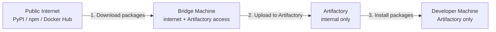
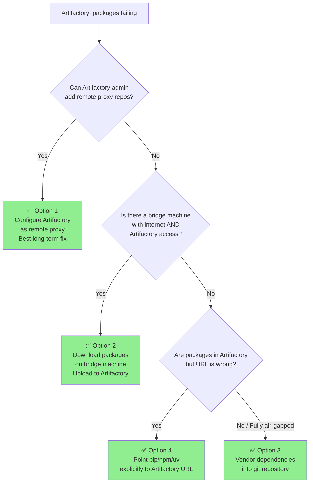

# Artifactory Dependency Workaround Guide

**Document Purpose:** This guide describes how to resolve dependency download failures when Artifactory is used as the only package registry and public registries (PyPI, npm, Docker Hub, GitHub Container Registry) are blocked.

---

## Table of Contents

1. [Overview & Root Cause](#1-overview--root-cause)
2. [Complete Dependency Inventory](#2-complete-dependency-inventory)
3. [Option 1 — Configure Artifactory as a Remote Proxy (Recommended)](#3-option-1--configure-artifactory-as-a-remote-proxy-recommended)
4. [Option 2 — Bridge Machine: Download & Upload Missing Packages](#4-option-2--bridge-machine-download--upload-missing-packages)
5. [Option 3 — Vendor Dependencies into the Repository (Fully Air-Gapped)](#5-option-3--vendor-dependencies-into-the-repository-fully-air-gapped)
6. [Option 4 — Point Build Tools to Artifactory Explicitly](#6-option-4--point-build-tools-to-artifactory-explicitly)
7. [Decision Guide](#7-decision-guide)
8. [Quick Reference: Copy-Paste Commands](#8-quick-reference-copy-paste-commands)

---

## 1. Overview & Root Cause

### What Is Happening

This project downloads dependencies from public registries during builds:

| Tool | Registry | Used for |
|------|----------|----------|
| `pip` / `uv` | `https://pypi.org/simple/` | Python packages |
| `npm` | `https://registry.npmjs.org/` | JavaScript / UI packages |
| `docker pull` | `ghcr.io` (GitHub Container Registry) | `uv` build tool image |
| `docker pull` | `public.ecr.aws` | AWS Lambda Python base image |

When **Artifactory is the only allowed registry** and packages are not in its cache, installations fail with errors such as:

```
ERROR: Could not find a version that satisfies the requirement strands-agents==1.14.0
ERROR: No matching distribution found for bedrock-agentcore>=0.1.1
npm ERR! code E404 - Not Found
```

### Why Packages Are Missing from Artifactory

Artifactory caches packages **on first request**. Packages that have never been requested, or were added after the last cache refresh, will be missing. The solution is one of:

- Enable Artifactory to proxy public registries (preferred)
- Manually upload the missing packages to Artifactory
- Vendor the packages directly in the repository

---

## 2. Complete Dependency Inventory

### 2.1 Python Dependencies

#### Core Library (`lib/idp_common_pkg/pyproject.toml`)

```
boto3==1.42.0
jsonschema>=4.25.1
pydantic>=2.12.0
deepdiff>=6.0.0
PyYAML>=6.0.0
Pillow==12.1.1
pypdfium2>=5.5.0
amazon-textract-textractor[pandas]==1.9.2
numpy==1.26.4
pandas==2.2.3
openpyxl==3.1.5
python-docx==1.2.0
strands-agents==1.14.0
strands-agents-tools==0.2.22
bedrock-agentcore>=0.1.1
stickler-eval==0.1.4
genson==1.3.0
munkres>=1.1.4
requests==2.33.0
pyarrow==20.0.0
aws-lambda-powertools>=3.2.0
jsonpatch==1.33
email-validator>=2.3.0
tabulate>=0.9.0
datamodel-code-generator>=0.25.0
mypy-boto3-bedrock-runtime>=1.39.0
ruamel-yaml>=0.17.0,<0.19.0
aws-xray-sdk>=2.14.0
genson==1.3.0
```

#### Lambda Function Dependencies (`src/lambda/*/requirements.txt`)

```
huggingface-hub==0.20.0
cfnresponse
crhelper~=2.0.10
aws-requests-auth==0.4.3
bedrock_agentcore_starter_toolkit
urllib3>=1.26.0
pypdf>=4.0.0
```

#### Development / Test Dependencies

```
pytest>=7.4.0
pytest-cov>=4.1.0
pytest-xdist>=3.3.1
pytest-asyncio>=1.1.0
pytest-mock>=3.11.1
moto[s3]==5.1.8
ruff>=0.14.0
typer>=0.19.2
rich>=13.0.0
cfn-lint
basedpyright
build==1.3.0
python-dotenv>=1.1.0
```

### 2.2 Node.js (npm) Dependencies

Located in `src/ui/package.json` and `docs-site/package.json`.

**Key packages include:**
- `react`, `react-dom`
- `@aws-amplify/ui-react`
- `@aws-appsync/gql`
- AWS AppSync codegen libraries
- `astro` (docs site)

To get the full list:
```bash
cat src/ui/package.json | jq '.dependencies, .devDependencies'
cat docs-site/package.json | jq '.dependencies, .devDependencies'
```

### 2.3 Docker Base Images

| Image | Registry | Purpose |
|-------|----------|---------|
| `ghcr.io/astral-sh/uv:0.9.6` | GitHub Container Registry | `uv` Python package installer (multi-stage build) |
| `public.ecr.aws/lambda/python:3.12-arm64` | AWS Public ECR | Lambda function runtime base image |

---

## 3. Option 1 — Configure Artifactory as a Remote Proxy *(Recommended)*

**Best for:** Long-term fix. All future installs work transparently. No code changes required.

**Who performs this:** Your Artifactory administrator.

### Steps for Artifactory Admin

#### A. Add PyPI Remote Repository

1. Log into Artifactory → **Administration** → **Repositories** → **Remote**
2. Click **New Remote Repository**
3. Set:
   - **Package Type:** `PyPI`
   - **Repository Key:** `pypi-remote` (or any name)
   - **URL:** `https://pypi.org/`
4. Save

#### B. Add npm Remote Repository

1. Click **New Remote Repository**
2. Set:
   - **Package Type:** `npm`
   - **Repository Key:** `npm-remote`
   - **URL:** `https://registry.npmjs.org`
3. Save

#### C. Add Docker Remote Repositories

For `ghcr.io` (GitHub Container Registry):
1. Click **New Remote Repository**
2. Set:
   - **Package Type:** `Docker`
   - **Repository Key:** `ghcr-remote`
   - **URL:** `https://ghcr.io`
3. Save

For AWS Public ECR (`public.ecr.aws`):
1. Click **New Remote Repository**
2. Set:
   - **Package Type:** `Docker`
   - **Repository Key:** `ecr-public-remote`
   - **URL:** `https://public.ecr.aws`
3. Save

#### D. Create Virtual Repositories (Aggregate local + remote)

Create virtual repositories that front your local + remote repos for seamless access:
- `pypi-virtual` → includes `pypi-local` + `pypi-remote`
- `npm-virtual` → includes `npm-local` + `npm-remote`
- `docker-virtual` → includes `docker-local` + `ghcr-remote` + `ecr-public-remote`

### Developer Configuration (after admin sets up proxy)

```bash
# Set pip to use Artifactory
export PIP_INDEX_URL=https://your-artifactory.company.com/artifactory/api/pypi/pypi-virtual/simple/
export PIP_TRUSTED_HOST=your-artifactory.company.com

# Set uv to use Artifactory
export UV_INDEX_URL=https://your-artifactory.company.com/artifactory/api/pypi/pypi-virtual/simple/

# Set npm to use Artifactory
npm config set registry https://your-artifactory.company.com/artifactory/api/npm/npm-virtual/

# Then run setup as normal
make setup-venv
```

---

## 4. Option 2 — Bridge Machine: Download & Upload Missing Packages

**Best for:** When you cannot change Artifactory config but have a machine that can reach the internet AND Artifactory.



### Python Packages

**On the bridge machine (internet access):**

```bash
# Create a directory for wheels
mkdir -p ./wheel-cache

# Download all Python dependencies as wheel files
# For Linux ARM64 (used by Lambda container images)
pip download \
  --platform manylinux2014_aarch64 \
  --python-version 312 \
  --only-binary=:all: \
  -d ./wheel-cache \
  "boto3==1.42.0" \
  "strands-agents==1.14.0" \
  "strands-agents-tools==0.2.22" \
  "bedrock-agentcore>=0.1.1" \
  "stickler-eval==0.1.4" \
  "Pillow==12.1.1" \
  "pypdfium2>=5.5.0" \
  "pyarrow==20.0.0" \
  "numpy==1.26.4" \
  "huggingface-hub==0.20.0" \
  "cfnresponse" \
  "crhelper~=2.0.10" \
  "aws-requests-auth==0.4.3" \
  "bedrock_agentcore_starter_toolkit"

# Download remaining packages for local dev (your OS/arch)
pip download \
  -d ./wheel-cache-local \
  -e "lib/idp_common_pkg[all,dev,test]" \
  -e lib/idp_cli_pkg \
  -e lib/idp_sdk \
  -e lib/idp_mcp_connector_pkg
```

**Upload to Artifactory via REST API:**

```bash
ARTIFACTORY_URL="https://your-artifactory.company.com/artifactory"
REPO="pypi-local"
AF_USER="your-username"
AF_PASSWORD="your-password-or-api-key"

for whl in ./wheel-cache/*.whl ./wheel-cache/*.tar.gz; do
  filename=$(basename "$whl")
  echo "Uploading $filename ..."
  curl -u "${AF_USER}:${AF_PASSWORD}" \
    -T "$whl" \
    "${ARTIFACTORY_URL}/${REPO}/${filename}"
done
```

**Or upload via Artifactory Web UI:**
1. Navigate to **Artifactory** → **Artifacts**
2. Select your `pypi-local` repository
3. Click **Deploy** → Upload `.whl` files from `./wheel-cache/`

### Docker Images

```bash
# Pull from public registries
docker pull ghcr.io/astral-sh/uv:0.9.6
docker pull public.ecr.aws/lambda/python:3.12-arm64

# Re-tag for your Artifactory Docker registry
docker tag ghcr.io/astral-sh/uv:0.9.6 \
  your-artifactory.company.com/docker-local/astral-sh/uv:0.9.6

docker tag public.ecr.aws/lambda/python:3.12-arm64 \
  your-artifactory.company.com/docker-local/lambda/python:3.12-arm64

# Push to Artifactory
docker login your-artifactory.company.com
docker push your-artifactory.company.com/docker-local/astral-sh/uv:0.9.6
docker push your-artifactory.company.com/docker-local/lambda/python:3.12-arm64
```

Then update `Dockerfile.optimized` lines 1 and 6:
```dockerfile
# Line 1 - change FROM
FROM your-artifactory.company.com/docker-local/astral-sh/uv:0.9.6 AS uv

# Line 6 - change FROM
FROM your-artifactory.company.com/docker-local/lambda/python:3.12-arm64 AS builder
```

---

## 5. Option 3 — Vendor Dependencies into the Repository (Fully Air-Gapped)

**Best for:** Completely air-gapped environments with no internet access whatsoever.

This involves downloading all packages **once** on an internet-connected machine and committing them to the repository, so no registry is needed at install time.

### Setup (on a machine with internet access)

```bash
# Create vendor directories
mkdir -p vendor/python vendor/npm

# Download all Python wheels for local development
pip download \
  -d vendor/python \
  "boto3==1.42.0" \
  "jsonschema>=4.25.1" \
  "pydantic>=2.12.0" \
  "deepdiff>=6.0.0" \
  "PyYAML>=6.0.0" \
  "Pillow==12.1.1" \
  "pypdfium2>=5.5.0" \
  "strands-agents==1.14.0" \
  "strands-agents-tools==0.2.22" \
  "bedrock-agentcore>=0.1.1" \
  "stickler-eval==0.1.4" \
  "numpy==1.26.4" \
  "pandas==2.2.3" \
  "pyarrow==20.0.0" \
  "requests==2.33.0" \
  "huggingface-hub==0.20.0" \
  "cfnresponse" \
  "crhelper~=2.0.10" \
  "aws-requests-auth==0.4.3" \
  "pytest>=7.4.0" \
  "moto[s3]==5.1.8" \
  "ruff>=0.14.0" \
  "typer>=0.19.2" \
  "rich>=13.0.0"

# Pack npm dependencies
cd src/ui && npm pack --pack-destination ../../vendor/npm
cd ../../docs-site && npm pack --pack-destination ../vendor/npm
cd ..
```

### Install from Vendor Directory (no network needed)

```bash
# Python
pip install --no-index --find-links vendor/python \
  -e "lib/idp_common_pkg[all,dev,test]" \
  -e lib/idp_cli_pkg \
  -e lib/idp_sdk \
  -e lib/idp_mcp_connector_pkg

# npm (configure local registry)
cd src/ui && npm install --prefer-offline --cache ../../vendor/npm
```

### Add a Makefile Target for Vendored Install

Add this to `Makefile`:

```makefile
setup-vendored: ## Install from local vendor/ directory (no network required)
	@echo "Installing from vendor directory (no-index mode)..."
	$(PIP) install --no-index --find-links vendor/python \
		-e "lib/idp_common_pkg[all,dev,test]" \
		-e lib/idp_cli_pkg \
		-e lib/idp_sdk \
		-e lib/idp_mcp_connector_pkg
	@echo -e "$(GREEN)✅ Vendored install complete!$(NC)"
```

### Add `vendor/` to `.gitignore` or commit it

If committing to git (fully self-contained):
```bash
# Remove vendor/ from .gitignore if present
grep -v "^vendor/" .gitignore > .gitignore.tmp && mv .gitignore.tmp .gitignore

# Commit
git add vendor/
git commit -m "Add vendored dependencies for air-gapped deployment"
```

---

## 6. Option 4 — Point Build Tools to Artifactory Explicitly

**Best for:** When Artifactory *does* have the packages but the build tools are not configured to use it (wrong index URL).

### Configure pip

Create or update `~/.pip/pip.conf` (macOS/Linux) or `%APPDATA%\pip\pip.ini` (Windows):

```ini
[global]
index-url = https://your-artifactory.company.com/artifactory/api/pypi/pypi-virtual/simple/
trusted-host = your-artifactory.company.com
```

Or use environment variables (temporary, no file changes):

```bash
export PIP_INDEX_URL=https://your-artifactory.company.com/artifactory/api/pypi/pypi-virtual/simple/
export PIP_TRUSTED_HOST=your-artifactory.company.com
```

### Configure uv

`uv` (used in `Dockerfile.optimized` and optionally in CI) reads:

```bash
export UV_INDEX_URL=https://your-artifactory.company.com/artifactory/api/pypi/pypi-virtual/simple/
```

Or create `~/.config/uv/uv.toml`:

```toml
[pip]
index-url = "https://your-artifactory.company.com/artifactory/api/pypi/pypi-virtual/simple/"
```

### Configure npm

```bash
# Set globally
npm config set registry https://your-artifactory.company.com/artifactory/api/npm/npm-virtual/

# OR create a project-level .npmrc file
echo "registry=https://your-artifactory.company.com/artifactory/api/npm/npm-virtual/" \
  > src/ui/.npmrc
echo "registry=https://your-artifactory.company.com/artifactory/api/npm/npm-virtual/" \
  > docs-site/.npmrc
```

### Configure Docker

```bash
# Configure Docker to use Artifactory as a mirror
# Edit /etc/docker/daemon.json (Linux) or Docker Desktop settings:
{
  "registry-mirrors": [
    "https://your-artifactory.company.com/artifactory/docker-virtual"
  ]
}
```

---

## 7. Decision Guide



---

## 8. Quick Reference: Copy-Paste Commands

### Identify Missing Packages (run this first)

```bash
# Capture all errors during setup to identify exactly which packages are failing
make setup-venv 2>&1 | tee /tmp/setup-errors.txt
grep -E "ERROR|Could not find|No matching|WARN" /tmp/setup-errors.txt
```

### Option 1 — Temporary environment variables to use Artifactory

```bash
# Replace with your actual Artifactory URL
ARTIFACTORY_URL="https://your-artifactory.company.com/artifactory"

export PIP_INDEX_URL="${ARTIFACTORY_URL}/api/pypi/pypi-virtual/simple/"
export PIP_TRUSTED_HOST="your-artifactory.company.com"
export UV_INDEX_URL="${ARTIFACTORY_URL}/api/pypi/pypi-virtual/simple/"
npm config set registry "${ARTIFACTORY_URL}/api/npm/npm-virtual/"

make setup-venv
```

### Option 2 — Download + Upload specific missing package

```bash
# Replace package name and version as needed
PACKAGE="strands-agents==1.14.0"
ARTIFACTORY_URL="https://your-artifactory.company.com/artifactory"
REPO="pypi-local"
AF_CREDS="username:api-key"

# Download
pip download -d /tmp/pkg "$PACKAGE"

# Upload
for f in /tmp/pkg/*.whl /tmp/pkg/*.tar.gz; do
  curl -u "$AF_CREDS" -T "$f" "${ARTIFACTORY_URL}/${REPO}/$(basename $f)"
done
```

### Option 3 — Install from vendor directory

```bash
pip install --no-index --find-links ./vendor/python \
  -e "lib/idp_common_pkg[all,dev,test]" \
  -e lib/idp_cli_pkg \
  -e lib/idp_sdk \
  -e lib/idp_mcp_connector_pkg
```

### Option 4 — Set pip.conf to use Artifactory

```bash
# Create pip config (macOS/Linux)
mkdir -p ~/.pip
cat > ~/.pip/pip.conf << 'EOF'
[global]
index-url = https://your-artifactory.company.com/artifactory/api/pypi/pypi-virtual/simple/
trusted-host = your-artifactory.company.com
EOF
```

---

## Need Help?

If you are unsure which packages are failing or need help generating a specific package list for your Artifactory admin to upload, run:

```bash
# Generate full resolved dependency list
cd lib/idp_common_pkg
pip-compile pyproject.toml --all-extras --output-file /tmp/full-requirements.txt 2>/dev/null
cat /tmp/full-requirements.txt
```

This produces a flat list of every package (and their exact versions) that can be handed to your Artifactory admin for bulk upload.

---

*Generated for the GenAI IDP Accelerator project — [GitHub Repository](https://github.com/aws-solutions-library-samples/accelerated-intelligent-document-processing-on-aws)*
