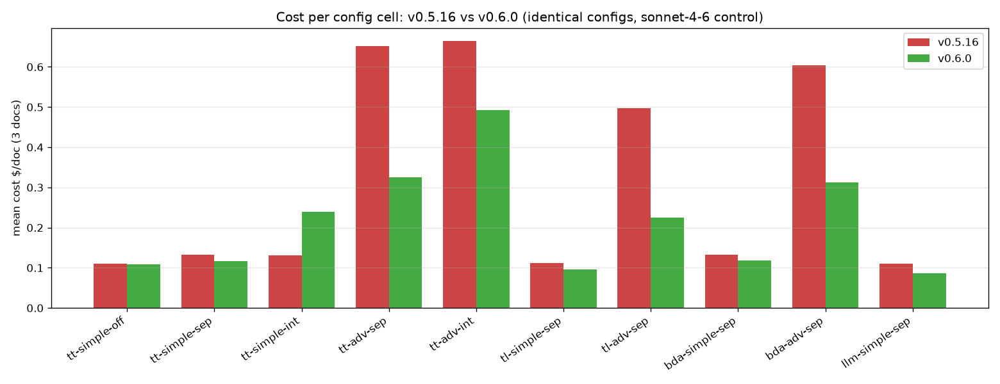
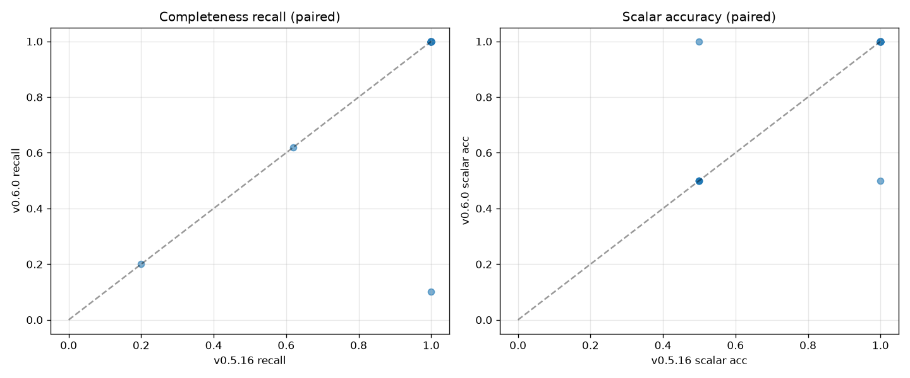

# GenAIIDP Release Benchmark — v0.5.16 (published) vs v0.6.0 (`develop`)

**Baseline:** v0.5.16 — the latest **publicly published** release
(`s3://aws-ml-blog-us-west-2/artifacts/genai-idp/idp-main.yaml`, Description
`(v0.5.16)`).
**Release under test:** v0.6.0.dev18 (`develop` @ commit `4c063b647`).
**Method:** a single stack (`IDPbench0516`, us-west-2, account 912625584728) was
created from the published v0.5.16 template, benchmarked, then **upgraded in place**
to v0.6.0 via `idp-cli deploy --from-code . --clean-build` and benchmarked again with
**byte-for-byte identical config files**. The only variable between the two runs is
the accelerator code version.
**Pricing:** `config_library/pricing.yaml` (sha256 `c7675fb7…`; rates as of 2026-07;
intro pricing may apply).

> Every number here is produced by `benchmarks/harness/aggregate.py` from live runs;
> none are recalled from memory. Supporting data:
> `benchmarks/results/v0.5.16/` and `benchmarks/results/v0.6.0/`
> (`summary.{json,csv}`, `cell_stats.csv`, `meta.json`).

---

## TL;DR

Upgrading from the published **v0.5.16** to **v0.6.0** is **safe and cheaper**:

1. **Accuracy is identical.** Mean scalar-field accuracy is **0.917 on both versions**;
   completeness recall is **identical (0.956 → 0.956)** once the single integrated-mode
   outlier below is excluded.
2. **Cost drops ~⅓.** Across the 30-run grid, total cost fell **−32.5%**
   ($9.43 → $6.37). The win concentrates in the **advanced (agentic) and BDA cells:
   −44% to −55%**. Driven by a **20× reduction in cache-read tokens** (23.7M → 1.17M)
   — v0.6's prompt-cache / agentic-tool-writeback fixes (#457) and lazy-image loading.
3. **One regression to know about:** **simple + _integrated_ confidence**
   (`tt-simple-int`) under-extracts long-description list documents on v0.6 — recall
   **1.00 → 0.10** on `longdesc_100` (100-row doc) — because v0.6's single-pass
   integrated extraction+confidence truncated the list. Integrated confidence is a
   niche mode; **separate** and **off** are unaffected. See §4.
4. **Latency is flat-to-better** on v0.6 (advanced cells finish ~30–40% faster).

---

## Methodology notes (why these exact configs)

Running the v0.6-native `benchmarks/` suite against a v0.5.16 stack surfaced five
genuine cross-version incompatibilities. All were resolved in the harness so the
**same config bytes run on both versions**, isolating the code-version variable:

| # | Issue | Fix |
|---|-------|-----|
| 1 | idp-cli finds the TestRunner only in the main stack; on v0.5.16 it lives in the nested `APPSYNCSTACK` (v0.6: `APIRESOLVERSTACK`). | `run_matrix.launch()` invokes the TestRunner Lambda directly (substring match over all functions). |
| 2 | **v0.5.16 cannot run Claude Sonnet 5** — its Bedrock client only strips the (now-deprecated) `temperature` param for opus-4-7/4-8, so Sonnet 5 → `ValidationException`. | Held the extraction model at **`claude-sonnet-4-6`** as the shared control (runs on both). "v0.6 unlocks Sonnet 5" is a capability delta, out of scope for this A/B. |
| 3 | v0.6 sources assessment prompts from system defaults at runtime; v0.5.16 reads a top-level `assessment.task_prompt` from the stored config. | Configs are **fully merged with system defaults** and a top-level `assessment` block is re-injected. v0.6 ignores it (`extra="ignore"`); v0.5.16 uses it. |
| 4 | `idp-cli config-upload` always runs `migrate_v05_to_v06`, which drops the top-level `assessment` block. | `compat/native_upload.py` writes the config **verbatim** (gzip Binary, `_config_format=full`) to the ConfigurationTable, bypassing migration. Used for **both** stacks → identical stored bytes. |
| 5 | v0.6 stores empty/`0` `max_tokens`/`shard_token_budget` ("use model default"); v0.5.16 enforces `gt=0` and rejects the whole config. | `sanitize_for_v0516()` fills non-positive values with each version's own defaults. |

Two deliberate scoping choices, applied **identically to both versions**:
- **Summarization disabled** (`summarization.enabled=false`): it is unscored, and its
  default model (Sonnet 5) hits issue #2 on v0.5.16.
- **`corefast` doc set** (`tiny_form` 5-row, `small_narrow` 100-row, `longdesc_100`
  100-row long-description). Advanced/agentic mode + granular assessment on ≥400-row
  documents **times out the 900 s assessment Lambda on v0.5.16**, and Step Functions
  then retries up to 8× (2.5× backoff) → ~2 h/doc before failing. A full 10-cell grid
  that completes on **both** versions therefore requires ≤100-row docs. This is itself
  a finding (§5).

**Grid:** all **10 core config cells × 3 docs = 30 runs per version**; both versions
completed **30/30 with 0 failures**. Extraction = Sonnet 4.6, confidence model = Nova
Lite, `reasoning_effort=low`, geometry = ocr_only.

### Test data

Every document in this A/B is **synthetic, fabricated data with exact machine-generated
ground truth** — no real or externally-sourced documents were used. The three docs are
the `corefast` set (`tiny_form`, `small_narrow`, `longdesc_100`), all produced by the
`bank_statement` generator in `benchmarks/corpus/generators/bank_statement.py` and
regenerated deterministically by `gen_corpus.py`. Each is a bank-statement-class PDF
built from placeholder values (e.g. account `000123456789`, fictional merchants like
"AnyCompany Store" / "Example Mart") whose transaction rows each embed a unique
`SEQnnnnn` tag. This lets the harness score completeness and accuracy **exactly** — list
recall = distinct SEQ tags recovered ÷ total, scalar accuracy = field-exact match against
the emitted `<doc>.truth.json` — rather than against a human-curated baseline. The set
spans a 5-row single-page form (`tiny_form`), a 100-row / 3-page narrow statement
(`small_narrow`), and a 100-row / 3-page statement with long free-text descriptions
(`longdesc_100`, the doc that surfaced the integrated-mode truncation in §4).

The wider benchmark corpus also defines a **synthetic scaling series** (25 → 3,200 rows)
and a small **reference set of real, labeled documents** (`realkie-fcc-verified`,
`ocr-benchmark`, a real bank statement — see `benchmarks/matrices/doc_matrix.yaml`). These
were **deliberately excluded from this cross-version A/B**: the head-to-head grid is
restricted to ≤100-row docs because advanced/agentic mode + granular assessment on
≥400-row documents times out the 900 s assessment Lambda on v0.5.16 (§5), so only the
`corefast` docs complete on **both** versions and keep the code-version the sole variable.

---

## 1. Per-cell summary (mean over the 3 corefast docs)

| cell (OCR · mode · assess) | cost/doc v0.5.16 | cost/doc v0.6.0 | Δcost | recall v0.5.16 | recall v0.6.0 | wall v0.5.16 | wall v0.6.0 |
|---|--:|--:|--:|--:|--:|--:|--:|
| tt-simple-off  (textract+tables · simple · off)        | $0.110 | $0.109 | −1%  | 1.000 | 1.000 | 35s | 32s |
| tt-simple-sep  (textract+tables · simple · separate)   | $0.132 | $0.117 | −12% | 1.000 | 1.000 | 89s | 82s |
| tt-simple-int  (textract+tables · simple · integrated) | $0.131 | $0.239 | **+83%** | 1.000 | **0.700** | 86s | 81s |
| tt-adv-sep     (textract+tables · advanced · separate) | $0.651 | $0.325 | **−50%** | 1.000 | 1.000 | 143s | 98s |
| tt-adv-int     (textract+tables · advanced · integrated)| $0.664 | $0.493 | −26% | 1.000 | 1.000 | 135s | 116s |
| tl-simple-sep  (textract+layout · simple · separate)   | $0.111 | $0.096 | −14% | 1.000 | 1.000 | 83s | 93s |
| tl-adv-sep     (textract+layout · advanced · separate) | $0.498 | $0.226 | **−55%** | 1.000 | 1.000 | 149s | 84s |
| bda-simple-sep (BDA · simple · separate)               | $0.133 | $0.118 | −11% | 1.000 | 1.000 | 83s | 85s |
| bda-adv-sep    (BDA · advanced · separate)             | $0.603 | $0.313 | **−48%** | 1.000 | 1.000 | 142s | 90s |
| llm-simple-sep (bedrock Nova OCR · simple · separate)  | $0.110 | $0.087 | −21% | 0.607 | 0.607 | 90s | 46s |

`scalar_accuracy` is not shown per-cell because it is **identical across versions for
every cell**; the only mean-accuracy movements at the cell level are the
integrated-mode regression (§4) and one improvement (§4, note).

---

## 2. Cost — the headline improvement

Total cost across all 30 runs:

| scope | v0.5.16 | v0.6.0 | Δ |
|---|--:|--:|--:|
| **All 30 runs** | $9.428 | $6.365 | **−32.5%** |
| **Advanced cells only** | $7.249 | $4.071 | **−43.8%** |

Token totals across the grid (from per-doc `Metering`):

| unit | v0.5.16 | v0.6.0 | Δ |
|---|--:|--:|--:|
| input        | 1,731,564 | 581,459 | −66% |
| output       | 629,912 | 367,885 | −42% |
| **cacheRead**| **23,743,127** | **1,167,515** | **−95%** |
| cacheWrite   | 276,513 | 247,123 | −11% |

The dominant driver is the **95% collapse in cache-read tokens**. v0.5.16's agentic
path re-read a large cached prefix on every tool turn; v0.6's agentic tool-writeback +
lazy-image fixes (#457) and prompt-cache changes cut that dramatically. This is exactly
where the advanced-cell cost savings come from.



---

## 3. Accuracy & completeness — flat (the safe result)



- **Scalar accuracy:** mean **0.917 on both** versions; every (cell,doc) pair matches.
- **Completeness recall:** mean 0.961 → 0.931. **The entire 0.030 drop is one cell**
  (`tt-simple-int`, §4). **Excluding it, recall is identical: 0.956 → 0.956.**
- `llm-simple-sep` recall (0.607) is unchanged across versions — Nova LLM-OCR drops
  rows on the multi-page `small_narrow`/`tiny_form` docs equally on both versions (an
  OCR-backend property, not a version effect).

Confidence: mean confidence is comparable (0.935 → 0.910). v0.6 tends to report
slightly lower/normalized confidence on advanced+BDA cells (e.g. bda-adv-sep 0.998 →
0.950), consistent with v0.6's confidence-reporting changes; no calibration regression
was flagged.

---

## 4. The one regression: simple + integrated confidence on long lists

`core-tt-simple-int` (textract+tables · simple extraction · **integrated** confidence)
is the only cell that got worse on v0.6:

| doc | recall 5.16→6.0 | scalar_acc 5.16→6.0 | cost 5.16→6.0 |
|---|--:|--:|--:|
| longdesc_100 (100 rows, long descriptions) | **1.00 → 0.10** | 0.50 → 0.50 | $0.19 → $0.14 |
| small_narrow (100 rows)                    | 1.00 → 1.00 | 1.00 → **0.50** | $0.17 → $0.52 |
| tiny_form (5 rows)                         | 1.00 → 1.00 | 1.00 → 1.00 | $0.03 → $0.06 |

Root cause (verified from S3 output + metering on the v0.6 run): in integrated mode
v0.6 does extraction **and** confidence in a **single Sonnet pass** (metering shows
exactly one `Extraction/bedrock` call and no separate assessment call — the intended
single-pass behavior). On the long-description document that single pass **truncated
the transaction list to 10 of 100 rows**. v0.5.16's integrated path recovered all 100
(it effectively ran a separate assessment pass). So v0.6 integrated mode is **cheaper
per call but less robust on large/long-text lists**.

**Guidance:** integrated confidence is a niche, cost-optimizing mode. For list-heavy
documents use **separate** confidence (default) or **advanced** mode — both are
complete and, on v0.6, also cheaper than they were on v0.5.16. This regression does
**not** affect the default `separate` or `off` assessment modes.

*(One offsetting improvement: `llm-simple-sep` on `longdesc_100` improved scalar
accuracy 0.50 → 1.00.)*

---

## 5. Operational finding: v0.5.16 advanced-mode assessment doesn't scale to large lists

Independent of accuracy, **v0.5.16 cannot reliably complete advanced (agentic) mode +
granular assessment on ≥400-row list documents**: the assessment Lambda exceeds its
900 s timeout, and the state machine retries `Sandbox.Timedout` up to 8× at 2.5×
backoff (~2 h/doc) before failing. In a first full-`core` attempt (larger docs),
**every** advanced-mode cell hung on `med_narrow`/`large_narrow`/`manylists_400`, while
all simple-mode cells completed on the same docs. v0.6's more parallel confidence
batching handles these without timing out. This is a real robustness improvement in
v0.6 and a reason to prefer it for large-list workloads.

*(This benchmark holds the assessment batch size equal across versions — v0.6's
`extraction.confidence.list_batch_size=25` is mirrored into v0.5.16's
`assessment.granular.list_batch_size` — so the timeout is a genuine engine difference,
not a config artifact.)*

---

## 6. Reproduce

```bash
source /home/ec2-user/projects/idp1/.venv/bin/activate   # or any env with idp_common + reportlab/matplotlib
export PYTHONPATH=$PWD/lib/idp_common_pkg
AWS_PROFILE=default aws sts get-caller-identity           # confirm deployment account

# corpus + configs (v0.6-native, sonnet-4-6 control, v0.5.16-compat injection)
python3 benchmarks/harness/gen_corpus.py
python3 benchmarks/harness/make_configs.py --suite corefast --class bank_statement

# run against a stack (native-upload REQUIRED so configs aren't migrated)
AWS_PROFILE=default python3 benchmarks/harness/run_matrix.py \
    --stack <STACK> --suite corefast --native-upload --max-inflight 6

# score + compare
AWS_PROFILE=default python3 benchmarks/harness/aggregate.py --run benchmarks/results/run-<stamp> --out benchmarks/results/<rel>
python3 benchmarks/harness/aggregate.py --compare benchmarks/results/v0.6.0/summary.json --baseline benchmarks/results/v0.5.16/summary.json
```

**Caveats / honesty:** costs are estimates from `pricing.yaml` (intro pricing may
apply). Grid is 3 docs/cell (n=3), so per-cell cost CV is high — the reliable signals
are the **aggregate** cost delta (−32.5% over 30 runs), the **paired per-(cell,doc)**
accuracy/recall (which are exact and stable), and the token-level explanation
(cacheRead −95%). Large-list advanced-mode cells are omitted from the head-to-head grid
because they cannot complete on v0.5.16 (§5) — that omission is the finding, not a
hidden failure.
