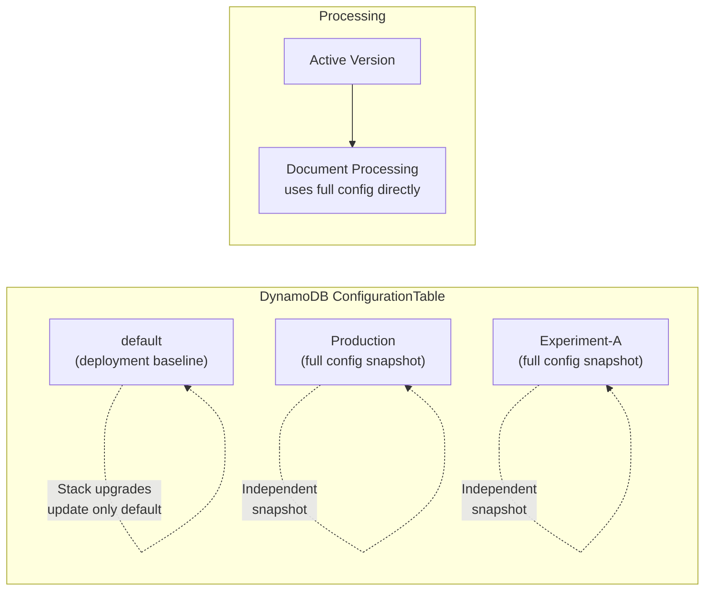

Copyright Amazon.com, Inc. or its affiliates. All Rights Reserved.
SPDX-License-Identifier: MIT-0

# Configuration Versions

Configuration Versions enable you to manage multiple configuration snapshots for your IDP solution, track which configuration was used for each document processed, and compare results across different configurations — all without redeploying your stack.


https://github.com/user-attachments/assets/b1e0cf16-d2c4-4927-a9ec-767b8ac49c9d


## Overview

Each configuration version is a **complete, self-contained configuration snapshot**. When you create or edit a version, the full configuration is saved — there is no hidden merging or delta logic. This makes behavior predictable and debuggable: what you save is exactly what gets used at runtime.



### Key Concepts

- **Versions are independent snapshots**: Each version stores a complete configuration. Editing one version has no effect on others.
- **The `default` version** is the deployment baseline created and updated by CloudFormation/CDK during stack deployments.
- **Active version**: One version is marked as "active" at any time. New document processing uses the active version unless overridden.
- **What you save is what you get**: No hidden merge transforms. The configuration stored in DynamoDB is the configuration used at runtime.
- **Stack upgrades update only `default`**: When you upgrade the solution, only the `default` version receives new settings. Your other versions remain untouched as locked snapshots that you explicitly manage.

### Use Cases

- **A/B testing**: Compare extraction accuracy across different model or prompt configurations
- **Environment separation**: Maintain `Production`, `Staging`, and `Experiment` versions within a single stack
- **Iterative tuning**: Create a new version for each prompt engineering iteration, track which version produced which results
- **Safe rollback**: Keep a known-good version active while experimenting with a new one

## Managing Versions via Web UI

### Configuration Versions Table

The **View/Edit Configuration** page includes a Configuration Versions table that lists all versions with:

| Column | Description |
|--------|-------------|
| **Version Name** | Unique identifier (e.g., `default`, `Production`, `v1`) |
| **Description** | Optional description (max 200 characters) |
| **Created** | Timestamp when the version was first created |
| **Updated** | Timestamp of the last modification |
| **Active** | Indicates which version is currently active for processing |

#### Available Actions

- **Open/Edit**: Click a version name to open it in the configuration editor
- **Create (Import)**: Import a configuration file (JSON/YAML) or from the Configuration Library as a new version
- **Activate**: Set a selected version as the active version for processing
- **Compare**: Select 2+ versions to view a side-by-side diff (exportable as CSV/JSON)
- **Delete**: Remove selected versions (cannot delete the active version or `default`)

### Editing a Version

When you open a version in the configuration editor:

1. The full configuration is loaded and displayed in the form editor
2. Fields that differ from the current `default` are visually highlighted
3. You can edit any setting — classification, extraction, models, prompts, document classes, etc.
4. Click **Save changes** to persist the full updated configuration

#### Unsaved Changes Indicator

- Individual fields with unsaved edits display an **orange dot** (●) next to the field label
- An **info banner** appears at the top: *"You have unsaved changes. Click Save changes to persist, or Discard changes to revert."*
- The **Discard changes** button reloads the last-saved configuration from the server

#### Browser Navigation Guard

The editor protects against accidental data loss:
- **Browser close/refresh**: The browser's native `beforeunload` dialog warns you before leaving
- **SPA navigation**: Navigating to another page within the app triggers a confirmation dialog when unsaved changes exist

### Special Operations

| Operation | What It Does |
|-----------|-------------|
| **Save changes** | Saves the current form as the full configuration for this version |
| **Save as Default** | Copies this version's configuration to become the new `default`, then resets the version to match |
| **Reset to Default** | Copies the current `default` configuration into this version, replacing all customizations |
| **Restore field** | (Per-field) Resets an individual field to its value in the `default` version |

### Version Comparison

Select two or more versions using the checkboxes, then click **Compare Selected**:

- A modal displays all settings that differ between the selected versions
- Differences are shown field-by-field with each version's value in its own column
- Export the comparison as **CSV** or **JSON** for offline review

### Export and Import

#### Export
- Click **Export** to download the currently open version as a JSON or YAML file
- The export contains the complete configuration — it can be imported into another stack or version

#### Import as New Version
- From the Versions Table, click **Import** to create a new version from a file
- Provide a unique version name and optional description
- The imported configuration becomes a new independent version

## Managing Versions via CLI

The IDP CLI supports full configuration version management. See [idp-cli.md](idp-cli.md) for complete command reference.

### Download a Specific Version

```bash
# Download the active version
idp-cli config-download --stack-name my-stack --output config.yaml

# Download a specific version
idp-cli config-download --stack-name my-stack --config-version Production --output config.yaml
```

### Upload / Create a Version

```bash
# Upload to the active version
idp-cli config-upload --stack-name my-stack --config-file ./config.yaml

# Update an existing version
idp-cli config-upload --stack-name my-stack --config-file ./config.yaml \
    --config-version Production

# Create a new version with description
idp-cli config-upload --stack-name my-stack --config-file ./config.yaml \
    --config-version Experiment-A \
    --version-description "Testing nova-2-lite for extraction"
```

### Process Documents with a Specific Version

```bash
# Process with a specific configuration version
idp-cli run-inference --stack-name my-stack --dir ./documents/ \
    --config-version Production --monitor

# Process test set with version and context
idp-cli run-inference --stack-name my-stack --test-set fcc-example-test \
    --config-version Experiment-A \
    --context "Testing nova-2-lite extraction prompts" \
    --monitor
```

The `--config-version` parameter:
1. Validates the version exists before starting processing
2. Stores the version name as S3 object metadata (`config-version`) on uploaded documents
3. The processing pipeline reads and uses the specified version's configuration

## Version Tracking in Document Processing

### How Version Is Tracked

When a document is processed, the configuration version used is recorded:

1. **S3 Metadata**: The config version is stored as object metadata on the document in S3
2. **DynamoDB**: The `ConfigVersion` attribute is saved with the document tracking record
3. **UI Display**: The config version appears in the Document List table, Document Details panel, and all export formats

### Version Selector in Processing UIs

A **Configuration Version** dropdown is available in:

- **Upload Documents** panel — select which version to use when uploading new documents
- **Reprocess Document** modal — select which version to use when reprocessing
- **Discovery** panel — select which version to save discovered schemas to

The dropdown shows all available versions with their descriptions, and indicates which is currently active.

## Test Studio Integration

The Test Studio fully supports configuration versions for systematic benchmarking:

### Running Tests with Versions
1. In the **Test Executions** tab, select a test set
2. Choose a **Configuration Version** from the dropdown
3. Optionally add a context description
4. Click **Run Test**

### Version Tracking in Results
- Each test run records the configuration version used
- The **Config Version** column appears in the test runs list (clickable link to the configuration page)
- The test results detail view displays the config version prominently
- The test comparison view includes config version for each compared run

### Export with Version Data
- **CSV export**: Includes a `Config Version` column with the version name
- **JSON export**: Includes `configVersion` field in each test run record
- **Print view**: Config version displayed in the results header

## Storage Architecture

### DynamoDB Key Format

Configuration versions are stored in the `ConfigurationTable` DynamoDB table:

| Partition Key (`Configuration`) | Description |
|------|-------------|
| `Config#default` | Deployment baseline (updated by stack deployments) |
| `Config#Production` | User-created version named "Production" |
| `Config#v1` | User-created version named "v1" |

### Item Structure

Each version item contains metadata as top-level DynamoDB attributes, plus the configuration data stored as a gzip-compressed Binary attribute:

| Field | Type | Description |
|-------|------|-------------|
| `Configuration` | String | Partition key (`Config#<versionName>`) |
| `IsActive` | Boolean | Whether this is the active version |
| `Description` | String | Optional version description |
| `CreatedAt` | String | ISO 8601 creation timestamp |
| `UpdatedAt` | String | ISO 8601 last-modified timestamp |
| `_compressed_config` | Binary | Gzip-compressed JSON containing all configuration data |
| `_config_storage` | String | Set to `"compressed"` for compressed format |

### Compressed Storage

Configuration data (ocr, classification, extraction, classes, assessment, summarization, etc.) is gzip-compressed into a single DynamoDB Binary attribute. This overcomes DynamoDB's 400KB item size limit, supporting configurations with **3,000+ document classes**.

- **Write path**: Config data is serialized to JSON and gzip-compressed (achieving 37-95x compression ratios for typical JSON Schema configurations)
- **Read path**: Compressed items are auto-detected via the `_config_storage: "compressed"` marker and transparently decompressed
- **Backward compatibility**: Legacy uncompressed items (from older versions) are read as-is — no migration steps needed. On the next write, the config is automatically stored in compressed format.

### Full Config Format

New-format configuration versions include a `_config_format: "full"` marker. This distinguishes them from legacy sparse-delta configs. The detection logic (`_is_full_config()`) checks for:
1. Explicit `_config_format: "full"` marker (new format), OR
2. Presence of ≥4 top-level config sections (heuristic for pre-marker full configs)

### Legacy Sparse Config Migration

If you have existing configurations from before this feature:
- **Auto-detection**: Legacy sparse configs (only containing deltas from default) are automatically detected
- **Auto-migration**: On first read, sparse configs are merged with the `default` version and the full result is saved back with the `_config_format: "full"` marker
- **Transparent**: No manual intervention required — the migration happens seamlessly on first access

## GraphQL API Reference

### Queries

| Query | Parameters | Description |
|-------|-----------|-------------|
| `getConfigVersions` | *(none)* | Returns list of all versions with metadata (name, isActive, timestamps, description) |
| `getConfigVersion` | `versionName: String!` | Returns the full configuration for a specific version |

### Mutations

| Mutation | Parameters | Description |
|----------|-----------|-------------|
| `updateConfiguration` | `input: AWSJSON!, versionName: String, description: String` | Update a version's configuration. Supports flags: `saveAsVersion`, `saveAsDefault`, `resetToDefault` |
| `setActiveVersion` | `versionName: String!` | Activate a specific version (deactivates all others) |
| `deleteConfigVersion` | `versionName: String!` | Delete a version (fails if active or `default`) |

## Upgrade Considerations

### Stack Upgrades and Version Independence

When you upgrade the IDP solution to a new version:

1. **`default` version is updated** with new settings, prompts, or model defaults from the deployment
2. **All other versions remain unchanged** — they are locked snapshots
3. **Trade-off**: New default features (e.g., improved prompts, new model options) do NOT automatically propagate to existing versions

### Managing Divergence

To incorporate new defaults into an existing version:
- **Reset to Default**: Copy the entire current default into your version (replaces all customizations)
- **Manual review**: Open your version alongside the default, compare differences, and selectively update fields
- **UI diff highlighting**: Fields in your version that differ from the current default are visually highlighted, making it easy to spot divergence

### Best Practices

1. **Export before upgrading**: Use the Export button to download your active version's configuration before a stack upgrade
2. **Review default changes**: After upgrading, compare your version with the updated default to identify beneficial new settings
3. **Version naming**: Use descriptive names (e.g., `prod-2026-02`, `experiment-nova2-lite`) for easy identification
4. **Document context**: Use version descriptions and test run context fields to record what each version is testing
