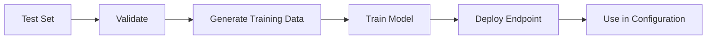

# Custom Model Fine-Tuning

This guide explains how to fine-tune Nova models for document classification using the IDP Accelerator.

## Overview

The Custom Model Fine-Tuning feature allows you to create specialized document classification models trained on your specific document types. This is particularly useful when:

- You have unique document types not well-recognized by base models
- You need higher accuracy for specific document classes
- You want to optimize classification for your domain-specific terminology

## How It Works



1. **Select a Test Set**: Choose an existing Test Set from Test Studio that contains labeled documents
2. **Validate**: The system checks if the Test Set has sufficient data for fine-tuning
3. **Generate Training Data**: Documents are converted to Bedrock's training format
4. **Train Model**: A Bedrock fine-tuning job trains a custom Nova model
5. **Deploy Endpoint**: The trained model is deployed as an on-demand Custom Model Deployment
6. **Use in Configuration**: Select the custom model when creating or editing configurations

## Prerequisites

- An existing Test Set with:
  - At least 10 documents
  - At least 2 document classes
  - Baseline classifications for all documents
- Appropriate IAM permissions for Bedrock model customization

## Using the UI

### Creating a Fine-Tuning Job

1. Navigate to **Configuration** → **Custom Models** in the left navigation
2. Click **Create Fine-Tuning Job**
3. Fill in the form:
   - **Job Name**: A descriptive name for your fine-tuning job
   - **Test Set**: Select the Test Set to use for training
   - **Base Model**: Choose Nova 2 Lite or Nova 2 Pro as the base model (recommended)
4. Review the validation results showing:
   - Document count
   - Class distribution
   - Train/validation split
   - Any warnings or errors
5. Click **Start Fine-Tuning**

### Monitoring Progress

The job will progress through these stages:

| Status | Description |
|--------|-------------|
| VALIDATING | Checking Test Set data |
| GENERATING_DATA | Converting documents to training format |
| TRAINING | Bedrock is training the model (can take 1-4 hours) |
| DEPLOYING | Creating the on-demand endpoint |
| COMPLETED | Model is ready to use |
| FAILED | An error occurred (check error message) |

### Using a Custom Model

Once a fine-tuning job completes:

1. Go to **Configuration** → **Versions**
2. Create or edit a configuration version
3. In the model selector, you'll see your custom models under "Custom Models"
4. Select your fine-tuned model
5. Save the configuration

## Using the CLI

### Validate a Test Set

```bash
idp finetuning validate --test-set docsplit
```

Output:
```
Test Set Validation Results:
  Valid: Yes
  Documents: 150
  Classes: 8
  Train/Validation Split: 135/15

Class Distribution:
  drivers_license: 25
  bank_statement: 30
  pay_stub: 20
  w2: 15
  utility_bill: 20
  insurance_card: 15
  tax_return: 15
  other: 10

Warnings:
  - Class 'other' has relatively few examples (10)
```

### Create a Fine-Tuning Job

```bash
idp finetuning create \
  --test-set docsplit \
  --base-model us.amazon.nova-pro-v1:0 \
  --name my-classifier
```

Output:
```
Fine-tuning job created:
  Job ID: abc123-def456-...
  Status: VALIDATING
  
Monitor progress with:
  idp finetuning status --job-id abc123-def456-...
```

### Check Job Status

```bash
idp finetuning status --job-id abc123-def456-...
```

Output:
```
Fine-Tuning Job Status:
  Job ID: abc123-def456-...
  Name: my-classifier
  Status: TRAINING
  Base Model: Nova Pro
  
  Timeline:
    Created: 2024-01-15 10:00:00
    Training Started: 2024-01-15 10:05:00
    
  Training Metrics:
    Training Loss: 0.05
    Validation Loss: 0.08
```

### List All Jobs

```bash
idp finetuning list
```

### Delete a Job

```bash
idp finetuning delete --job-id abc123-def456-...
```

### List Available Models

```bash
idp models list
```

Output:
```
Base Models:
  - us.amazon.nova-2-lite-v1:0 (Nova 2 Lite - recommended)
  - us.amazon.nova-2-pro-v1:0 (Nova 2 Pro - recommended)
  - us.amazon.nova-lite-v1:0 (Nova Lite v1 - legacy)
  - us.amazon.nova-pro-v1:0 (Nova Pro v1 - legacy)

Custom Models:
  - my-classifier (Nova Pro) - Active
  - docsplit-v2 (Nova Lite) - Active
```

## Using the SDK

```python
from idp_sdk import IDPClient

client = IDPClient()

# Validate a test set
validation = client.finetuning.validate_test_set("docsplit")
print(f"Valid: {validation.is_valid}")
print(f"Documents: {validation.document_count}")
print(f"Classes: {validation.class_count}")

# Create a fine-tuning job
job = client.finetuning.create_job(
    test_set_id="docsplit",
    base_model="us.amazon.nova-pro-v1:0",
    name="my-classifier"
)
print(f"Job ID: {job.id}")

# Wait for completion (with progress updates)
completed_job = client.finetuning.wait_for_completion(
    job.id,
    poll_interval=60  # Check every minute
)
print(f"Status: {completed_job.status}")
print(f"Model ARN: {completed_job.custom_model_deployment_arn}")

# List available models
models = client.models.list_available_models()
for model in models.custom_models:
    print(f"  {model.name} ({model.base_model})")
```

## Best Practices

### Data Quality

- **Diverse Examples**: Include varied examples of each document class
- **Balanced Classes**: Try to have similar numbers of examples per class
- **Clean Baselines**: Ensure baseline classifications are accurate
- **Sufficient Data**: More examples generally lead to better results

### Model Selection

| Base Model | Best For |
|------------|----------|
| Nova 2 Lite | Faster training, lower cost, simpler documents (recommended) |
| Nova 2 Pro | Higher accuracy, complex documents, more classes (recommended) |
| Nova Lite (v1) | Legacy support |
| Nova Pro (v1) | Legacy support |

### Training Tips

1. **Start Small**: Begin with Nova 2 Lite to validate your approach
2. **Monitor Metrics**: Watch training/validation loss for overfitting
3. **Iterate**: If results aren't satisfactory, improve your training data
4. **Compare**: Run evaluations comparing base vs. custom models

## Troubleshooting

### Common Errors

| Error | Solution |
|-------|----------|
| "Insufficient documents" | Add more documents to your Test Set |
| "Insufficient classes" | Ensure at least 2 document classes |
| "Training failed" | Check Bedrock quotas and permissions |
| "Deployment failed" | Verify Custom Model Deployment permissions |

### Checking Logs

Fine-tuning job logs are available in CloudWatch:
- Log group: `/aws/lambda/idp-finetuning-*`
- Step Functions execution history in the AWS Console

### IAM Permissions

Ensure your deployment has these Bedrock permissions:
```
bedrock:CreateModelCustomizationJob
bedrock:GetModelCustomizationJob
bedrock:CreateCustomModelDeployment
bedrock:GetCustomModelDeployment
bedrock:ListCustomModelDeployments
bedrock:DeleteCustomModelDeployment
```

## Cost Considerations

Fine-tuning costs include:
1. **Training**: Charged per training hour (varies by base model)
2. **Deployment**: On-demand pricing when the model is invoked
3. **Storage**: S3 storage for training data and model artifacts

Custom Model Deployments use on-demand pricing, so you only pay when the model is invoked. This is more cost-effective than Provisioned Throughput for variable workloads.

## API Reference

### GraphQL Queries

```graphql
# List fine-tuning jobs
query ListFinetuningJobs($limit: Int, $nextToken: String) {
  listFinetuningJobs(limit: $limit, nextToken: $nextToken) {
    items {
      id
      jobName
      status
      baseModel
      createdAt
    }
    nextToken
  }
}

# Get job details
query GetFinetuningJob($jobId: ID!) {
  getFinetuningJob(jobId: $jobId) {
    id
    jobName
    testSetId
    testSetName
    baseModel
    status
    createdAt
    trainingStartedAt
    trainingCompletedAt
    deploymentCompletedAt
    customModelArn
    customModelDeploymentArn
    trainingMetrics {
      trainingLoss
      validationLoss
    }
    errorMessage
  }
}

# Validate test set
query ValidateTestSet($testSetId: ID!) {
  validateTestSetForFinetuning(testSetId: $testSetId) {
    isValid
    documentCount
    classCount
    classDistribution
    trainCount
    validationCount
    warnings
    errors
  }
}

# List available models
query ListAvailableModels {
  listAvailableModels {
    baseModels {
      id
      name
      provider
    }
    customModels {
      id
      name
      baseModel
      status
    }
  }
}
```

### GraphQL Mutations

```graphql
# Start fine-tuning job
mutation StartFinetuningJob($input: StartFinetuningJobInput!) {
  startFinetuningJob(input: $input) {
    id
    jobName
    status
  }
}

# Delete fine-tuning job
mutation DeleteFinetuningJob($jobId: ID!) {
  deleteFinetuningJob(jobId: $jobId)
}