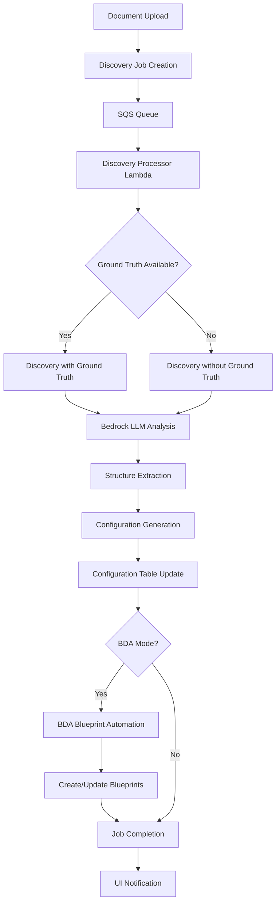
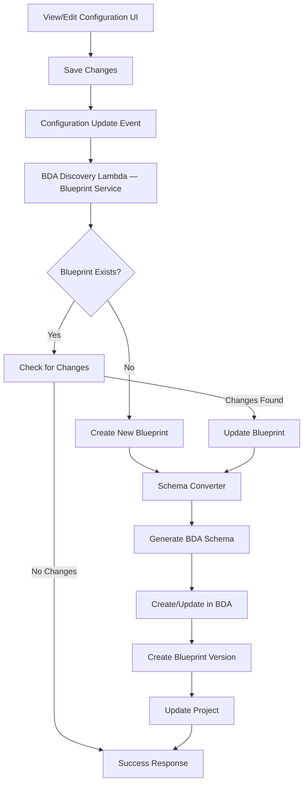
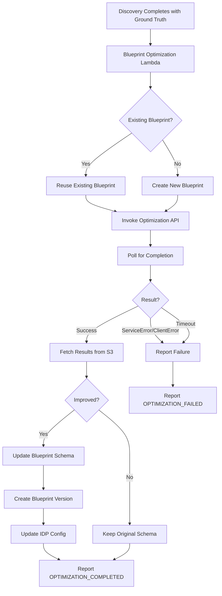
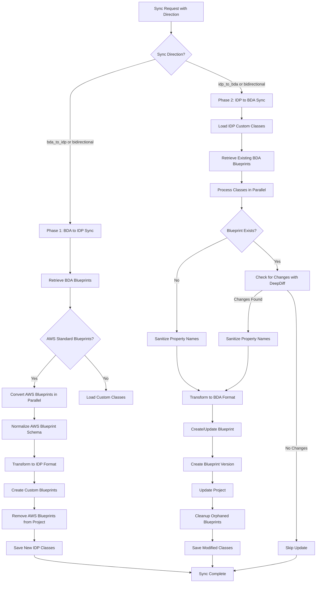

Copyright Amazon.com, Inc. or its affiliates. All Rights Reserved.
SPDX-License-Identifier: MIT-0

# Discovery Module

The Discovery module is an intelligent document analysis system that automatically identifies document structures, field types, and organizational patterns to generate document processing configurations. Discovery works identically in both processing modes of the [unified pattern](architecture.md) — **BDA mode** (`use_bda: true`) and **Pipeline mode** (`use_bda: false`). When BDA mode is active, discovery also automates BDA blueprint creation and management.

Demo video (4m)

https://github.com/user-attachments/assets/9c3923fb-f4ff-43cd-a563-44c7c6132921


## Table of Contents

- [Overview](#overview)
  - [What is Discovery](#what-is-discovery)
  - [Key Features](#key-features)
  - [Use Cases](#use-cases)
- [Architecture](#architecture)
  - [Core Components](#core-components)
  - [Processing Flow](#processing-flow)
  - [Integration Points](#integration-points)
- [Discovery Methods](#discovery-methods)
  - [Discovery Without Ground Truth](#discovery-without-ground-truth)
  - [Discovery With Ground Truth](#discovery-with-ground-truth)
  - [Multi-Section Package Discovery](#multi-section-package-discovery)
  - [Choosing the Right Method](#choosing-the-right-method)
- [Configuration](#configuration)
  - [Model Configuration](#model-configuration)
  - [Prompt Customization](#prompt-customization)
  - [Output Format Configuration](#output-format-configuration)
  - [Configuration Management](#configuration-management)
- [Using the Discovery Module](#using-the-discovery-module)
  - [Web UI Interface](#web-ui-interface)
  - [API Integration](#api-integration)
  - [Processing Results](#processing-results)
- [BDA Integration](#bda-integration)
  - [Automated Blueprint Creation](#automated-blueprint-creation)
  - [Intelligent Update Detection](#intelligent-update-detection)
  - [BDA Schema Conversion](#bda-schema-conversion)
  - [Blueprint Lifecycle Management](#blueprint-lifecycle-management)
  - [BdaIDP Sync Feature](#bdaidp-sync-feature)
- [Best Practices](#best-practices)
  - [Document Selection](#document-selection)
  - [Ground Truth Preparation](#ground-truth-preparation)
  - [Configuration Tuning](#configuration-tuning)
- [Troubleshooting](#troubleshooting)
  - [Common Issues](#common-issues)
  - [Error Handling](#error-handling)
- [Limitations](#limitations)
  - [Known Limitations](#known-limitations)


## Overview

### What is Discovery

The Discovery module analyzes document samples to automatically identify:

- **Document Structure**: Logical groupings of fields and sections
- **Field Types**: Data types (string, number, date, etc.) for each field
- **Field Descriptions**: Contextual information about field purpose and location
- **Document Classes**: Categorization and naming of document types
- **Organizational Patterns**: How fields are grouped and related

This analysis produces structured configuration templates that can be used to configure document processing workflows. The discovery process is the same regardless of whether you run in BDA mode or Pipeline mode — the only difference is that BDA mode adds automatic blueprint creation as a downstream step.

### Key Features

- **🤖 Automated Analysis**: Uses advanced LLMs to analyze document structure without manual intervention
- **📋 Configuration Generation**: Creates ready-to-use configuration templates for document processing
- **🎯 Ground Truth Support**: Leverages existing labeled data to improve discovery accuracy
- **📄 Multi-Section Discovery**: Discover multiple document classes from a single multi-page PDF package by defining page ranges
- **✨ AI Auto-Detect Sections**: Automatically identify document section boundaries using LLM analysis
- **🏷️ Class Name Hints**: Pre-label discovered classes from auto-detect or manual labels
- **🔧 Configurable Models**: Supports multiple Bedrock models with customizable parameters
- **📝 Custom Prompts**: Allows fine-tuning of analysis behavior through prompt engineering
- **🔄 Iterative Refinement**: Enables progressive improvement of document understanding
- **🌐 Multi-Format Support**: Handles PDF documents and various image formats
- **⚡ Real-Time Processing**: Provides immediate feedback through the web interface
- **📊 PDF Page Thumbnails**: Visual page preview with color-coded range highlighting in the browser
- **🔗 BDA Blueprint Automation**: Automatic BDA blueprint creation when running in BDA mode

### Use Cases

**New Document Type Onboarding:**
- Analyze sample documents to understand structure
- Generate initial processing configuration
- Reduce time-to-production for new document types

**Configuration Optimization:**
- Improve existing document processing accuracy
- Identify missing fields or incorrect field types
- Refine field descriptions and groupings

**Document Understanding:**
- Explore unknown document formats
- Understand complex document structures
- Document field relationships and dependencies

**Rapid Prototyping:**
- Quickly bootstrap new document processing workflows
- Test processing approaches with minimal setup
- Validate document processing concepts

## Architecture

### Core Components

**Discovery Processor Lambda (`src/lambda/discovery_processor/index.py`):**
- Handles discovery jobs from the SQS queue
- Orchestrates document analysis workflow using common services
- Consistent job status management and error reporting
- Triggers configuration updates (including BDA blueprint automation in BDA mode)

**Classes Discovery Service (`lib/idp_common_pkg/idp_common/discovery/classes_discovery.py`):**
- Core discovery engine for document analysis and structure identification
- LLM-powered document understanding with configurable Bedrock models
- Generates standardized document class definitions
- Supports both guided (ground truth) and unguided discovery methods

**Discovery Panel UI (`src/ui/src/components/discovery/DiscoveryPanel.jsx`):**
- Unified web interface for all discovery operations
- Real-time job status tracking via GraphQL subscriptions
- PDF page thumbnail rendering with color-coded range highlighting
- Configuration export and integration

**Discovery Tracking Table (DynamoDB):**
- Job status tracking and progress monitoring
- Metadata storage for job information
- Enables real-time UI updates via event coordination

**Configuration Table (DynamoDB):**
- Discovered classes are stored as "custom" configuration classes
- Shared across both BDA and Pipeline processing modes

**BDA Blueprint Automation (BDA mode only):**
- **BDA Discovery Function** (`patterns/unified/src/bda_discovery_function/index.py`): Processes configuration update events and manages BDA blueprints
- **BDA Blueprint Service** (`lib/idp_common_pkg/idp_common/bda/bda_blueprint_service.py`): Blueprint lifecycle management, schema conversion, and project synchronization
- **Schema Converter** (`lib/idp_common_pkg/idp_common/bda/schema_converter.py`): Transforms discovery results to BDA-compatible schemas

### Processing Flow



### Integration Points

**S3 Integration:**
- Document storage and retrieval
- Ground truth file processing
- Result artifact storage

**DynamoDB Integration:**
- Job tracking and status management
- Configuration storage and retrieval
- Metadata persistence

**Bedrock Integration:**
- LLM-powered document analysis
- Configurable model selection
- Prompt-based structure extraction

**GraphQL/AppSync Integration:**
- Real-time job status updates
- UI synchronization and notifications
- Configuration management APIs

## Discovery Methods

### Discovery Without Ground Truth

This method analyzes documents from scratch without any prior knowledge or labeled examples.

**How it Works:**
1. Document is processed through OCR or direct text extraction
2. LLM analyzes the document structure and content
3. Fields are identified based on visual layout and text patterns
4. Document class and description are generated automatically
5. Field groupings and relationships are determined

**Best For:**
- Completely new document types
- Exploratory analysis of unknown formats
- Initial document understanding
- Rapid prototyping scenarios

**Configuration Example:**
```yaml
discovery:
  without_ground_truth:
    model_id: "us.amazon.nova-pro-v1:0"
    temperature: 1.0
    top_p: 0.1
    max_tokens: 10000
    system_prompt: >-
      You are an expert in processing forms. Analyze forms line by line to identify 
      field names, data types, and organizational structure. Focus on creating 
      comprehensive blueprints for document processing without extracting actual values.
    user_prompt: >-
      This image contains forms data. Analyze the form line by line...
```

**Output Structure:**
```json
{
  "document_class": "W4-Form",
  "document_description": "Employee withholding allowance certificate",
  "groups": [
    {
      "name": "EmployeeInformation",
      "description": "Personal details of the employee",
      "attributeType": "group",
      "groupType": "normal",
      "groupAttributes": [
        {
          "name": "FirstName",
          "dataType": "string",
          "description": "Employee's first name from line 1"
        }
      ]
    }
  ]
}
```

### Discovery With Ground Truth

This method uses existing labeled data or known field definitions to optimize the discovery process.

**How it Works:**
1. Ground truth data is loaded from S3 (JSON format)
2. Document is analyzed with reference to expected fields
3. LLM matches document structure to ground truth patterns
4. Field descriptions and types are refined based on known data
5. Missing or additional fields are identified and documented

**Best For:**
- Improving existing configurations
- Leveraging known document structures
- Ensuring consistency with established patterns
- Optimizing field extraction accuracy

**Ground Truth Format:**
```json
{
  "document_class": "W4Form",
  "employee_name": "John Smith",
  "ssn": "123-45-6789",
  "address": "123 Main Street",
  "filing_status": "Single",
  "dependents": 0
}
```

**Configuration Example:**
```yaml
discovery:
  with_ground_truth:
    model_id: "us.amazon.nova-pro-v1:0"
    temperature: 1.0
    top_p: 0.1
    max_tokens: 10000
    system_prompt: >-
      You are an expert in processing forms. Use provided ground truth data as 
      reference to optimize field extraction and ensure consistency with expected 
      document structure and field definitions.
    user_prompt: >-
      This image contains unstructured data. Analyze the data line by line using 
      the provided ground truth as reference...
      <GROUND_TRUTH_REFERENCE>
      {ground_truth_json}
      </GROUND_TRUTH_REFERENCE>
```

### Multi-Section Package Discovery

For multi-page document packages (e.g., lending packages, insurance packets, healthcare bundles) that contain multiple different document types, the Discovery module supports discovering **multiple classes from a single PDF** by defining page ranges.

#### Discovery Modes

When a PDF file is selected, the UI presents two discovery modes:

- **Single Section Document**: Discovers one class from the entire document (with optional ground truth). This is the original behavior.
- **Multi-Section Package**: Define page ranges to discover multiple classes from different sections of the document. Each range creates a separate, independent discovery job.

#### Page Range Selection

In Multi-Section Package mode, the UI displays:

1. **PDF Page Thumbnails** — rendered in the browser using `pdfjs-dist`, showing a visual grid of all pages with color-coded highlighting for each defined range
2. **Page Range Inputs** — editable start/end page numbers for each range
3. **Document Type Labels** — optional text field per range for labeling the document type (e.g., "W2 Form", "Invoice"). When provided, the label is used as a class name hint for the discovery LLM.

#### AI Auto-Detect Sections

The **"✨ Auto-detect sections"** button uses an LLM to automatically identify document section boundaries:

1. The PDF is uploaded to S3
2. The `autoDetectSections` GraphQL mutation calls a Lambda that sends the full PDF to Bedrock
3. The LLM returns a JSON array of sections: `[{"start": 1, "end": 2, "type": "Letter"}, ...]`
4. Page ranges are auto-populated with the LLM's boundary detection, including type labels
5. User can review, adjust ranges, edit labels, then click "Start Discovery"

The auto-detect prompt is fully configurable via the Discovery Configuration in View/Edit Configuration (`discovery.auto_split` section).

#### Configuration

```yaml
discovery:
  auto_split:
    model_id: "us.amazon.nova-pro-v1:0"
    temperature: 0.0    # Low temperature for consistent boundary detection
    top_p: 0.1
    max_tokens: 4096
    system_prompt: >-
      You are an expert document analyst. Your task is to identify
      distinct document sections within a multi-page document package.
      Return only valid JSON.
    user_prompt: >-
      Analyze this multi-page document package. Identify the page boundaries
      where different document types or sections begin and end...
```

#### API Usage

```python
from idp_common.discovery.classes_discovery import ClassesDiscovery

discovery = ClassesDiscovery(
    input_bucket="my-bucket",
    input_prefix="lending_package.pdf",
    version="my-config-version"
)

# Auto-detect section boundaries
sections = discovery.auto_detect_sections(
    input_bucket="my-bucket",
    input_prefix="lending_package.pdf"
)
# Returns: [{"start": 1, "end": 2, "type": "Letter"}, {"start": 3, "end": 5, "type": "W2 Form"}, ...]

# Discover a specific page range with class name hint
result = discovery.discovery_classes_with_document(
    input_bucket="my-bucket",
    input_prefix="lending_package.pdf",
    page_range="3-5",
    class_name_hint="W2 Form"
)
```

#### How Page Extraction Works

When a `page_range` is specified for a PDF, the system uses `pypdfium2` to extract only the specified pages into a new sub-PDF before sending to the Bedrock LLM. This means:
- The LLM only sees the relevant pages, improving accuracy
- Each page range job is independent and can run in parallel
- The original document is never modified

### Choosing the Right Method

| Factor | Without Ground Truth | With Ground Truth |
|--------|---------------------|-------------------|
| **Use Case** | New document exploration | Configuration optimization |
| **Accuracy** | Good for structure discovery | Higher accuracy for known patterns |
| **Speed** | Fast, single-pass analysis | Optimized based on reference data |
| **Consistency** | May vary between runs | Consistent with reference patterns |
| **Setup Effort** | Minimal - just upload document | Requires ground truth preparation |
| **Best For** | Unknown document types | Improving existing workflows |

## Configuration

The Discovery module supports comprehensive configuration through the deployment template and configuration files. All settings can be customized through the web UI's View/Edit Configuration panel or configuration files.

### Model Configuration

**Supported Models:**
- `us.amazon.nova-lite-v1:0` - Fast, cost-effective for simple documents
- `us.amazon.nova-pro-v1:0` - Balanced performance and accuracy (recommended)
- `us.amazon.nova-premier-v1:0` - Highest accuracy for complex documents
- `us.anthropic.claude-3-haiku-20240307-v1:0` - Fast processing
- `us.anthropic.claude-3-5-sonnet-20241022-v2:0` - High accuracy
- `us.anthropic.claude-3-7-sonnet-20250219-v1:0` - Latest capabilities

**Model Parameters:**
```yaml
discovery:
  without_ground_truth:
    model_id: "us.amazon.nova-pro-v1:0"
    temperature: 1.0        # Creativity level (0.0-1.0)
    top_p: 0.1             # Nucleus sampling (0.0-1.0)
    max_tokens: 10000      # Maximum response length
```

**Parameter Guidelines:**
- **Temperature**: Use 1.0 for creative structure discovery, 0.0 for consistent results
- **Top P**: Lower values (0.1) for focused analysis, higher for diverse interpretations
- **Max Tokens**: 10000+ recommended for complex documents with many fields

### Prompt Customization

**System Prompt Configuration:**
```yaml
discovery:
  without_ground_truth:
    system_prompt: >-
      You are an expert in processing forms. Extracting data from images and documents. 
      Analyze forms line by line to identify field names, data types, and organizational 
      structure. Focus on creating comprehensive blueprints for document processing 
      without extracting actual values.
```

**User Prompt Configuration:**
```yaml
discovery:
  without_ground_truth:
    user_prompt: >-
      This image contains forms data. Analyze the form line by line.
      Image may contains multiple pages, process all the pages. 
      Form may contain multiple name value pair in one line. 
      Extract all the names in the form including the name value pair which doesn't have value. 
      Organize them into groups, extract field_name, data_type and field description.
      Field_name should be less than 60 characters, should not have space use '-' instead of space.
      field_description is a brief description of the field and the location of the field 
      like box number or line number in the form and section of the form.
      Field_name should be unique within the group.
      Add two fields document_class and document_description. 
      For document_class generate a short name based on the document content like W4, I-9, Paystub. 
      For document_description generate a description about the document in less than 50 words. 
      Group the fields based on the section they are grouped in the form. 
      Group should have attributeType as "group".
      If the group repeats, add an additional field groupType and set the value as "Table".
      Do not extract the values.
      Return the extracted data in JSON format.
```

**Ground Truth Prompt Features:**
- **Placeholder Support**: Use `{ground_truth_json}` for dynamic ground truth injection
- **Reference Integration**: Automatically includes ground truth data in analysis context
- **Consistency Enforcement**: Ensures field names and types match reference patterns

### Output Format Configuration

**Sample JSON Structure:**
```yaml
discovery:
  output_format:
    sample_json: >-
      {
        "document_class": "Form-1040",
        "document_description": "Brief summary of the document",
        "groups": [
          {
            "name": "PersonalInformation",
            "description": "Personal information of Tax payer",
            "attributeType": "group",
            "groupType": "normal",
            "groupAttributes": [
              {
                "name": "FirstName",
                "dataType": "string",
                "description": "First Name of Taxpayer"
              },
              {
                "name": "Age",
                "dataType": "number",
                "description": "Age of Taxpayer"
              }
            ]
          }
        ]
      }
```

**Field Types Supported:**
- `string` - Text fields, names, addresses
- `number` - Numeric values, amounts, quantities
- `date` - Date fields in various formats
- `boolean` - Yes/no, checkbox fields
- `array` - Lists or repeated elements

**Group Types:**
- `normal` - Standard field groupings
- `List` - Repeating tabular data structures

### Configuration Management

**Schema Definition:**

The Discovery configuration is defined in the CloudFormation template with comprehensive UI schema support:

```yaml
UpdateSchemaConfig:
  Type: AWS::CloudFormation::CustomResource
  Properties:
    ServiceToken: !Ref UpdateConfigurationFunctionArn
    Schema:
      type: object
      properties:
        discovery:
          order: 5
          type: object
          sectionLabel: Discovery Configuration
          description: Configuration for document class discovery functionality
          properties:
            without_ground_truth:
              order: 0
              type: object
              sectionLabel: Discovery Without Ground Truth
              # ... detailed field definitions
```

**UI Integration Features:**
- **Dropdown Model Selection**: Predefined list of supported Bedrock models
- **Range Validation**: Temperature, top_p with proper min/max values
- **Textarea Prompts**: Multi-line editing for system and user prompts
- **Real-time Validation**: Immediate feedback on configuration changes
- **Help Text**: Contextual descriptions for each configuration option

**Default Settings:**
```yaml
discovery:
  without_ground_truth:
    model_id: "us.amazon.nova-pro-v1:0"
    temperature: 1.0
    top_p: 0.1
    max_tokens: 10000
    system_prompt: "You are an expert in processing forms..."
    user_prompt: "This image contains forms data..."
  with_ground_truth:
    model_id: "us.amazon.nova-pro-v1:0"
    temperature: 1.0
    top_p: 0.1
    max_tokens: 10000
    system_prompt: "You are an expert in processing forms..."
    user_prompt: "This image contains unstructured data..."
  output_format:
    sample_json: "{...}"
```

**Configuration Loading Priority:**
1. Custom configuration from DynamoDB (if available)
2. Mode-specific system defaults (`pattern-1.yaml` for BDA mode, `pattern-2.yaml` for Pipeline mode)
3. Built-in default configuration
4. Environment variable fallbacks

**Customization Options:**

- **Model Selection**: Choose models based on document complexity and processing requirements. Balance accuracy vs. cost vs. speed. Consider context window limits for large documents.
- **Prompt Engineering**: Customize system prompts for domain-specific terminology. Adjust user prompts for specific document layouts. Include examples or constraints in prompts.
- **Parameter Tuning**: Adjust temperature for consistency vs. creativity. Modify top_p for focused vs. diverse analysis. Set appropriate max_tokens for document complexity.
- **Output Customization**: Define custom field naming conventions. Specify required field types and formats. Configure grouping and organizational patterns.

## Using the Discovery Module

### Web UI Interface

**Accessing Discovery:**
1. Navigate to the main application dashboard
2. Click on the "Discovery" tab or panel
3. Select a **Configuration Version** to save discovered classes to
4. Upload a document file (PDF, PNG, JPG, TIFF)
5. For PDFs, choose a **Discovery Mode**:
   - **Single Section Document** — discovers one class from the whole document; optionally upload a ground truth JSON file
   - **Multi-Section Package** — define page ranges (manually or via ✨ Auto-detect) to discover multiple classes
6. Click **"Start Discovery"** (or "Start Discovery (N sections)" for multi-section)
7. Monitor progress in real-time in the Discovery Jobs table below

**Monitoring Progress:**
- Real-time progress messages via GraphQL subscriptions (e.g., "Analyzing document structure with AI...", "Saving to configuration...")
- Live elapsed time counter for active jobs
- Discovered document class name shown as a green badge on success (e.g., `W4-Form`)
- Failure root cause displayed in expandable error details with user-friendly messages
- Search/filter bar to find jobs by document name, config version, status, or class name
- Time range selector (Last hour, 24 hours, 2 days, 7 days, All time)
- Pagination with configurable page size
- Resizable columns and column visibility preferences (settings gear icon)
- Multi-select with delete capability to clean up old jobs

**Reviewing Results:**
- Discovered class name prominently displayed as a badge in the Result column
- Config Version hyperlinked to the configuration editor
- Original document filename displayed (timestamp prefix stripped)
- Duration column showing total processing time
- Export options for configuration integration
- Comparison with existing configurations

### API Integration

**GraphQL Mutations:**
```graphql
mutation StartDiscoveryJob($input: DiscoveryJobInput!) {
  startDiscoveryJob(input: $input) {
    jobId
    status
    message
  }
}
```

**Job Status Subscription:**
```graphql
subscription OnDiscoveryJobStatusChange($jobId: ID!) {
  onDiscoveryJobStatusChange(jobId: $jobId) {
    jobId
    status
    progress
    errorMessage
    result
  }
}
```

**Direct API Usage:**
```python
from idp_common.discovery.classes_discovery import ClassesDiscovery

# Initialize with configuration
discovery = ClassesDiscovery(
    input_bucket="my-documents",
    input_prefix="sample-form.pdf",
    config=my_discovery_config,
    region="us-west-2"
)

# Run discovery without ground truth
result = discovery.discovery_classes_with_document(
    input_bucket="my-documents",
    input_prefix="sample-form.pdf"
)

# Run discovery with ground truth
result = discovery.discovery_classes_with_document_and_ground_truth(
    input_bucket="my-documents",
    input_prefix="sample-form.pdf",
    ground_truth_key="ground-truth.json"
)
```

### Processing Results

**Result Structure:**
```json
{
  "status": "SUCCESS",
  "jobId": "discovery-job-12345",
  "message": "Discovery completed successfully",
  "configuration": {
    "document_class": "W4Form",
    "document_description": "Employee withholding certificate",
    "groups": [...],
    "metadata": {
      "processing_time": "45.2s",
      "model_used": "us.amazon.nova-pro-v1:0",
      "confidence_score": 0.92
    }
  }
}
```

**Integration Options:**
- **Direct Configuration Update**: Automatically update existing configuration
- **Export for Review**: Download configuration for manual review and editing
- **Merge with Existing**: Combine with current document class definitions
- **Create New Class**: Add as new document type to existing configuration

## BDA Integration

When running in **BDA mode** (`use_bda: true`), discovery provides additional automation for BDA blueprint management. This section covers BDA-specific features that are not active in Pipeline mode.

### Automated Blueprint Creation

When discovery completes in BDA mode, the system automatically:

1. **Analyzes Discovery Results**: Processes the discovery output
2. **Converts to BDA Schema**: Transforms field definitions to BDA-compatible format
3. **Creates/Updates Blueprints**: Manages blueprint lifecycle in the BDA project
4. **Versions Blueprints**: Automatically creates new versions when changes are detected
5. **Integrates with Project**: Ensures blueprints are available for document processing

**Blueprint Naming Convention:**
```
{StackName}-{DocumentClass}-{UniqueId}
Example: IDP-W4Form-a1b2c3d4
```

**BDA Blueprint Automation Flow:**


### Intelligent Update Detection

The system only updates blueprints when actual changes are detected:

**Change Detection Logic:**
- **Document Class Changes**: Name or description modifications
- **Field Changes**: New fields, modified descriptions, or data type changes
- **Group Changes**: Structural changes in field organization
- **Schema Changes**: Any modification that affects BDA blueprint structure

**Update Process:**
```python
# Example of intelligent update detection
if blueprint_exists:
    if self._check_for_updates(custom_class, existing_blueprint):
        # Update existing blueprint
        self.blueprint_creator.update_blueprint(
            blueprint_arn=blueprint_arn,
            stage="LIVE",
            schema=json.dumps(blueprint_schema)
        )
        # Create new version
        self.blueprint_creator.create_blueprint_version(
            blueprint_arn=blueprint_arn,
            project_arn=self.dataAutomationProjectArn
        )
    else:
        logger.info("No updates needed - blueprint unchanged")
```

### BDA Schema Conversion

**Field Type Mapping:**
Discovery field types are automatically converted to BDA-compatible formats:

| Discovery Type | BDA Schema Type | Description |
|----------------|-----------------|-------------|
| `string` | `string` | Text fields, names, addresses |
| `number` | `number` | Numeric values, amounts |
| `date` | `string` with date format | Date fields with validation |
| `boolean` | `boolean` | Yes/no, checkbox fields |
| `array` | `array` | Lists or repeated elements |

**Group Conversion:**
- **Normal Groups**: Converted to BDA object definitions
- **Table Groups**: Converted to BDA array structures with item templates
- **Nested Groups**: Supported through BDA schema references

**Example Schema Conversion:**
```json
// Discovery Result
{
  "name": "W4Form",
  "description": "Employee withholding certificate",
  "groups": [
    {
      "name": "PersonalInfo",
      "groupAttributes": [
        {
          "name": "FirstName",
          "dataType": "string",
          "description": "Employee first name from line 1"
        }
      ]
    }
  ]
}

// Generated BDA Schema
{
  "class": "W4Form",
  "description": "Employee withholding certificate",
  "definitions": {
    "PersonalInfo": {
      "type": "object",
      "properties": {
        "first-name": {
          "type": "string",
          "instruction": "Employee first name from line 1"
        }
      }
    }
  }
}
```

### Blueprint Lifecycle Management

**Creation Workflow:**
1. **Discovery Completion**: Discovery results are generated and saved to the configuration table
2. **Configuration Event**: BDA Discovery Function receives a configuration update event
3. **Blueprint Service**: Processes configuration and manages blueprint lifecycle
4. **Schema Generation**: Converts discovery results to BDA schema format
5. **Blueprint Creation**: Creates new blueprint in BDA service
6. **Project Integration**: Associates blueprint with BDA project
7. **Version Management**: Creates initial blueprint version

**Update Workflow:**
1. **Change Detection**: Compares new discovery results with existing blueprint
2. **Schema Update**: Generates updated BDA schema if changes detected
3. **Blueprint Update**: Updates existing blueprint with new schema
4. **Version Creation**: Creates new blueprint version
5. **Project Sync**: Ensures project references latest version

**Project Association:**
- Blueprints are automatically associated with the configured BDA project
- Project ARN is specified during stack deployment
- Multiple document classes can share the same BDA project
- Projects always reference the latest blueprint version

**Required Permissions:**
```yaml
BDABlueprintPermissions:
  - bedrock:CreateBlueprint
  - bedrock:UpdateBlueprint
  - bedrock:CreateBlueprintVersion
  - bedrock:ListBlueprints
  - bedrock:GetBlueprint
  - bedrock:DeleteBlueprint
  - bedrock:InvokeBlueprintOptimizationAsync
  - bedrock:GetBlueprintOptimizationStatus
```

**Monitoring:**
- Blueprint creation/update activities are logged to CloudWatch
- Schema conversion details are captured
- Error conditions are clearly documented

### Blueprint Optimization

The Blueprint Optimization feature uses the BDA `InvokeBlueprintOptimizationAsync` API to automatically improve extraction accuracy for discovered document classes. When a discovery job includes a ground truth file, the system can optimize the BDA blueprint by comparing extraction results against the ground truth and refining the blueprint schema.

#### How It Works

1. **Blueprint Lookup**: The optimizer checks if a blueprint already exists for the discovered class in the BDA project. If found, it reuses the existing blueprint; otherwise, it creates a new one following the standard naming convention (`{StackName}-{ClassName}-{hash}`).
2. **S3 Asset Preparation**: The sample document (PDF) and ground truth (JSON) S3 URIs are constructed from the discovery bucket.
3. **Optimization Invocation**: The `InvokeBlueprintOptimizationAsync` API is called with the blueprint ARN, sample document, ground truth, and an output S3 prefix.
4. **Status Polling**: The system polls `GetBlueprintOptimizationStatus` with exponential backoff (5s initial, 30s max, 15-minute timeout) until a terminal state is reached.
5. **Results Evaluation**: The optimization results (stored at `{outputPrefix}/optimization_results.json`) contain before/after metrics. The system compares `exactMatch` and `f1` scores.
6. **Schema Application**: If the optimized schema shows improvement, the blueprint is updated with the new schema, a new version is created, and the IDP class configuration is updated.

#### Optimization Flow



#### UI Status Display

The Discovery Panel shows optimization progress with dedicated status indicators:

| Status | UI Label | Description |
|--------|----------|-------------|
| `OPTIMIZATION_IN_PROGRESS` | Optimizing | Optimization is running (blueprint creation, API invocation, polling) |
| `OPTIMIZATION_COMPLETED` | Optimized | Optimization finished (improved or no improvement) |
| `OPTIMIZATION_FAILED` | Optimization Failed | Optimization encountered an error |

The Result column shows additional context:
- **Improved**: Class name badge + accuracy improvement message (e.g., "exactMatch: 0.78 → 0.91")
- **No improvement**: Message indicating original schema was kept
- **Failed**: Expandable error details

#### Components

- **`BlueprintOptimizer`** (`lib/idp_common_pkg/idp_common/bda/blueprint_optimizer.py`): Core orchestrator — manages the full optimization lifecycle including blueprint lookup/creation, API invocation, polling, evaluation, and schema application.
- **`blueprint_optimization` Lambda** (`src/lambda/blueprint_optimization/index.py`): Async Lambda handler invoked by the discovery processor. Manages AppSync status updates and error reporting.
- **`OptimizationResult`**: Dataclass returned by the optimizer with status, metrics, blueprint ARN, and optionally the optimized schema.

#### Configuration

Blueprint optimization is disabled by default. To enable it, set both `use_bda: true` and `enable_blueprint_optimization: true` in your configuration version via the View/Edit Configuration UI or directly in the config YAML:

```yaml
use_bda: true
enable_blueprint_optimization: true
```

When enabled, the optimizer uses:
- The same BDA project as the main blueprint service (per configuration version)
- The same blueprint naming convention (`{StackName}-{ClassName}-{hash}`)
- The discovery bucket for S3 input/output URIs
- The `bedrock-data-automation` client with `boto3>=1.42.0` (bundled in the Lambda function's `requirements.txt`)

#### IAM Permissions

The Blueprint Optimization Lambda requires these additional Bedrock permissions (configured in `template.yaml`):

```yaml
- bedrock:InvokeBlueprintOptimizationAsync
- bedrock:GetBlueprintOptimizationStatus
```

Resource ARN patterns:
```yaml
- arn:${AWS::Partition}:bedrock:${AWS::Region}:${AWS::AccountId}:blueprint/*
- arn:${AWS::Partition}:bedrock:${AWS::Region}:${AWS::AccountId}:blueprint-optimization-invocation/*
```

#### Retry and Error Handling

- **S3 Eventual Consistency**: The optimization results file may not be immediately available after the API reports success. The system retries up to 5 times with 2-second delays.
- **Polling Timeout**: If optimization doesn't complete within 15 minutes, the result is `TIMED_OUT`.
- **API Errors**: `ServiceError` and `ClientError` from the BDA API are captured and reported as `OPTIMIZATION_FAILED`.
- **Blueprint Not Found**: If the blueprint stage doesn't match (must be `LIVE`), the API returns `ResourceNotFoundException`.

### BdaIDP Sync Feature

The BdaIDP Sync feature provides bidirectional synchronization between BDA (Bedrock Data Automation) blueprints and IDP custom classes. This feature enables seamless integration between BDA's blueprint management system and IDP's document class configuration, with support for AWS Standard blueprints, optimized parallel processing, and configurable **Replace** or **Merge** sync modes.


https://github.com/user-attachments/assets/6016614d-e582-4956-8c39-c189a52f63c6


#### How BdaIDP Sync Works

The sync feature operates through the `sync_bda_idp_resolver` Lambda function, which orchestrates the synchronization process:

1. **Flexible Sync Directions**: Supports three synchronization directions:
   - `bidirectional`: Syncs both directions (default, backward compatible)
   - `bda_to_idp`: Syncs from BDA blueprints to IDP classes only
   - `idp_to_bda`: Syncs from IDP classes to BDA blueprints only
2. **Configurable Sync Modes**: Each direction supports two modes:
   - `replace` (default): Full replacement — target is aligned to match source exactly. Items not in the source are removed.
   - `merge`: Additive — source items are added to the target without removing existing items.
3. **AWS Standard Blueprint Support**: Automatically converts AWS-managed blueprints to custom blueprints
4. **Schema Transformation**: Converts between IDP JSON Schema format and BDA blueprint format
5. **Change Detection**: Only updates when actual schema changes are detected
6. **Cleanup Management**: Removes orphaned blueprints that no longer have corresponding IDP classes (replace mode only)
7. **Parallel Processing**: Uses multi-threading for improved performance with configurable worker count

#### Sync Process Flow



#### Key Sync Features

**🔄 Flexible Sync Directions**
- **Bidirectional** (default): Full two-way synchronization between BDA and IDP
- **BDA to IDP**: One-way sync from BDA blueprints to IDP classes
- **IDP to BDA**: One-way sync from IDP classes to BDA blueprints
- Configurable via `sync_direction` parameter in API calls

**🎯 Intelligent Change Detection**
- Uses DeepDiff library to compare schemas and detect actual changes
- Only triggers updates when meaningful differences are found
- Prevents unnecessary blueprint versions and API calls
- Compares transformed schemas to ensure accurate change detection

**🧹 Automatic Cleanup**
- Removes BDA blueprints that no longer have corresponding IDP classes
- Maintains clean blueprint inventory in BDA projects
- Prevents accumulation of obsolete blueprints
- Only runs during `idp_to_bda` or `bidirectional` sync

**📋 Schema Transformation**
- Converts IDP JSON Schema (draft 2020-12) to BDA blueprint format (draft-07)
- Handles field type mapping and structural differences
- Preserves semantic meaning across format conversions
- Bidirectional transformation support for both sync directions

**🏢 AWS Standard Blueprint Management**
- Automatically detects AWS-managed blueprints in BDA projects
- Converts AWS Standard blueprints to custom blueprints
- Normalizes AWS blueprint schemas to fix common issues
- Creates corresponding IDP classes for AWS blueprints
- Removes AWS blueprints from project after conversion

**⚡ Parallel Processing**
- Multi-threaded processing for improved performance
- Configurable worker count via `BDA_SYNC_MAX_WORKERS` environment variable (default: 5)
- Parallel blueprint creation and updates
- Parallel AWS blueprint conversion
- Thread-safe operations with proper locking mechanisms

**🔧 Property Name Sanitization**
- Automatically removes special characters from property names
- Ensures BDA compatibility by sanitizing field names
- Maintains mapping of original to sanitized names
- Prevents blueprint creation failures due to invalid characters

#### Sync Direction Configuration

The sync direction can be specified when calling the sync operation:

**GraphQL API:**
```graphql
mutation SyncBdaIdp {
  syncBdaIdp(direction: "bidirectional") {
    success
    message
    processedClasses
    direction
  }
}
```

**Python API:**
```python
from idp_common.bda.bda_blueprint_service import BdaBlueprintService

# Initialize service
service = BdaBlueprintService(
    dataAutomationProjectArn="arn:aws:bedrock:us-west-2:123456789012:project/my-project"
)

# Bidirectional sync (default)
result = service.create_blueprints_from_custom_configuration(
    sync_direction="bidirectional"
)

# BDA to IDP only (replace mode - removes IDP classes not in BDA)
result = service.create_blueprints_from_custom_configuration(
    sync_direction="bda_to_idp", sync_mode="replace"
)

# BDA to IDP only (merge mode - adds BDA classes, keeps existing IDP classes)
result = service.create_blueprints_from_custom_configuration(
    sync_direction="bda_to_idp", sync_mode="merge"
)

# IDP to BDA only (replace mode - removes BDA blueprints not in IDP)
result = service.create_blueprints_from_custom_configuration(
    sync_direction="idp_to_bda", sync_mode="replace"
)

# IDP to BDA only (merge mode - adds IDP classes to BDA, keeps BDA-only blueprints)
result = service.create_blueprints_from_custom_configuration(
    sync_direction="idp_to_bda", sync_mode="merge"
)
```

**Sync Mode Behavior:**

| Direction | Mode | Behavior |
|-----------|------|----------|
| `bda_to_idp` | `replace` (default) | IDP classes are replaced with BDA blueprints. Classes not in BDA are removed. |
| `bda_to_idp` | `merge` | BDA blueprints are added to IDP. Existing IDP classes are kept. |
| `idp_to_bda` | `replace` (default) | BDA blueprints are replaced with IDP classes. Orphaned blueprints are deleted. |
| `idp_to_bda` | `merge` | IDP classes are pushed to BDA. Existing BDA-only blueprints are kept. |

**Environment Configuration:**
```bash
# Configure maximum parallel workers (default: 5)
BDA_SYNC_MAX_WORKERS=10
```

#### AWS Standard Blueprint Conversion

The sync feature includes automatic conversion of AWS Standard blueprints to custom blueprints:

**Conversion Process:**
1. **Detection**: Identifies AWS-managed blueprints (containing `aws:blueprint` in ARN)
2. **Normalization**: Fixes common issues in AWS blueprint schemas:
   - Adds missing `$schema` field (draft-07)
   - Adds missing `type` fields to root and definitions
   - Adds missing `instruction` fields to `$ref` properties
   - Fixes array items with BDA-specific fields
   - Fixes double-escaped quotes in instruction strings
3. **Transformation**: Converts normalized BDA schema to IDP class format
4. **Blueprint Creation**: Creates new custom blueprint from transformed schema
5. **Project Update**: Removes AWS blueprint and adds custom blueprint to project
6. **Configuration Save**: Saves new IDP class to configuration table

**Schema Normalization Examples:**

```python
# Before normalization (AWS blueprint)
{
  "definitions": {
    "Address": {
      "properties": {
        "street": {
          "$ref": "#/definitions/Street"
          # Missing instruction field
        },
        "items": {
          "type": "array",
          "items": {
            "type": "string",
            "inferenceType": "explicit",  # Should not be in items
            "instruction": "Item description"
          }
        }
      }
    }
  }
}

# After normalization
{
  "$schema": "http://json-schema.org/draft-07/schema#",  # Added
  "type": "object",  # Added
  "definitions": {
    "Address": {
      "type": "object",  # Added
      "properties": {
        "street": {
          "$ref": "#/definitions/Street",
          "instruction": "-"  # Added
        },
        "items": {
          "type": "array",
          "instruction": "-",  # Added
          "inferenceType": "explicit",  # Moved to array level
          "items": {
            "type": "string"  # Cleaned up
          }
        }
      }
    }
  }
}
```

**Parallel Conversion:**
- AWS blueprints are converted in parallel using ThreadPoolExecutor
- Configurable worker count (default: min(3, BDA_SYNC_MAX_WORKERS))
- Thread-safe operations with proper locking
- Skips blueprints that already have corresponding IDP classes

#### Limitations and Constraints

##### BDA Schema Limitations

**Nested Objects Not Supported:**
BDA currently has limitations with complex nested structures that affect sync operations:

```json
// ❌ NOT SUPPORTED: Nested objects within objects
{
  "employee": {
    "type": "object",
    "properties": {
      "personalInfo": {
        "type": "object",
        "properties": {
          "name": {"type": "string"},
          "address": {"type": "string"}
        }
      }
    }
  }
}

// ✅ SUPPORTED: Flat object structure
{
  "employee": {
    "type": "object",
    "properties": {
      "name": {"type": "string"},
      "address": {"type": "string"},
      "department": {"type": "string"}
    }
  }
}
```

**Nested Arrays Not Supported:**
Arrays within object definitions are not supported by BDA:

```json
// ❌ NOT SUPPORTED: Arrays within object definitions
{
  "Employee": {
    "type": "object",
    "properties": {
      "shifts": {
        "type": "array",
        "items": {"$ref": "#/$defs/Shift"}
      }
    }
  }
}

// ✅ SUPPORTED: Top-level arrays
{
  "employees": {
    "type": "array",
    "items": {"$ref": "#/$defs/Employee"}
  }
}
```

##### AWS Standard Blueprint Handling

- AWS-provided blueprints (identifiable by `aws:blueprint` in ARN) are read-only
- During `bda_to_idp` or `bidirectional` sync, AWS blueprints are automatically converted to custom blueprints, transformed into IDP classes, and removed from the BDA project after successful conversion
- Conversion only occurs if no corresponding IDP class exists
- Failed conversions are logged but don't stop the sync process

#### Sync Performance

**Multi-Threading Configuration:**

```python
# Configure in environment
BDA_SYNC_MAX_WORKERS=10  # Default: 5

# Processing breakdown:
# - IDP to BDA sync: Uses max_workers threads
# - AWS blueprint conversion: Uses min(3, max_workers) threads
# - Thread-safe operations with locking mechanisms
```

**Performance Characteristics:**

| Operation | Processing Mode | Default Workers | Typical Time |
|-----------|----------------|-----------------|--------------|
| IDP to BDA Sync | Parallel | 5 | 2-5s per class |
| AWS Blueprint Conversion | Parallel | 3 | 3-7s per blueprint |
| Change Detection | Sequential | N/A | <1s per class |
| Schema Transformation | Sequential | N/A | <1s per class |

**Optimization Tips:**
- Increase `BDA_SYNC_MAX_WORKERS` for large numbers of classes (10-20 recommended)
- Monitor CloudWatch logs for thread execution times
- Consider sync direction to avoid unnecessary operations
- Use `idp_to_bda` when only updating blueprints from IDP changes
- Use `bda_to_idp` when only importing AWS blueprints or BDA changes

#### Best Practices for Sync

**1. Choose Appropriate Sync Direction:**
```python
# After modifying IDP classes in UI
service.create_blueprints_from_custom_configuration(
    sync_direction="idp_to_bda"  # Only update BDA blueprints
)

# After adding AWS Standard blueprints to BDA project
service.create_blueprints_from_custom_configuration(
    sync_direction="bda_to_idp"  # Only import to IDP
)

# For complete synchronization
service.create_blueprints_from_custom_configuration(
    sync_direction="bidirectional"  # Full two-way sync
)
```

**2. Use Simplified IDP Schemas:**

Flatten complex structures — avoid nested objects and place arrays at the top level only:

```json
{
  "properties": {
    "employees": {
      "type": "array",
      "description": "List of employees",
      "items": {"$ref": "#/$defs/Employee"}
    }
  },
  "$defs": {
    "Employee": {
      "type": "object",
      "properties": {
        "name": {"type": "string"},
        "id": {"type": "string"}
      }
    }
  }
}
```

**3. Pre-Sync Validation Checklist:**
- ✅ No nested objects within object definitions
- ✅ No arrays within object definitions  
- ✅ All array properties have description or instruction fields
- ✅ Field names follow BDA naming conventions (no special characters like &, /)
- ✅ Schema uses supported data types (string, number, boolean)
- ✅ Property names are less than 60 characters
- ✅ No double-escaped quotes in instruction strings

**4. Schema Design — Recommended Pattern:**
```json
{
  "$schema": "https://json-schema.org/draft/2020-12/schema",
  "$id": "SimpleInvoice",
  "type": "object",
  "description": "Simple invoice document",
  "properties": {
    "invoiceNumber": {
      "type": "string",
      "description": "Invoice number"
    },
    "invoiceDate": {
      "type": "string", 
      "description": "Invoice date"
    },
    "lineItems": {
      "type": "array",
      "description": "Invoice line items",
      "items": {"$ref": "#/$defs/LineItem"}
    }
  },
  "$defs": {
    "LineItem": {
      "type": "object",
      "properties": {
        "description": {"type": "string", "description": "Item description"},
        "quantity": {"type": "number", "description": "Item quantity"},
        "unitPrice": {"type": "number", "description": "Unit price"},
        "totalPrice": {"type": "number", "description": "Total price"}
      }
    }
  }
}
```

#### Troubleshooting Sync Issues

**Common Error Patterns:**

| Error | Cause | Solution |
|-------|-------|----------|
| `Skipping nested object property 'personalInfo'` | Nested objects not supported by BDA | Flatten the object structure into individual fields |
| `Array property missing required 'instruction' field` | Missing metadata | Handled automatically (defaults to "-") |
| `BDA schema validation failed` | Invalid schema format | Ensure schema follows BDA draft-07 requirements |
| `Property name contains invalid characters` | Special characters in names | Automatically sanitized; check logs for name mapping |
| `Failed to normalize AWS blueprint schema` | Unsupported AWS blueprint structures | Check AWS blueprint format; may need manual intervention |
| `Thread execution error during parallel processing` | Parallel processing failure | Check CloudWatch logs; consider reducing `BDA_SYNC_MAX_WORKERS` |

**Debugging Steps:**

1. **Check CloudWatch Logs**: Review `sync_bda_idp_resolver` and `BdaBlueprintService` logs for detailed error messages, thread execution logs, and property name sanitization mappings.
2. **Validate Schema Structure**: Use JSON Schema validators; look for nested objects/arrays in definitions; check for special characters in property names.
3. **Test with Simplified Schema**: Start with a minimal test schema, verify sync works, then gradually add complexity.
4. **Verify Sync Direction**: Confirm the correct direction for your use case; test each direction independently if issues occur.

## Best Practices

### Document Selection

**Choose Representative Samples:**
- Select documents that represent typical variations
- Include both simple and complex examples
- Ensure all important sections are represented
- Use high-quality, clear document images

**Document Quality Guidelines:**
- **Resolution**: Minimum 150 DPI for text clarity
- **Format**: PDF preferred, high-quality images acceptable
- **Completeness**: Include all pages of multi-page documents
- **Legibility**: Ensure text is readable and not corrupted

**Sample Size Recommendations:**
- **Single Document**: Good for initial exploration
- **2-3 Documents**: Better for understanding variations
- **5+ Documents**: Optimal for comprehensive analysis
- **Different Layouts**: Include various form versions if available

### Ground Truth Preparation

**JSON Format Requirements:**
```json
{
  "document_class": "FormName",
  "field_name_1": "expected_value_1",
  "field_name_2": "expected_value_2",
  "nested_object": {
    "sub_field": "sub_value"
  },
  "array_field": ["item1", "item2"]
}
```

**Best Practices:**
- **Field Names**: Use descriptive, consistent naming conventions
- **Data Types**: Include examples of all expected data types
- **Completeness**: Cover all important fields in the document
- **Accuracy**: Ensure ground truth data is correct and validated
- **Structure**: Reflect the logical organization of document fields

**Ground Truth Sources:**
- Existing database schemas or data models
- Manual annotation of sample documents
- Previous extraction results (validated)
- Domain expert knowledge and requirements

### Configuration Tuning

**Model Selection Guidelines:**
- **Nova Lite**: Simple forms with clear structure
- **Nova Pro**: Most document types (recommended default)
- **Nova Premier**: Complex layouts, handwritten content
- **Claude Models**: Alternative for specific use cases

**Parameter Optimization:**
```yaml
# For consistent, structured output
discovery:
  without_ground_truth:
    temperature: 0.0    # Low creativity
    top_p: 0.1         # Focused sampling
    
# For creative structure discovery
discovery:
  without_ground_truth:
    temperature: 1.0    # High creativity
    top_p: 0.3         # Diverse sampling
```

**Prompt Engineering Tips:**
- **Be Specific**: Clearly define expected field types and formats
- **Include Examples**: Show desired output structure in prompts
- **Set Constraints**: Specify field naming conventions and limitations
- **Domain Context**: Include relevant domain knowledge and terminology

**Iterative Improvement:**
1. Start with default configuration
2. Run discovery on sample documents
3. Review and validate results
4. Adjust prompts and parameters based on findings
5. Re-run discovery to validate improvements
6. Repeat until satisfactory results are achieved

## Troubleshooting

### Common Issues

**Issue: Discovery Job Fails to Start**
```
Symptoms: Job status remains "PENDING" or shows "FAILED" immediately
Causes: 
- Invalid document format or corrupted file
- Insufficient permissions for S3 access
- Missing or invalid configuration

Solutions:
- Verify document is valid PDF or supported image format
- Check S3 bucket permissions and access policies
- Validate configuration syntax and required fields
- Review CloudWatch logs for specific error messages
```

**Issue: BDA Blueprint Creation Fails (BDA mode only)**
```
Symptoms: Discovery completes but BDA blueprints are not created/updated
Causes:
- Missing BDA permissions
- Invalid BDA project ARN
- Schema conversion errors
- BDA service throttling

Solutions:
- Verify BDA permissions in IAM role
- Check BDA project ARN in stack parameters
- Review BDA Discovery Function logs
- Implement retry logic for throttling
- Validate generated schema format
```

**Issue: Configuration Events Not Processing**
```
Symptoms: Discovery completes but configuration updates don't occur
Causes:
- SQS queue configuration issues
- Lambda function errors
- Event routing problems
- Permission issues

Solutions:
- Check SQS queue visibility and permissions
- Review Lambda function logs
- Verify event source mappings
- Validate IAM permissions for event processing
```

**Issue: Poor Field Detection Quality**
```
Symptoms: Missing fields, incorrect field types, poor grouping
Causes:
- Document quality issues (low resolution, poor scan)
- Inappropriate model selection for document complexity
- Generic prompts not suited for document type

Solutions:
- Use higher resolution documents (minimum 150 DPI)
- Try different models (Nova Premier for complex documents)
- Customize prompts with domain-specific terminology
- Provide ground truth data for better guidance
```

**Issue: Inconsistent Results Between Runs**
```
Symptoms: Different field structures on repeated analysis
Causes:
- High temperature setting causing creative variation
- Ambiguous document structure or layout
- Insufficient prompt constraints

Solutions:
- Reduce temperature to 0.0 for consistent results
- Add more specific constraints in user prompts
- Use ground truth data to establish expected patterns
- Include examples in prompts for guidance
```

**Issue: Timeout or Performance Problems**
```
Symptoms: Jobs taking too long or timing out
Causes:
- Large documents exceeding processing limits
- Complex layouts requiring extensive analysis
- Model capacity or throttling issues

Solutions:
- Split large documents into smaller sections
- Use faster models (Nova Lite) for initial analysis
- Implement retry logic with exponential backoff
- Consider preprocessing to simplify document structure
```

### Error Handling

**Configuration Validation:**
```python
def validate_discovery_config(config):
    """Validate discovery configuration before processing."""
    required_fields = ['model_id', 'system_prompt', 'user_prompt']
    
    for scenario in ['without_ground_truth', 'with_ground_truth']:
        scenario_config = config.get('discovery', {}).get(scenario, {})
        for field in required_fields:
            if not scenario_config.get(field):
                raise ValueError(f"Missing required field: {field} in {scenario}")
    
    # Validate model ID
    supported_models = [
        'us.amazon.nova-lite-v1:0',
        'us.amazon.nova-pro-v1:0',
        'us.amazon.nova-premier-v1:0',
        # ... other supported models
    ]
    
    model_id = scenario_config.get('model_id')
    if model_id not in supported_models:
        raise ValueError(f"Unsupported model: {model_id}")
```

**Graceful Degradation:**
```python
def discovery_with_fallback(discovery_service, document_key, ground_truth_key=None):
    """Attempt discovery with fallback strategies."""
    try:
        # Try with ground truth if available
        if ground_truth_key:
            return discovery_service.discovery_classes_with_document_and_ground_truth(
                input_bucket, document_key, ground_truth_key
            )
        else:
            return discovery_service.discovery_classes_with_document(
                input_bucket, document_key
            )
    except Exception as e:
        logger.warning(f"Discovery failed with error: {e}")
        
        # Fallback to simpler model or configuration
        fallback_config = get_fallback_config()
        fallback_service = ClassesDiscovery(
            input_bucket=input_bucket,
            input_prefix=document_key,
            config=fallback_config
        )
        
        return fallback_service.discovery_classes_with_document(
            input_bucket, document_key
        )
```

## Limitations

### Known Limitations

**Configuration Table:**
- Discovery feature stores all custom classes as an array in Configuration table with "custom" key.
- ~~DynamoDB has hard limit of 400 KB per item.~~ **Resolved**: Configuration data is now gzip-compressed before storing to DynamoDB, achieving 37-95x compression ratios. Configurations with 3,000+ document classes fit comfortably within the 400KB limit.

**Discovery Output Format:**
- Output format is configured via View/Edit Configuration. JSON format should follow custom classes format.  
- Output in any other format will result in failure.

**Production Usage:**
- We recommend not to use the Discovery module in production. This is to reduce the risk of any hallucination during the document discovery. 
- We recommend using the Discovery module in your lower environment to discover and construct the configurations. Export the tested configuration to production deployment.


The Discovery module provides a powerful foundation for understanding and processing new document types. By following these guidelines and best practices, you can effectively leverage the module to bootstrap document processing workflows and continuously improve their accuracy and coverage.
