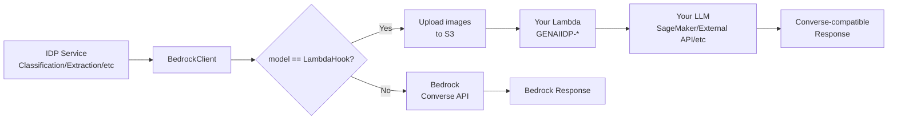

Copyright Amazon.com, Inc. or its affiliates. All Rights Reserved.
SPDX-License-Identifier: MIT-0

# Lambda Hook Inference (Custom LLM Integration)

The GenAI IDP Accelerator supports integrating custom LLM inference endpoints through a **Lambda Hook** mechanism. This allows you to use any LLM — including models hosted on Amazon SageMaker, Amazon ECS, Amazon EC2, or external inference APIs — for any inference step in the document processing pipeline.

## Overview

Instead of calling the Amazon Bedrock Converse API, the accelerator invokes your custom Lambda function with the same Converse API-compatible payload. Your Lambda function processes the request using whatever inference backend you choose and returns a Converse API-compatible response.



## Supported Steps

The LambdaHook option is available for the following pipeline steps in Pattern-1 and Pattern-2:

| Step | Config Field | Description |
|------|-------------|-------------|
| **OCR** (Bedrock backend) | `ocr.model_id` | LLM-based OCR when `backend=bedrock` |
| **Classification** | `classification.model` | Document type classification |
| **Extraction** | `extraction.model` | Structured data extraction |
| **Assessment** | `assessment.model` | Confidence scoring |
| **Summarization** | `summarization.model` | Document summarization |

## Configuration

### Web UI

1. Navigate to the **Configuration** page
2. Select the step you want to customize (e.g., Extraction)
3. In the **Model** dropdown, select **"LambdaHook"** (first option)
4. Enter your Lambda function ARN in the **Model Lambda Hook ARN** field
5. Save the configuration

### Config YAML

```yaml
extraction:
  model: "LambdaHook"
  model_lambda_hook_arn: "arn:aws:lambda:us-east-1:123456789012:function:GENAIIDP-my-custom-extractor"
  temperature: 0.0
  system_prompt: "You are a document extraction expert..."
  task_prompt: "Extract the following attributes..."
```

### Lambda Function Naming Convention

Your Lambda function name **must start with `GENAIIDP-`**. This naming convention enables secure, scoped IAM permissions — the IDP stack's Lambda functions are granted `lambda:InvokeFunction` permission only for functions matching `GENAIIDP-*`.

**Valid examples:**
- `GENAIIDP-sagemaker-inference`
- `GENAIIDP-api-proxy`
- `GENAIIDP-custom-extraction`

**Invalid examples:**
- `my-custom-function` (missing `GENAIIDP-` prefix)
- `genaiidp-lowercase` (case-sensitive)

## Request Payload

Your Lambda function receives a **Converse API-compatible** payload:

```json
{
  "modelId": "LambdaHook",
  "messages": [
    {
      "role": "user",
      "content": [
        {
          "text": "Extract the following attributes from this Bank Statement document:\n\n..."
        },
        {
          "image": {
            "format": "jpeg",
            "source": {
              "s3Location": {
                "uri": "s3://working-bucket/temp/lambdahook/abc123.jpeg",
                "bucketOwner": "123456789012"
              }
            }
          }
        }
      ]
    }
  ],
  "system": [
    {
      "text": "You are a document extraction expert. Respond only with JSON..."
    }
  ],
  "inferenceConfig": {
    "temperature": 0.0,
    "maxTokens": 10000,
    "topK": 5
  },
  "context": "Extraction"
}
```

### Key Differences from Bedrock Converse API

1. **Images use S3 references** — To avoid the Lambda 6MB payload limit, inline image bytes are automatically uploaded to S3 and replaced with `s3Location` references. Your Lambda needs `s3:GetObject` permission on the working bucket.

2. **`<<CACHEPOINT>>` tags are stripped** — These Bedrock-specific tags are removed from text content before sending to your Lambda.

3. **`context` field is added** — Indicates which pipeline step is calling (OCR, Classification, Extraction, Assessment, Summarization).

## Expected Response

Your Lambda function must return a **Converse API-compatible** response:

```json
{
  "output": {
    "message": {
      "role": "assistant",
      "content": [
        {
          "text": "{\"account_number\": \"12345\", \"balance\": \"$1,250.00\"}"
        }
      ]
    }
  },
  "usage": {
    "inputTokens": 1500,
    "outputTokens": 200,
    "totalTokens": 1700
  }
}
```

### Response Fields

| Field | Required | Description |
|-------|----------|-------------|
| `output.message.role` | Yes | Must be `"assistant"` |
| `output.message.content[0].text` | Yes | The model's response text |
| `usage.inputTokens` | No | Input token count (for cost tracking) |
| `usage.outputTokens` | No | Output token count (for cost tracking) |
| `usage.totalTokens` | No | Total token count |

If `usage` is not provided, zeros will be recorded for metering.

## Sample Lambda Functions

Ready-to-deploy sample Lambda hook functions are provided in [`samples/lambda-hook-inference/`](../samples/lambda-hook-inference/):

| Sample | Description |
|--------|-------------|
| **GENAIIDP-bedrock-proxy** | Forwards to Bedrock Converse API — use as a starting template for custom hooks with pre/post processing |
| **GENAIIDP-sagemaker-hook** | Calls a SageMaker real-time inference endpoint — shows format conversion between Converse API and SageMaker |

Each sample includes:
- Well-commented Python code with clearly marked customization points
- A SAM template (`template.yaml`) for one-click deployment with proper IAM permissions
- S3 image download handling (since images arrive as S3 references)

```bash
# Deploy the samples
cd samples/lambda-hook-inference
sam build && sam deploy --guided --stack-name GENAIIDP-lambda-hooks
```

See the [samples README](../samples/lambda-hook-inference/README.md) for full deployment instructions.

## Example Implementations

The following examples show how to build Lambda hooks for various inference providers. For deployable versions, see the samples above.

### SageMaker Endpoint

```python
import json
import boto3

sagemaker_runtime = boto3.client('sagemaker-runtime')
s3_client = boto3.client('s3')

def lambda_handler(event, context):
    """Proxy inference to a SageMaker endpoint."""
    
    # Extract prompts from Converse-compatible payload
    system_text = event['system'][0]['text']
    user_content = event['messages'][0]['content']
    
    # Build prompt for your model
    user_text = ""
    images = []
    for item in user_content:
        if 'text' in item:
            user_text += item['text']
        elif 'image' in item:
            # Download image from S3
            s3_uri = item['image']['source']['s3Location']['uri']
            bucket, key = s3_uri.replace('s3://', '').split('/', 1)
            img_data = s3_client.get_object(Bucket=bucket, Key=key)['Body'].read()
            images.append(img_data)
    
    # Format for your SageMaker model
    payload = {
        "inputs": f"{system_text}\n\n{user_text}",
        "parameters": {
            "temperature": event.get('inferenceConfig', {}).get('temperature', 0.0),
            "max_new_tokens": event.get('inferenceConfig', {}).get('maxTokens', 4096),
        }
    }
    
    response = sagemaker_runtime.invoke_endpoint(
        EndpointName='my-model-endpoint',
        ContentType='application/json',
        Body=json.dumps(payload)
    )
    
    result = json.loads(response['Body'].read())
    
    return {
        "output": {
            "message": {
                "role": "assistant",
                "content": [{"text": result['generated_text']}]
            }
        },
        "usage": {
            "inputTokens": result.get('input_tokens', 0),
            "outputTokens": result.get('output_tokens', 0),
            "totalTokens": result.get('total_tokens', 0),
        }
    }
```

## IAM Permissions

### Your Lambda Function Needs

Your custom Lambda function needs read access to the IDP working bucket (for S3-referenced images):

```json
{
  "Effect": "Allow",
  "Action": ["s3:GetObject"],
  "Resource": "arn:aws:s3:::idp-working-bucket-*/temp/lambdahook/*"
}
```

### IDP Stack Grants

The IDP stack automatically grants its Lambda functions:
- `lambda:InvokeFunction` on `arn:aws:lambda:*:*:function:GENAIIDP-*`
- `s3:PutObject` on the working bucket `temp/lambdahook/` prefix (for image uploads)

## Error Handling

The Lambda Hook includes built-in retry logic:
- **Transient errors** (throttling, timeout): Retried with exponential backoff (same as Bedrock)
- **Function errors**: Retried for unhandled exceptions (cold start issues, etc.)
- **Permanent errors**: Raised immediately (invalid ARN, missing permissions, etc.)

## Metering and Cost Tracking

Lambda Hook invocations are tracked in the document's metering data under:
```
{context}/lambda_hook/{lambda_arn}
```

For example: `Extraction/lambda_hook/arn:aws:lambda:us-east-1:123456789012:function:GENAIIDP-extractor`

Token usage from the Lambda response's `usage` field is included in metering for cost calculations.

## Limitations

1. **Lambda payload limit**: The 6MB synchronous invocation payload limit is mitigated by uploading images to S3, but extremely large text content (>5MB of text alone) may still hit the limit.
2. **Lambda timeout**: Lambda functions have a maximum timeout of 15 minutes. For very large documents, consider chunking.
3. **Cold starts**: Lambda cold starts add latency to the first invocation. Use provisioned concurrency for consistent performance.
4. **No cachePoint support**: Bedrock's prompt caching feature is not available with Lambda hooks.
5. **No guardrails**: Bedrock Guardrails are not applied to Lambda hook invocations.