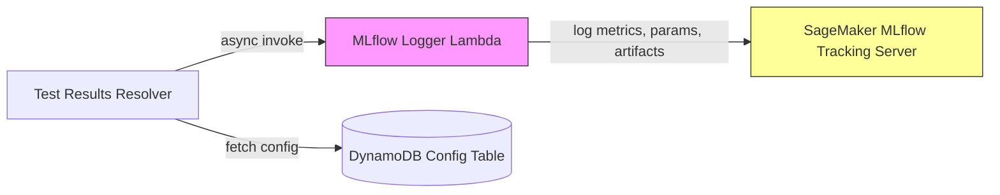

Copyright Amazon.com, Inc. or its affiliates. All Rights Reserved.
SPDX-License-Identifier: MIT-0

# MLflow Experiment Tracking

The GenAIIDP solution includes optional integration with [Amazon SageMaker with MLflow](https://docs.aws.amazon.com/sagemaker/latest/dg/mlflow.html) for experiment tracking. When enabled, every test run automatically logs metrics, configuration parameters, and artifacts to an MLflow tracking server, enabling you to:

- Compare accuracy, cost, and performance across test runs
- Track which models, prompts, and inference parameters produced each result
- Filter and search runs by model ID, temperature, or any logged parameter
- Visualize trends in accuracy and cost over time
- Download full configuration snapshots and class definitions for reproducibility

## Table of Contents

- [MLflow Experiment Tracking](#mlflow-experiment-tracking)
  - [Architecture](#architecture)
  - [Prerequisites](#prerequisites)
  - [Enabling MLflow](#enabling-mlflow)
  - [How It Works](#how-it-works)
  - [What Gets Logged](#what-gets-logged)
    - [Metrics](#metrics)
    - [Parameters](#parameters)
    - [Artifacts](#artifacts)
    - [Tags](#tags)
  - [Example MLflow Run](#example-mlflow-run)
  - [AWS Resources Created](#aws-resources-created)
  - [IAM Permissions](#iam-permissions)
  - [Configuration](#configuration)
  - [Viewing Results](#viewing-results)
  - [Troubleshooting](#troubleshooting)

## Architecture



When a test run completes and metrics are aggregated, the `TestResultsResolverFunction` asynchronously invokes the `MLflowLoggerFunction` with the full metrics payload and IDP configuration. The logger function then records everything to the SageMaker MLflow tracking server. The invocation is fire-and-forget — MLflow logging never blocks or delays the test run results.

## Prerequisites

1. An [Amazon SageMaker MLflow Tracking Server](https://docs.aws.amazon.com/sagemaker/latest/dg/mlflow-create-tracking-server-studio.html) in the same region as your IDP deployment
2. The tracking server ARN in the format:
   ```
   arn:aws:sagemaker:<region>:<account-id>:mlflow-tracking-server/<server-name>
   ```

## Enabling MLflow

Set the following CloudFormation parameters during stack deployment or update:

| Parameter | Value | Description |
|-----------|-------|-------------|
| `EnableMLflow` | `true` | Enables the MLflow Logger Lambda and wires it into the test results pipeline |
| `MlflowTrackingURI` | `arn:aws:sagemaker:...` | ARN of your SageMaker MLflow tracking server |

`MlflowTrackingURI` is required when `EnableMLflow` is `true`. A CloudFormation rule validates this at deploy time.

When `EnableMLflow` is `false` (the default), no MLflow resources are created and no logging occurs.

## How It Works

1. A test run completes and the `TestResultsResolverFunction` aggregates metrics (via Stickler or Athena fallback)
2. The resolver fetches the IDP configuration for the test run from DynamoDB
3. The resolver asynchronously invokes the `MLflowLoggerFunction` with:
   - All aggregated metrics (accuracy, cost, field-level scores, etc.)
   - The full IDP configuration (models, inference params, prompts, class definitions)
4. The MLflow Logger Lambda:
   - Creates an MLflow experiment named after the test run ID
   - Logs flat numeric values as MLflow metrics (searchable, chartable)
   - Logs model IDs and inference parameters as MLflow params (filterable)
   - Logs complex structures (prompts, class definitions, cost breakdown, full config) as JSON artifacts
5. The invocation is `Event` type (async) — the test results resolver does not wait for MLflow logging to complete

## What Gets Logged

### Metrics

Numeric values logged as MLflow metrics. These are searchable and chartable in the MLflow UI.

| Category | Example Keys | Description |
|----------|-------------|-------------|
| Overall accuracy | `overall_accuracy` | Aggregate accuracy score |
| Confidence | `average_confidence` | Mean extraction confidence |
| Cost | `total_cost` | Total processing cost |
| Document count | `document_count` | Number of documents in the test run |
| Accuracy breakdown | `accuracy_breakdown.Payslip`, `accuracy_breakdown.W2` | Per-class accuracy (flattened from nested dict) |
| Split classification | `split_classification_metrics.Payslip.precision` | Per-class precision/recall/f1 (flattened) |
| Field-level metrics | `PayDate.cm_recall`, `CurrentGrossPay.cm_f1` | Per-field cm_precision, cm_recall, cm_f1, cm_accuracy |
| Cost breakdown | `cost.ocr.textract_analyze_document_layout_pages`, `cost.classification.bedrock_us.amazon.nova_2_lite_v1_0_inputtokens` | Per-service estimated cost (sanitized keys) |
| Weighted scores | Logged as artifact (see below) | Complex nested structure |

Metric key sanitization: `/`, `:`, and `-` are replaced with `_`, and all keys are lowercased.

### Parameters

Short key-value strings logged as MLflow params. These are filterable in the MLflow UI — useful for comparing runs across different model configurations.

| Parameter | Example Value | Source |
|-----------|--------------|--------|
| `test_run_id` | `abc-123-def` | Test run identifier |
| `classification.model` | `us.amazon.nova-2-lite-v1:0` | Classification model ID |
| `classification.temperature` | `0.0` | Classification temperature |
| `classification.top_p` | `0.0` | Classification top_p |
| `classification.top_k` | `5.0` | Classification top_k |
| `classification.max_tokens` | `4096` | Classification max tokens |
| `classification.enabled` | `True` | Classification enabled flag |
| `classification.method` | `multimodalPageLevelClassification` | Classification method |
| `extraction.model` | `us.amazon.nova-2-lite-v1:0` | Extraction model ID |
| `extraction.temperature` | `0.0` | Extraction temperature |
| `extraction.top_p` | `0.0` | Extraction top_p |
| `extraction.top_k` | `5.0` | Extraction top_k |
| `extraction.max_tokens` | `65535` | Extraction max tokens |
| `assessment.model` | `us.amazon.nova-lite-v1:0` | Assessment model ID |
| `assessment.confidence_threshold` | `0.8` | Assessment confidence threshold |
| `assessment.granular.enabled` | `True` | Granular assessment flag |
| `summarization.model` | `us.amazon.nova-pro-v1:0` | Summarization model ID |
| `evaluation.model` | `us.amazon.nova-2-lite-v1:0` | Evaluation model ID |
| `ocr.backend` | `textract` | OCR backend |
| `use_bda` | `False` | BDA mode flag |

Only parameters that exist in the configuration are logged — missing values are omitted, not set to empty strings.

### Artifacts

Complex data structures logged as JSON files under the `metrics/` artifact path.

| Artifact | Description |
|----------|-------------|
| `full_config.json` | Complete IDP configuration snapshot for the test run |
| `prompts.json` | System and task prompts for each stage (classification, extraction, assessment, summarization) |
| `class_definitions.json` | Document class schemas with field definitions and evaluation methods |
| `weighted_overall_scores.json` | Weighted accuracy scores per document class |
| `field_metrics.json` | Full per-field evaluation metrics |
| `cost_breakdown.json` | Detailed cost breakdown by service and operation |

### Tags

| Tag | Value |
|-----|-------|
| `source` | `test_results_resolver` |

## Example MLflow Run

For a test run with the lending package sample configuration, a single MLflow run would contain:

```
── Params (27) ──────────────────────────────────────
test_run_id                     = "run-2026-03-25-001"
classification.model            = "us.amazon.nova-2-lite-v1:0"
classification.temperature      = "0.0"
classification.top_p            = "0.0"
classification.top_k            = "5.0"
classification.max_tokens       = "4096"
classification.method           = "multimodalPageLevelClassification"
extraction.model                = "us.amazon.nova-2-lite-v1:0"
extraction.temperature          = "0.0"
extraction.top_p                = "0.0"
extraction.top_k                = "5.0"
extraction.max_tokens           = "65535"
assessment.model                = "us.amazon.nova-lite-v1:0"
assessment.temperature          = "0.0"
assessment.top_p                = "0.0"
assessment.top_k                = "5.0"
assessment.max_tokens           = "10000"
assessment.enabled              = "True"
assessment.confidence_threshold = "0.8"
assessment.granular.enabled     = "True"
summarization.model             = "us.amazon.nova-pro-v1:0"
summarization.temperature       = "0.0"
summarization.top_p             = "0.0"
summarization.top_k             = "5.0"
summarization.max_tokens        = "4096"
summarization.enabled           = "True"
evaluation.model                = "us.amazon.nova-2-lite-v1:0"
ocr.backend                     = "textract"
use_bda                         = "False"

── Metrics (35+) ────────────────────────────────────
overall_accuracy                = 0.92
average_confidence              = 0.87
total_cost                      = 0.089
document_count                  = 5
PayDate.cm_recall               = 1.0
PayDate.cm_precision            = 1.0
CurrentGrossPay.cm_f1           = 0.95
cost.ocr.textract_analyze_document_layout_pages = 0.02
cost.classification.bedrock_us.amazon.nova_2_lite_v1_0_inputtokens = 0.0026
...

── Artifacts ────────────────────────────────────────
metrics/full_config.json
metrics/prompts.json
metrics/class_definitions.json
metrics/weighted_overall_scores.json
metrics/field_metrics.json
metrics/cost_breakdown.json
```

## AWS Resources Created

When `EnableMLflow` is `true`, the following resources are created in the unified pattern stack:

| Resource | Type | Description |
|----------|------|-------------|
| `MLflowLoggerFunction` | `AWS::Serverless::Function` | Lambda function (container image, arm64, 512MB, 5min timeout) that logs to MLflow |
| `MLflowLoggerFunctionLogGroup` | `AWS::Logs::LogGroup` | CloudWatch log group for the Lambda function |

The Lambda function is built as a Docker container image using `Dockerfile.optimized` with the `sagemaker-mlflow` Python package and `git` installed (required by MLflow for artifact logging).

Additionally, the `TestResultsResolverFunction` in the AppSync stack receives:
- `MLFLOW_LOGGER_FUNCTION_ARN` environment variable (conditional)
- `lambda:InvokeFunction` IAM permission for the MLflow Logger Lambda (conditional)

All MLflow resources are conditional on `IsMLflowEnabled` — when disabled, no resources are created and no additional costs are incurred.

## IAM Permissions

The MLflow Logger Lambda has the following permissions:

| Permission | Resource | Purpose |
|------------|----------|---------|
| `sagemaker-mlflow:*` | `*` | Full access to SageMaker MLflow APIs |
| `kms:GenerateDataKey`, `kms:Decrypt` | Customer managed key | Encryption for CloudWatch logs |
| `logs:CreateLogGroup`, `logs:CreateLogStream`, `logs:PutLogEvents` | Log group | CloudWatch logging |
| `s3:PutObject`, `s3:PutObjectAcl` | `sagemaker-<region>-<account>/mlflow-artifacts/*` | MLflow artifact storage in the SageMaker-managed S3 bucket |

## Configuration

No runtime configuration is needed beyond the two CloudFormation parameters. The MLflow integration automatically uses the IDP configuration that was active for each test run.

To change which MLflow tracking server is used, update the `MlflowTrackingURI` stack parameter and redeploy.

## Viewing Results

1. Open the SageMaker Studio UI or the MLflow tracking server UI
2. Navigate to the experiment named after your test run ID
3. Use the MLflow UI to:
   - Compare metrics across runs (accuracy, cost, confidence)
   - Filter runs by model parameters (e.g., show all runs using `nova-pro`)
   - Download artifacts (prompts, class definitions, full config)
   - Create charts tracking accuracy trends over time

## Troubleshooting

| Issue | Cause | Resolution |
|-------|-------|------------|
| No MLflow data after test run | `EnableMLflow` is `false` or `MLFLOW_LOGGER_FUNCTION_ARN` env var is empty | Verify stack parameters and redeploy with `EnableMLflow=true` |
| MLflow Logger Lambda errors | Invalid tracking server ARN or permissions | Check CloudWatch logs at `/<stack-name>/lambda/MLflowLoggerFunction` |
| Missing config params in MLflow | Config not found in DynamoDB for the test run | Verify the test run has a metadata record with `Config` in the tracking table |
| Partial metrics logged | Some metric values are non-numeric (null, string) | Non-numeric values are skipped during flattening — this is expected behavior |
| `sagemaker-mlflow` import error | Container image build issue | Verify `requirements.txt` includes `sagemaker-mlflow` and the Docker build completed successfully |
