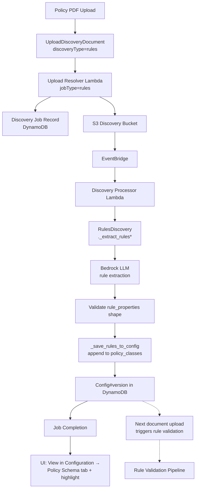

Copyright Amazon.com, Inc. or its affiliates. All Rights Reserved.
SPDX-License-Identifier: MIT-0

# Policy Discovery Module

The Policy Discovery module extracts **business rules** from policy documents (Medicare/Medicaid policy manuals, prior authorization guidelines, compliance manuals, etc.) and saves them into the versioned configuration as `policy_classes`. Those policy classes are then consumed by the [Rule Validation](rule-validation.md) stage of the unified processing pipeline to evaluate pass/fail for each incoming document against the extracted rules.

Policy Discovery is the **rules counterpart** of the classes-based [Discovery Module](discovery.md). Where Discovery tells the system *what fields a document type has*, Policy Discovery tells the system *what rules a document must satisfy to be compliant*.


## Table of Contents

- [Overview](#overview)
  - [What is Policy Discovery](#what-is-policy-discovery)
  - [Key Features](#key-features)
  - [Use Cases](#use-cases)
- [Architecture](#architecture)
  - [Core Components](#core-components)
  - [Processing Flow](#processing-flow)
  - [Integration Points](#integration-points)
- [Discovery Methods](#discovery-methods)
  - [Traditional Rule Extraction](#traditional-rule-extraction)
  - [Agentic Rule Extraction](#agentic-rule-extraction)
  - [Choosing the Right Method](#choosing-the-right-method)
- [Configuration](#configuration)
  - [Model Configuration](#model-configuration)
  - [Prompt Customization](#prompt-customization)
  - [Default Prompts](#default-prompts)
- [Using the Module](#using-the-module)
  - [Web UI Interface](#web-ui-interface)
  - [API Integration](#api-integration)
  - [Output Format](#output-format)
- [Rule Validation Integration](#rule-validation-integration)
  - [How Extracted Rules Are Used](#how-extracted-rules-are-used)
  - [Required: Add a Document Matching Regex](#required-add-a-document-matching-regex)
- [Best Practices](#best-practices)
- [Troubleshooting](#troubleshooting)
- [Limitations](#limitations)


## Overview

### What is Policy Discovery

Policy Discovery analyzes a policy document (e.g., the NCCI Medicare Policy Manual, a payer's prior-authorization guideline, an internal compliance manual) and produces a flat list of **individual rules**, each phrased as a yes/no validation question with:

- A short, descriptive **snake_case rule name** (e.g., `modifier_59_distinct_sites`, `prior_auth_required_for_imaging`)
- A **description** written as a yes/no question the validator can answer for each incoming document (e.g., *"Is modifier 59 appended only when reporting a service distinct from other services on the same day?"*)
- The **page number or section** in the source policy where the rule was found (for auditability)

All rules for a policy document are grouped into a single **policy class** — a JSON-Schema-shaped object — and appended to `Config#<version>.policy_classes` in the Configuration DynamoDB table. From there, the [Rule Validation](rule-validation.md) stage of the pipeline uses them to evaluate incoming documents.

### Key Features

- **🤖 Automated Rule Extraction**: Parse a policy PDF into a structured list of rules using Bedrock LLMs
- **🔄 Traditional & Agentic Modes**: Single-shot LLM call or multi-turn Strands agent with reviewer feedback loop
- **📚 Append-Only Persistence**: Re-uploading or uploading a second policy document appends a new policy class — earlier policies are never overwritten
- **🔖 Unique Class Naming**: Class names are derived from the source filename with a hex suffix (e.g., `NCCI_Medicare_Policy_839f3946`) so multiple uploads remain distinguishable
- **🏷 Discriminated Jobs**: Policy discovery jobs are tagged with `jobType: 'rules'` so the UI can surface them distinctly from classes discovery jobs
- **🔗 Deep-Link to Configuration**: Finishing a job renders a "View in Configuration" link that navigates to the Policy Schema tab and auto-selects the newly extracted class

### Use Cases

**Regulatory Compliance Onboarding:**
- Drop a payer's policy manual in; get the validation ruleset without hand-authoring each rule
- Extract NCCI Medicare rules from the published manual

**Internal Policy Automation:**
- Convert an internal compliance handbook into machine-checkable rules
- Keep validation logic in sync with the authoritative policy document

**Cross-Policy Coverage:**
- Upload multiple policy manuals covering different procedures or payers; each becomes its own policy class, composable at validation time

**Rule Authoring Acceleration:**
- Use extracted rules as a starting point; manually refine wording or thresholds before production use


## Architecture

### Core Components

**Discovery Processor Lambda (`src/lambda/discovery_processor/index.py`):**
- Dispatches between classes discovery and rules discovery based on the job's `discoveryType` field
- For rules jobs, waits for the S3 upload to land (HeadObject poll) before invoking the discovery service
- Updates job status messages (e.g., `Extracted N rules - appended to policy_classes...`)

**Rules Discovery Service (`lib/idp_common_pkg/idp_common/discovery/rules_discovery.py`):**
- Core engine for rule extraction from policy documents
- Two code paths: `_extract_rules` (traditional, single LLM call) and `_extract_rules_agentic` (Strands-agent with optional reviewer)
- Validates each rule object (`_validate_rule_class`) has the required `rule_properties` shape
- Writes results via `_save_rules_to_config`, which performs the append-only merge into `Config#<version>.policy_classes`

**Upload Resolver Lambda (`nested/appsync/src/lambda/discovery_upload_resolver/index.py`):**
- Handles the `UploadDiscoveryDocument` GraphQL mutation for both classes and rules discovery
- When `discoveryType == 'rules'`, sets `jobType: 'rules'` on the tracking record so the UI can discriminate
- Issues a presigned upload URL and creates the initial job record in DynamoDB

**Discovery Panel UI (`src/ui/src/components/discovery/DiscoveryPanel.tsx`):**
- The **Policy Discovery** tab renders inside the same panel as Single Document and Multiple Documents discovery
- When the Policy Discovery tab is active, the mode selector (Single/Multi-Section), ground-truth file input, and page-range selector are hidden — none of those apply to whole-document rule extraction
- Submits `UploadDiscoveryDocument` with `discoveryType: "rules"` and the active configuration version

**Job Details UI (`src/ui/src/components/discovery/DiscoveryJobDetails.tsx`):**
- Breadcrumb reads "Policy Discovery Job" when `jobType === 'rules'`
- "View in Configuration" link navigates to `?tab=rule-schema&highlight=<extractedClassName>`, deep-linking to the Policy Schema tab with the newly-added class pre-selected

**Schema Builder UI (`src/ui/src/components/json-schema-builder/SchemaBuilder.tsx`):**
- Accepts an optional `highlightClassName` prop; when set, auto-selects the matching class card and scrolls it into view via the `data-schema-class-id` attribute

### Processing Flow



### Integration Points

**S3 Integration:**
- Policy document storage in the discovery bucket
- HeadObject poll to avoid racing the upload

**DynamoDB Integration:**
- Discovery job tracking (with `jobType='rules'` and `discoveryType='rules'` fields)
- Versioned configuration storage (`Config#<version>.policy_classes`)

**Bedrock Integration:**
- LLM rule extraction (defaults to `global.anthropic.claude-sonnet-4-6`; substitute `us.anthropic.claude-sonnet-4-6` or a regional equivalent if your stack doesn't have access to global inference profiles)
- Optional Strands agent with reviewer in agentic mode

**AppSync/GraphQL Integration:**
- `UploadDiscoveryDocument` mutation carries the `discoveryType` argument
- `onDiscoveryJobStatusChange` subscription streams progress (reused from classes discovery)

**Rule Validation Integration:**
- See [Rule Validation Integration](#rule-validation-integration) below. The `PolicyClassificationService` reads from the same `policy_classes` list at pipeline runtime.


## Discovery Methods

### Traditional Rule Extraction

A single Bedrock LLM call that analyzes the full policy document in one pass and returns a flat list of rules.

**How it Works:**
1. Policy PDF is uploaded to the discovery bucket
2. The Discovery Processor invokes `RulesDiscovery._extract_rules`
3. The policy document (as image or text) is sent to the configured Bedrock model with the Policy Discovery prompt
4. The response is parsed as JSON and each rule object is validated for the required fields (`$schema`, `$id`, `rule_properties`, etc.)
5. Valid rules are reshaped and appended to `policy_classes`

**Best For:**
- Well-structured policy manuals where a single pass captures all rules
- Cost-sensitive workloads (single LLM call per document)
- Deterministic output (low temperature, high top_k discipline)

**Configuration Example:**
```yaml
discovery:
  rules:
    model: "us.anthropic.claude-sonnet-4-6"
    temperature: 0.0
    top_p: 0.0
    top_k: 5
    max_tokens: 64000
    agentic:
      enabled: false
```

### Agentic Rule Extraction

A multi-turn Strands agent flow with an optional reviewer agent that iterates on the extracted ruleset.

**How it Works:**
1. The `_extract_rules_agentic` path spins up a Strands agent configured to return structured output
2. The agent iteratively refines the ruleset — re-reading the policy, catching missed rules, correcting phrasing
3. When a reviewer is enabled, a second agent audits the ruleset against the source document and suggests revisions
4. Final output is validated and saved identically to the traditional path

**Best For:**
- Long or fragmented policy documents where a single pass under-extracts
- Policies with complex exception handling that benefit from a review pass
- Higher-stakes compliance domains where completeness matters more than cost

**Configuration Example:**
```yaml
discovery:
  rules:
    model: "us.anthropic.claude-sonnet-4-6"
    agentic:
      enabled: true
      review_agent: true           # optional second-pass reviewer
      review_agent_model: ""       # defaults to the main model if blank
```

### Choosing the Right Method

| Factor | Traditional | Agentic |
|--------|-------------|---------|
| **LLM calls per document** | 1 | 2-N (loop + optional review) |
| **Latency** | Seconds to a minute | Minutes |
| **Cost** | Low | Higher (multiple calls) |
| **Rule coverage** | Good for clean manuals | Better for long or messy documents |
| **Best for** | Short-to-medium policies, deterministic workflows | Long manuals, compliance-critical domains |


## Configuration

All Policy Discovery settings live under the `discovery.rules` section of the Configuration, editable via the web UI's View/Edit Configuration panel.

### Model Configuration

**Supported Models:** The same Bedrock model catalog as the Discovery module. Recommended: `us.anthropic.claude-sonnet-4-6` for quality (or `global.anthropic.claude-sonnet-4-6` if your deployment uses global inference profiles); any Claude or Nova model may be substituted.

**Parameter Guidelines:**
- **Temperature: `0.0`** — deterministic rule extraction; re-running on the same document should give the same rules
- **Top P: `0.0` / Top K: `5`** — strict decoding, minimizes off-rule hallucination
- **Max Tokens: `64000`** — policy manuals often have dozens to hundreds of rules; a high cap avoids mid-JSON truncation

### Prompt Customization

Both `system_prompt` and `task_prompt` are fully editable. The task prompt supports the same text templating as other discovery prompts; no special placeholders are required because the policy document itself is passed as inline content.

### Default Prompts

The system defaults live in `lib/idp_common_pkg/idp_common/config/system_defaults/base-rule-discovery.yaml`:

```yaml
discovery:
  rules:
    system_prompt: >-
      You are an expert in analyzing policy documents and extracting
      business rules, regulations, and compliance requirements.
      Extract rules as structured, actionable validation statements.
    task_prompt: >-
      Analyze the policy document thoroughly, page by page. For each rule found:
      1. Give the rule a short, descriptive snake_case name
      2. Write a clear, actionable description — phrased as a yes/no validation question
      3. Include specific codes, numbers, thresholds, or conditions mentioned
      4. Note any exceptions or special cases within the description
      5. Reference the page number or section where the rule was found
```

The full default task prompt also defines the JSON output format the LLM must return — one object with a `rule_properties` dict keyed by snake_case rule names.


## Using the Module

### Web UI Interface

**Accessing Policy Discovery:**
1. Navigate to the **Discovery** page
2. Select the **Policy Discovery** tab (the third tab, after Single Document and Multiple Documents)
3. Select a **Configuration Version** to save the extracted rules to
4. Upload a policy PDF
5. Click **"Start Discovery"**
6. Monitor progress in the Discovery Jobs table below

**Monitoring Progress:**
- Real-time status messages via GraphQL subscriptions (e.g., `Analyzing policy document...`, `Extracted N rules - appended to policy_classes...`)
- Jobs with `jobType === 'rules'` display a **"Policy Discovery Job"** breadcrumb when opened

**Reviewing Results:**
- On the completed job detail page, click **"View in Configuration"**
- The link navigates to Configuration → **Policy Schema** tab with `?tab=rule-schema&highlight=<className>`
- The newly extracted class is auto-selected and scrolled into view
- Inspect the rules, optionally edit descriptions, and save

### API Integration

**GraphQL Mutation:**
```graphql
mutation UploadDiscoveryDocument($fileName: String!, $discoveryType: String, $version: String) {
  uploadDiscoveryDocument(
    fileName: $fileName
    discoveryType: $discoveryType
    version: $version
  ) {
    presignedUrl
    objectKey
  }
}
```

Pass `discoveryType: "rules"` to route the upload to Policy Discovery instead of classes discovery.

**Job Status Subscription:**
```graphql
subscription OnDiscoveryJobStatusChange($jobId: ID!) {
  onDiscoveryJobStatusChange(jobId: $jobId) {
    jobId
    status
    statusMessage
    discoveredClassName
    jobType
    errorMessage
  }
}
```

**Direct API Usage (idp_common):**
```python
from idp_common.discovery.rules_discovery import RulesDiscovery

discovery = RulesDiscovery(
    input_bucket="my-discovery-bucket",
    input_prefix="policies/ncci-medicare-manual.pdf",
    config=my_rule_discovery_config,
    version="rule-validation",  # configuration version to save into
    region="us-east-1",
)

# Extract and persist rules into Config#rule-validation.policy_classes
result = discovery.discovery_rules_from_document(
    input_bucket="my-discovery-bucket",
    input_prefix="policies/ncci-medicare-manual.pdf",
)

# Or extract from a local file without persisting
result = discovery.discovery_rules_from_document_local(
    file_path="/tmp/ncci-medicare-manual.pdf",
)
```

### Output Format

A rule class appended to `policy_classes` has the following JSON-Schema shape:

```json
{
  "$schema": "https://json-schema.org/draft/2020-12/schema",
  "$id": "NCCI_Medicare_Policy_839f3946",
  "type": "object",
  "x-aws-idp-policy-type": "NCCI_Medicare_Policy_839f3946",
  "description": "All rules extracted from the policy document",
  "rule_properties": {
    "report_most_specific_code": {
      "type": "string",
      "description": "Is the HCPCS/CPT code that describes the procedure performed to the greatest specificity possible reported?",
      "page": "V-3"
    },
    "modifier_59_distinct_sites": {
      "type": "string",
      "description": "Is modifier 59 appended only when reporting a service distinct from other services on the same day?",
      "page": "V-7"
    }
  }
}
```

**Field explanations:**
- `$id` / `x-aws-idp-policy-type`: the unique policy class name, derived from the source filename (first 20 sanitized chars) plus an 8-hex suffix so repeated uploads of the same document each land as a distinct class
- `rule_properties`: a dict keyed by snake_case rule name. Each value carries a `description` (the validation question) and a `page` reference into the source policy
- `description` at the class level: a free-text summary of the policy document's overall purpose


## Rule Validation Integration

### How Extracted Rules Are Used

Policy Discovery is only the **authoring** side. The rules are evaluated by the Rule Validation stage of the unified processing pipeline, which runs after extraction and HITL (if enabled) on every document submitted to the main input bucket:

1. `ProcessResultsFunction` checks whether `rule_validation.enabled == true` **AND** `policy_classes` is non-empty. If yes, it sets `rule_validation_enabled: true` on the Step Functions state input.
2. The state machine routes to `PolicyClassificationStep` (Lambda: `RuleValidationPolicyClassificationFunction`), which uses `PolicyClassificationService` to decide which policy classes apply to *this* document.
3. `PolicyClassificationService.classify_document` runs the regex matchers defined on each policy class (see next section). Matched policy classes are passed downstream; unmatched ones are skipped.
4. The `ProcessRuleValidationSections` Map state iterates over document sections, invoking `RuleValidationFunction` per section to answer each rule's yes/no question from the extracted section data.
5. `RuleValidationOrchestration` consolidates the per-section responses into `consolidated_summary.json` and `consolidated_summary.md` written to the Output bucket under `<document>/rule_validation/consolidated/`.

See [docs/rule-validation.md](rule-validation.md) for the validator-side details.

### Required: Add a Document Matching Regex

Policy Discovery saves the rule class *without* a matching regex. That means **rules extracted by Policy Discovery will not automatically run against future documents** until you give the policy class a document-matching pattern. This is intentional — the same NCCI Medicare rules apply only to medicare PA packets, not to every document in the system.

After a Policy Discovery job completes, add either (or both) of the following fields on the newly created policy class via the Policy Schema UI:

- **`Document Name Regex`** (`x-aws-idp-document-name-regex`): case-insensitive pattern matched against the document filename. Example for medicare PA packets:
  ```
  (?i).*(medicare|medicaid|pa_packet|prior_auth).*
  ```
- **`Page Content Regex`** (`x-aws-idp-document-page-content-regex`): case-insensitive pattern matched against each page's OCR text. Useful when filenames aren't diagnostic. Example:
  ```
  (?i)(medicare\s+number|prior\s+authorization)
  ```

If **multiple policy classes** are configured, `PolicyClassificationService` requires at least one regex pattern to be present on *some* class — otherwise no match is possible and rule validation is skipped. If **only one** policy class is configured, the regex is optional (single-class mode always matches).

> **Tip:** When iterating on a new policy, lean on `Document Name Regex` first — filenames are stable and cheap to match. Fall back to `Page Content Regex` only when filenames don't carry enough signal.


## Best Practices

**Document Selection:**
- Upload the **authoritative, source-of-truth** policy document — a superseded version will produce stale rules
- Prefer text-based PDFs over scanned images when available; the LLM extracts rules more reliably from clean text
- One upload per policy domain — don't concatenate multiple policies into a single PDF; the extractor will blur the boundaries

**Reviewing Extracted Rules:**
- Treat rule extraction as a first pass, not a final answer. Walk the extracted rules against the source document once before putting them into production validation.
- Watch for hallucinated rules — rules with no `page` reference or page references that don't actually contain the rule should be removed.
- Normalize rule names if the LLM produced inconsistent style (e.g., some `camelCase`, some `snake_case`).

**Configuration Tuning:**
- Keep `temperature: 0.0` for rule extraction. Determinism matters more than creativity here — you want the same document to produce the same rules on every run.
- Raise `max_tokens` (not temperature) if the LLM is truncating mid-JSON on a long manual. The default 64000 is a safe ceiling.

**Naming & Regex:**
- Immediately after each extraction, set the `Document Name Regex` on the new class. Undocumented regex ⇒ rules never fire.
- When you upload the same policy document twice (e.g., iterating on prompts), remember each upload creates a new class with a fresh 8-hex suffix. Delete or disable the stale ones.


## Troubleshooting

### Common Issues

**Job completes but no new class appears in Policy Schema:**
- Check the job's `discoveryType` field — must be `"rules"`, not `"classes"`. A misrouted mutation saves to the wrong place.
- Confirm the `Config#<version>` record in DynamoDB exists — `_save_rules_to_config` targets the active version; if the UI created a new version after the job started, the rules may have landed in the older version.

**Job fails with "Failed to extract data from document":**
- Increase `max_tokens` to 64000+ if the manual is long (100+ rules).
- Switch to agentic mode for complex manuals where a single pass under-extracts.
- Check the source PDF's text layer — purely scanned policy manuals may need OCR preprocessing before rule extraction.

**Document Uploads but Rule Validation doesn't fire on subsequent documents:**
- **Most common cause:** the extracted policy class has no `Document Name Regex` or `Page Content Regex`. See [Required: Add a Document Matching Regex](#required-add-a-document-matching-regex).
- Check `ProcessResultsFunction` CloudWatch logs for `Rule validation is enabled but no policy_classes configured - skipping rule validation`. If you see that, `policy_classes` is empty in the deployed config version.
- Check the Step Functions execution history for whether `PolicyClassificationStep` and `ProcessRuleValidationSections` actually ran, or whether it short-circuited to `SetEmptyRuleValidationResult`.

**Two identical rule classes after re-uploading:**
- Expected — uploads are append-only by design so accidental re-uploads don't clobber prior work. Delete the duplicate in the Policy Schema UI.


## Limitations

- **Single-document rule extraction only.** Policy Discovery does not currently support multi-document clustering (unlike [Multi-Document Collection Discovery](discovery.md#multi-document-collection-discovery)). Each policy manual is processed independently.
- **No automatic regex generation.** The LLM extracts rules but does not propose a `Document Name Regex` for the policy class. Regex authoring is a manual step today.
- **No cross-policy deduplication.** If two policy documents contain the same underlying rule, it will appear in both policy classes. Duplicate detection across policies is not provided.
- **Token limits on very large manuals.** Manuals with thousands of rules may exceed a single Bedrock call's output token limit even at `max_tokens: 64000`. Split the document by chapter/section into multiple uploads for very large sources.
- **Validation-question phrasing depends on prompt.** Rule descriptions are only as good as the `task_prompt`'s instruction to phrase them as yes/no questions. Customize the prompt if the default phrasing doesn't match your validator's expectations.
