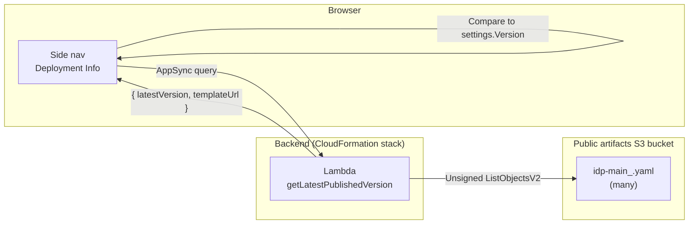

# Version Update Indicator

The Web UI's **Deployment Info** side-nav section can surface a small
**`Update`** badge next to the deployed `Version: …` line whenever a
newer template version has been published to the public artifacts S3
bucket.

## How it works

1. On Web UI load, a single `getLatestPublishedVersion` GraphQL query
   is issued by `useLatestVersion()` (`src/ui/src/hooks/use-latest-version.ts`).
2. The resolver Lambda (`src/lambda/version_check_resolver/index.py`)
   lists the public bucket's prefix for keys matching
   `<prefix>/idp-main_<version>.yaml`, picks the highest semver, and
   returns the corresponding HTTPS S3 URL. Results are cached in the
   warm Lambda for 10 minutes (`VERSION_CHECK_CACHE_TTL`).
3. The UI compares the latest version with `settings.Version` (the
   deployed stack's version, populated by `publish.py`'s `<VERSION>`
   token). If the published version is strictly newer (per
   `compareVersions()` in `src/ui/src/utils/version-compare.ts`), an
   `Update` badge is rendered next to the deployed version.
4. Hovering the badge opens a Cloudscape `Popover` with the version
   diff. **Admin** users additionally see an `Update stack in
   CloudFormation →` link that deep-links to the AWS console with the
   new template URL pre-filled. Non-admin users see a hint to contact
   their administrator.

## Configuration

The check is controlled by two CloudFormation parameters whose **defaults
are auto-substituted by `idp-cli publish`** to point at the bucket and
prefix you're publishing to. This means:

- **For the public AWS release** (publishing to `aws-ml-blog-<region>` /
  `artifacts/genai-idp`): the indicator works out of the box for every
  customer who deploys the published template — no manual stack
  parameters needed.
- **For private/forked builds** (publishing to your own bucket via
  `idp-cli publish --bucket my-artifacts --prefix my-prefix`): the
  defaults are set to `my-artifacts-<region>` / `my-prefix`, so your
  customers automatically check *your* bucket for updates.
- **For headless / private-network deployments**: the customer can
  override `PublicArtifactsBucket=""` at deploy time to disable the
  check entirely. **Headless template builds** (`idp-cli publish
  --headless` / GovCloud) automatically strip the resolver, the
  parameters, and the Settings entries via the
  `HeadlessTemplateTransformer` — the indicator is a UI-only feature
  and is removed alongside the rest of the AppSync stack.

| Parameter | Default | Description |
|---|---|---|
| `PublicArtifactsBucket` | *(substituted by publish — `<bucket>-<region>` of the publishing operator)* | S3 bucket holding the public IDP CloudFormation templates. Set to `""` at deploy time to disable the check (the resolver returns `checkEnabled=false` and the UI hides the indicator). |
| `PublicArtifactsPrefix` | *(substituted by publish — the publish prefix without version suffix, e.g. `artifacts/genai-idp`)* | S3 key prefix under `PublicArtifactsBucket` where versioned `idp-main_<version>.yaml` templates live. |

The token substitution happens in
`lib/idp_sdk/idp_sdk/_core/publish.py` via two new tokens
(`<PUBLIC_ARTIFACTS_BUCKET_TOKEN>`, `<PUBLIC_ARTIFACTS_PREFIX_TOKEN>`)
mapped to `self.bucket` and `self.prefix` respectively. Because the
publisher writes the version-stripped prefix here (not
`prefix_and_version`), the resolver can list **sibling** versioned
templates published by future `publish` runs — which is exactly what we
need for "is there a newer version?".

The resolver uses **unsigned/anonymous S3 reads** (botocore
`UNSIGNED`), so it works against any public bucket without an IAM grant
against the bucket's account. There is no per-account IAM policy
required.

## Role gating for the "Update Stack" link

The version-check itself is open to all authenticated roles — the
version number is not sensitive and Viewer/Reviewer/Author users
benefit from knowing drift exists so they can flag it to their admin.

The actionable **Update stack in CloudFormation →** link inside the
popover is only rendered for users in the **Admin** Cognito group
(checked via `useUserRole().isAdmin`). For non-admin users the popover
shows the version diff plus a "Contact your administrator…" hint
instead.

The CloudFormation console deep-link itself does not bypass IAM — the
user must still have CloudFormation update permissions for the deployed
stack — but rendering the link to non-admins would be misleading.

## Edge cases

| Case | Behaviour |
|---|---|
| `PublicArtifactsBucket` parameter empty | Resolver returns `checkEnabled: false`; UI shows no badge |
| Listing fails (network, perms, region mismatch) | Hook silently catches; no badge shown; no toast |
| Current version is a `.dev` build > public latest | Pre-releases sort below the matching final release; no badge shown |
| GovCloud / private network | Defaults to no public bucket → no badge. Operators can override `PublicArtifactsPrefix` to point at an internal mirror if desired |
| Pre-release on public bucket | The resolver returns the highest semver including pre-releases; in practice the public bucket only publishes final releases |

## Files

- `src/lambda/version_check_resolver/index.py` — Lambda resolver
- `nested/appsync/src/api/schema.graphql` — `LatestPublishedVersion` GraphQL type and `getLatestPublishedVersion` query
- `src/ui/src/hooks/use-latest-version.ts` — React hook
- `src/ui/src/utils/version-compare.ts` — semver-aware comparator
- `src/ui/src/components/genaiidp-layout/navigation.tsx` — badge + popover rendering
- `template.yaml` — `PublicArtifactsBucket` / `PublicArtifactsPrefix` parameters and resolver wiring
