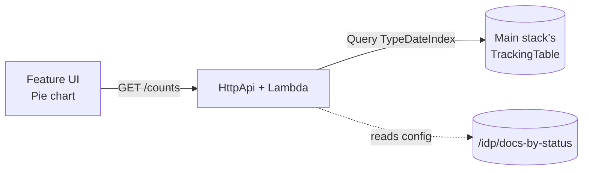

# sample-feature: `docs-by-status`

A working reference implementation of an IDP Accelerator installable feature.
Built from `feature-template/`, with the feature-specific pieces filled in.

## What it does

Adds a **Docs By Status** page to the IDP UI that shows a pie chart of how
many documents are in each status (NEW, QUEUED, RUNNING, COMPLETED, FAILED,
…). The counts are fetched from a feature-specific HTTP API that queries the
main stack's `TrackingTable` (via a cross-stack read role), filtering to
`ItemType='document'` via the `TypeDateIndex` GSI.



## How this differs from `feature-template/`

The template is a scaffold; this is a concrete, runnable feature:

| Template               | Sample                                          |
|------------------------|-------------------------------------------------|
| `feature.yaml` — `my-feature` | `feature.yaml` — `docs-by-status`          |
| `App.tsx` — hello-world stub | `App.tsx` — Cloudscape PieChart + KeyValuePairs |
| `handler.py` — echoes username | `handler.py` — queries TrackingTable, returns counts |
| `template.yaml` — no host-data permissions | adds read permission on `<MainStackName>-TrackingTableName` |

## Publishing

This feature is bundled with the accelerator: it's listed in
`config_library/extensions-oss.yaml`, so `idp-cli publish` builds it and adds it
to the catalog automatically — no manual publish needed.

To publish a copy to your own feature bucket for testing:

```bash
cd feature-platform/sample-feature
idp-feature-cli publish . --bucket-basename <your-bucket> --region us-east-1
```

After deploying the main stack with `EnableFeaturePlatform=true` (the default),
install the feature and reload the UI — the **Sample: Document Status (feature
add-on)** page appears under the **Extensions** nav section.

See the [Feature Platform Developer Guide](../../docs/feature-platform-developer-guide.md)
for the full authoring walkthrough.
