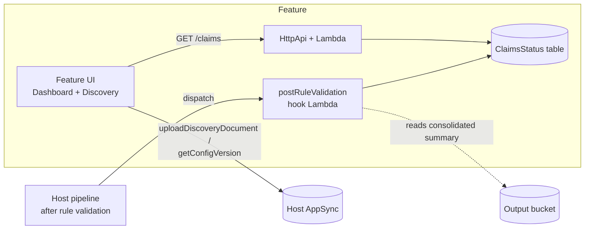

# Sample: Health Insurance Review — `sample-health-insurance-review`

The **advanced (use-case)** sample feature for the IDP Accelerator Feature
Platform — a health insurance claims-review vertical built on the accelerator's
[rule validation](../../docs/rule-validation.md) capability.

> **This is a sample, not a product.** It demonstrates how a *use-case*
> extension is built; a full Claims Processing solution is planned separately
> as an AWS Marketplace offering and is not this demo. (The featureId,
> directory, and docs slug keep the `sample-health-insurance-review` name for stability;
> only the display name is "Sample: Health Insurance Review".)

Where [`sample-feature/`](../sample-feature/) (`docs-by-status`) is a minimal
contract reference, this feature exercises the parts of the platform it does
not:

| Capability                       | `docs-by-status` | `sample-health-insurance-review` |
| -------------------------------- | :--------------: | :-------------: |
| UI bundle + registration         |        ✅        |       ✅        |
| Cognito-auth HTTP API            |     ✅ (1 GET)   |  ✅ (multi-route) |
| Config preset applied at install |        —         |       ✅        |
| `postRuleValidation` pipeline hook |      —         |       ✅        |
| Host-GraphQL calls from the UI   |        —         |   ✅ (Rules Discovery) |

## What it does

Adds a **Claims Review** page with two tabs:

- **Claims Dashboard** — every document that ran rule validation, with a
  deterministic claim status, Pass/Fail/Not-Found counts, and a per-rule
  drill-down.
- **Rules Discovery** — upload a payer policy PDF; the host's Rules Discovery
  pipeline extracts validation rules into a config version, which the tab
  renders as a browsable rule set.



## Claim status (deterministic, no LLM)

`hook/handler.py` derives the status from the consolidated rule-validation
summary's `overall_statistics.recommendation_counts`:

- all **Pass** → `CLEAN_CLAIM`
- any **Fail** → `REVIEW_REQUIRED`
- otherwise (Information Not Found dominates) → `INSUFFICIENT_DOCUMENTATION`

## Config preset

`config-preset/claims-config.yaml` is a **snapshot** of
[`config_library/unified/rule-validation/config.yaml`](../../config_library/unified/rule-validation/config.yaml)
— the canonical, maintained copy. If you update the rule-validation preset
there, refresh this snapshot and bump the feature version. At install the
ui-deployer applies it as a **non-active** config version
(`sample-health-insurance-review-v<version>`) for an admin to activate.

## Host contracts this feature relies on

This feature depends on these host-side contracts (shipped in
`feature-platform/main-stack-extensions/` and `patterns/unified/`):

- `applyFeatureConfigPreset` / `removeFeatureConfigPreset` mutations.
- The pipeline-hooks dispatcher
  (`patterns/unified/src/pipeline_hooks_function/`), which invokes hooks listed
  under `rule_validation.postHook` in the **active** config version.

Note: the feature does **not** call `registerFeatureHooks`. That mutation writes
the hook into whatever version is active at install (typically `default`), so
activating this feature's preset version would orphan the hook. Instead the
ui-deployer injects the `postRuleValidation` hook directly into the preset's
`rule_validation.postHook` before `applyFeatureConfigPreset`, so the hook
travels with the version the admin activates. (`unregisterFeatureHooks` is still
called on uninstall, as best-effort cleanup of any hook a prior feature build
left in the active version.)

It also imports three host exports: `<MainStackName>-OutputBucketName`,
`-WorkingBucketName`, and `-DiscoveryBucketName`.

## Publishing

Bundled with the accelerator: listed in
`config_library/extensions-oss.yaml`, so `idp-cli publish` builds it and adds it
to the catalog automatically.

To publish a copy to your own feature bucket for testing:

```bash
cd feature-platform/sample-health-insurance-review
idp-feature-cli publish . --feature-bucket <your-bucket> --region us-east-1
```

## Tests

```bash
cd feature-platform/sample-health-insurance-review/hook && python -m pytest
cd feature-platform/sample-health-insurance-review/feature-api && python -m pytest
cd feature-platform/sample-health-insurance-review/feature-ui && npm ci && npm run build
```

See [docs/extensions/sample-health-insurance-review.md](../../docs/extensions/sample-health-insurance-review.md)
for the end-user walkthrough and the
[Feature Platform Developer Guide](../../docs/feature-platform-developer-guide.md)
for the host contracts.
