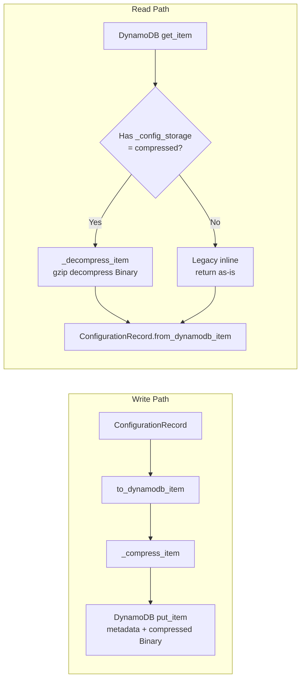
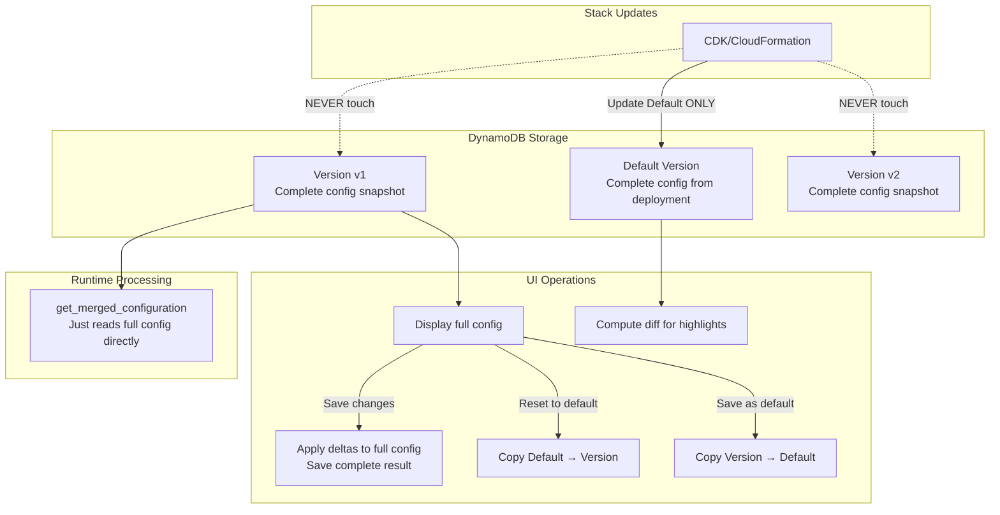

# Active Context

## Current Work Focus

### DynamoDB Configuration Compression - Issue #200 (February 19, 2026)
**Status:** ✅ Completed

#### Problem
DynamoDB enforces a hard 400KB per-item limit. The `ConfigurationManager` stored the entire IDP configuration (all document class schemas, extraction settings, etc.) as a single DynamoDB item. This capped the solution at ~45-47 document classes, blocking enterprise use cases requiring 100-500+ document types.

#### Solution: Gzip Compression
Added transparent gzip compression to the DynamoDB read/write layer. Config data is compressed into a single Binary attribute, while metadata fields (Configuration, IsActive, Description, CreatedAt, UpdatedAt) remain as top-level DynamoDB attributes for queryability.

#### Compression Results
- JSON schemas are extremely repetitive → 10-20x compression ratios
- 100 classes (~800KB raw) → ~60KB compressed ✅
- 500 classes (~4MB raw) → ~300KB compressed ✅
- Supports up to ~500 document classes comfortably

#### Backward Compatibility
- **Reads**: Auto-detects compressed vs legacy inline format via `_config_storage` marker
- **Writes**: Always uses compressed format (new items)
- **Upgrades**: Existing deployments continue working; configs auto-migrate to compressed on next write
- **No infrastructure changes**: Zero new S3 buckets, IAM policies, env vars, or template.yaml changes

#### Files Changed

| File | Change |
|------|--------|
| `lib/idp_common_pkg/idp_common/config/configuration_manager.py` | Added `_compress_item()`, `_decompress_item()`, updated `_write_record()`, `_read_record()`, `get_raw_configuration()` |
| `lib/idp_common_pkg/tests/unit/config/test_compression.py` | New: 18 comprehensive tests for compression |
| `lib/idp_common_pkg/tests/unit/config/test_save_schema_configuration.py` | Updated to decompress before asserting |
| `lib/idp_common_pkg/tests/unit/config/test_description_only_update.py` | Updated to decompress before asserting |

---

### Configuration Storage: Full Configs Per Version (February 14, 2026)
**Status:** ✅ Completed - Core refactoring done

#### Problem
The previous "sparse delta" pattern for config versions was introducing significant complexity and bugs:
- Two read paths (raw vs Pydantic-validated) needed to avoid Pydantic filling defaults
- Complex merge logic at runtime (Default + sparse Version deltas)
- Sync logic when default changed had to propagate to all versions
- Null-as-deletion semantics for "restore to default"
- Auto-cleanup stripping values that coincidentally matched defaults
- ~200+ lines of merge/delta/sync code

#### Decision
Now that we have proper config versioning, sparse deltas are no longer needed. Each version stores a **complete, self-contained configuration snapshot**.

#### New Design

#### Key Principles

1. **Versions are independent snapshots**: Each version is a complete config. Updating the default does NOT auto-propagate to other versions.

2. **What you save is what you get**: No hidden merge transforms. The config stored in DynamoDB is the config used at runtime.

3. **UI diff is a display concern**: The UI computes `get_diff_dict(default, version)` for highlighting changes, but this is only for display — not for storage.

4. **"Reset to default"**: Copies the current default config into the version.

5. **"Restore field"**: UI looks up the default value and sets it in the version config.

6. **Full config marker**: New-format configs have `_config_format: "full"` marker in DynamoDB.

#### Legacy Support

- **Auto-detection**: `_is_full_config()` detects whether a stored config is full (new) or sparse (legacy)
- **Auto-migration**: When a legacy sparse config is read at runtime, it's merged with default and the full result is saved back
- **Backward-compatible methods**: `save_raw_configuration()` and `sync_custom_with_new_default()` are kept as wrappers

#### Files Changed

| File | Change |
|------|--------|
| `lib/idp_common_pkg/idp_common/config/configuration_manager.py` | Complete rewrite of version storage logic |
| `lib/idp_common_pkg/idp_common/config/__init__.py` | Simplified `get_merged_configuration` |

#### What Was Removed/Simplified

- `save_configuration()`: No longer syncs other versions when default is updated
- `handle_update_custom_configuration()`: Normal updates apply deltas to full config, save full result
- `get_merged_configuration()`: Reads full config directly (legacy fallback merges + auto-migrates)
- `_sync_custom_with_new_default_sparse()`: Removed (was syncing versions on default change)
- `save_raw_configuration()`: Now a backward-compat wrapper that converts sparse→full
- `sync_custom_with_new_default()`: Now a no-op backward-compat wrapper

#### Trade-offs Accepted

✅ **Simpler code**: One read path, one write path, no merge logic at runtime
✅ **Predictable behavior**: What you save is what you get
✅ **Easier debugging**: Look at DynamoDB, see the full config
❌ **Stack upgrades don't auto-propagate**: New default settings don't flow to existing versions
   - Mitigation: UI can show "your version differs from current default" and let users choose

---

### Config Version Comparison Deep Diffs (February 14, 2026)
**Status:** ✅ Completed

#### Problem
The "Compare Selected" config versions feature was not showing changes in `classes` (document extraction schemas) or `rule_classes` (rule validation schemas) sections. Two issues:
1. `classes` was explicitly listed in `ignoredFields` — entirely skipped from comparison
2. No identity-based array comparison — arrays of complex JSON Schema objects (keyed by `$id`) need to be compared by matching items by their `$id` field, not by array index

#### Solution
Modified `src/ui/src/components/configuration-layout/ConfigurationComparison.jsx`:
- **Removed `classes` from `ignoredFields`** so document schemas are now included in comparison
- **Added `isIdentityKeyedArray()` detection** — detects arrays where all items have a `$id` field (applies to `classes` and `rule_classes`)
- **Added `$id`-based path generation** — for identity-keyed arrays, paths use the `$id` value as the key (e.g., `classes[Payslip].description`) instead of numeric index
- **Added `$id`-based path resolution** — `getNestedValue()` supports bracket notation like `classes[Payslip]` to find the array item where `$id === 'Payslip'`
- **Improved value formatting** — JSON-stringified objects/arrays get smarter display (truncation, item counts)
- Regular arrays (non-identity-keyed) are still treated as leaf values and stringified for comparison

#### Path format examples
- `classes[Payslip].description` — class description changed
- `classes[Payslip].properties.City.type` — nested field type changed
- `classes[BankStatement].$schema` — class present in one version but not another shows as `<missing>`
- `rule_classes[global_periods].rule_properties.minor_surgery` — rule property changed

---

### Configuration Versions Documentation (February 14, 2026)
**Status:** ✅ Completed

Created comprehensive documentation for the Configuration Versions feature:
- **New file**: `docs/configuration-versions.md` — full feature doc covering concepts, Web UI, CLI, Test Studio, storage architecture, GraphQL API, and upgrade considerations
- **Updated**: `docs/configuration.md` — added Configuration Versions section and unsaved changes/navigation guard docs
- **Updated**: `docs/test-studio.md` — fixed version naming terminology (arbitrary names, not v0/v1/v2)
- **Updated**: `docs/idp-cli.md` — corrected config-upload section to reflect full config storage (not sparse merging)
- **Updated**: `docs/web-ui.md` — added brief config versions reference
- **Updated**: `CHANGELOG.md` — added Configuration Versioning System entry under [Unreleased]

---

### TIFF Image Format Support Fix (February 6, 2026)
**Status:** ✅ Completed

Modified `_process_image_file_direct()` in `lib/idp_common_pkg/idp_common/ocr/service.py` to convert non-Bedrock-compatible formats (TIFF, BMP) to JPEG during OCR processing.

---

### Page/Section Number Alignment Fix (Pattern-1 to Pattern-2)
**Date:** February 6, 2026
**Status:** ✅ Completed

Modified `patterns/pattern-1/src/processresults_function/index.py` to keep `page_indices` 0-based in result.json while transforming `page_id` and `section_id` to 1-based for S3 paths and Document model.

---

### GitHub Issue #87 - System Defaults Configuration ✅
**Issue:** Simplify configuration management with system defaults
**Date:** January 20, 2026

System defaults YAML structure, merge utilities, CLI commands, and deploy integration all completed.

## Important Patterns and Preferences

### Configuration Design (Updated Feb 14, 2026)
- **Versions store FULL configs** (not sparse deltas)
- **Default is just another version** (the deployment baseline)
- **Versions are independent** - default changes don't propagate
- **UI computes diffs** for display highlighting only
- **Legacy sparse configs auto-migrate** on first read

### Configuration Merge Priority (for initial config creation)
1. User's custom config (highest)
2. Pattern-specific defaults (pattern-X.yaml)
3. Base defaults (base.yaml)
4. Pydantic model defaults (lowest)

### Auto-Detection Logic
Pattern is auto-detected from config:
- `classificationMethod: "bda"` → pattern-1
- `classificationMethod: "udop"` → pattern-3
- Default → pattern-2

## Learnings and Project Insights

1. **Sparse deltas are complex**: The merge/sync/strip logic was a major source of bugs
2. **Versioning eliminates need for deltas**: Each version can be a complete snapshot
3. **Auto-migration is smooth**: Legacy sparse configs seamlessly upgrade to full on first read
4. **Backward compat wrappers**: Keep old method signatures to avoid breaking callers