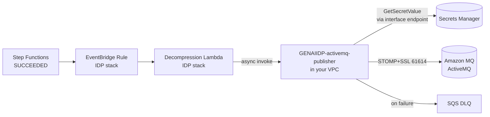

# GENAIIDP-activemq-publisher

Post-processing Lambda hook that publishes completed IDP document results to an
**Amazon MQ for ActiveMQ** broker over **STOMP+SSL**, running entirely inside a
customer VPC with no internet egress.



## Why STOMP

| Protocol | Port | Usable from Python Lambda |
|----------|------|---------------------------|
| **STOMP+SSL** | 61614 | **Yes** — `stomp.py` is pure Python, no native build |
| OpenWire | 61617 | No — Java client only |
| AMQP 1.0 | 5671 | Only via `python-qpid-proton` (native build required). `pika` speaks AMQP **0-9-1** and will not work against ActiveMQ. |
| MQTT | 8883 | Yes, but a poor fit for document result payloads |

## Deploy

```bash
cd samples/post-processing-lambda-hook/GENAIIDP-activemq-publisher
sam build
sam deploy --guided \
  --stack-name idp-activemq-hook \
  --capabilities CAPABILITY_IAM
```

Key parameters:

| Parameter | Notes |
|-----------|-------|
| `VpcId`, `PrivateSubnetIds` | Subnets need a route to the broker. **No NAT gateway required.** |
| `BrokerStompEndpoints` | `host:61614` — list **both** endpoints for an active/standby broker so the client fails over. |
| `BrokerSecurityGroupId` | Broker's SG. With `ManageBrokerIngress=true` (default) the stack adds the ingress rule for you. |
| `CreateSecretsManagerEndpoint` | `true` creates the interface endpoint. Set `false` if the VPC already has one, and supply `VpcCidr`. |
| `Destination` | `/queue/idp.document.completed` by default. |
| `IncludeSectionAttributes` | Set `false` to publish only S3 result URIs — recommended when extracted attributes carry PII. |
| `ReservedConcurrentExecutions` | Caps simultaneous broker connections (default 10). Keep well under the broker instance's connection limit. |

Then wire it into the IDP stack — set the main stack's
`PostProcessingLambdaHookFunctionArn` parameter to this stack's `FunctionArn`
output.

## Populate the secret

The stack creates the secret with **placeholder** values so it can deploy before
broker credentials exist. The function **refuses to publish** while the
placeholder is present and raises a descriptive error, so a half-configured
stack fails loudly rather than opening a bad connection.

```bash
aws secretsmanager put-secret-value \
  --secret-id "$(aws cloudformation describe-stacks --stack-name idp-activemq-hook \
      --query "Stacks[0].Outputs[?OutputKey=='BrokerCredentialsSecretArn'].OutputValue" --output text)" \
  --secret-string '{"username":"idp-publisher","password":"<real-password>"}'
```

Credentials are cached in the execution environment for 5 minutes, so a rotation
takes effect within 5 minutes without a redeploy.

> The secret carries `DeletionPolicy: Retain` — deleting or replacing the stack
> will not destroy real credentials. It must be deleted manually (or re-imported)
> if you tear the integration down.

## VPC endpoints required

| Access | Endpoint needed? |
|--------|------------------|
| Secrets Manager | **Yes** — interface endpoint (created by this stack by default) |
| CloudWatch Logs | No — Lambda delivers logs out of band, not through the VPC ENI |
| SQS DLQ (async destination) | No — delivered by the Lambda service, not from the ENI |
| S3 | Not used by default. Only needed if you extend the handler to fetch `extractionResultUri` contents — that would require an S3 **gateway** endpoint. |

## Message format

Published as `application/json`, `persistent:true`, with headers `message-id`,
`correlation-id` (both the Step Functions `executionArn`), `idp-document-id`,
and `idp-schema-version`.

```json
{
  "schemaVersion": "1.0",
  "eventId": "09904ff3-...",
  "eventTime": "2024-01-15T14:30:00Z",
  "executionArn": "arn:aws:states:...:execution:IDP-Workflow:doc_12345",
  "status": "SUCCEEDED",
  "document": {
    "id": "invoice-001.pdf",
    "inputBucket": "my-input-bucket",
    "inputKey": "invoice-001.pdf",
    "outputBucket": "my-output-bucket",
    "numPages": 3,
    "status": "EVALUATING",
    "summaryReportUri": "s3://my-output-bucket/invoice-001.pdf/summary/summary.md"
  },
  "sections": [
    {
      "sectionId": "1",
      "classification": "Invoice",
      "pageIds": ["1", "2", "3"],
      "extractionResultUri": "s3://.../sections/1/result.json",
      "attributes": {"invoice_number": "INV-2024-001", "total_amount": "$1,250.00"}
    }
  ],
  "metering": {"OCR/textract/analyze_document": {"pages": 3}}
}
```

Messages larger than `MAX_MESSAGE_BYTES` (128 KiB) are republished with section
`attributes` stripped and `"attributesOmitted": true` set — consumers fall back
to `extractionResultUri`.

## Delivery semantics

- The IDP decompressor invokes this function **asynchronously**, so Lambda
  retries twice on failure and then writes to this stack's SQS DLQ.
- Retries mean **at-least-once** delivery. `message-id` is the stable
  `executionArn`; consumers should dedupe on it. ActiveMQ does not dedupe
  natively.
- Each publish waits for a broker **RECEIPT** frame before returning, so a
  silently-dropped message surfaces as a function error rather than a false
  success.

## Test before the broker is reachable

Deploy with `DryRun=true` and the function logs the exact message it would
publish, without connecting. Send a document through IDP, then:

```bash
aws logs tail "/aws/lambda/GENAIIDP-activemq-publisher-idp-activemq-hook" --follow
```

Flip `DryRun=false` once the payload looks right and the secret is populated.

## Troubleshooting

| Symptom | Cause |
|---------|-------|
| `still holds the placeholder value 'REPLACE_ME'` | Secret not populated — see above. |
| Timeout on connect | Broker SG ingress missing (`ManageBrokerIngress=false` and no manual rule), or subnets have no route to the broker. |
| `GetSecretValue` timeout | No Secrets Manager interface endpoint, or the function SG's 443 egress does not reach it. |
| `No STOMP receipt from broker within Ns` | Broker rejected the destination, or the user lacks write authorization on that queue. |
| Broker connection-limit errors | Lower `ReservedConcurrentExecutions`. |
