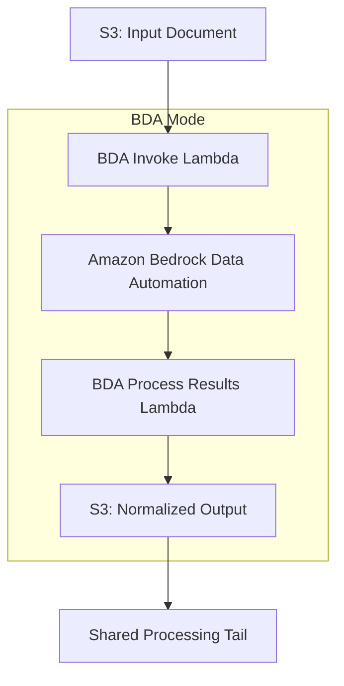

# BDA Mode Threat Analysis

## Document Information

| Field | Value |
|-------|-------|
| **Document Version** | 2.0 |
| **Last Updated** | 2025-03-19 |
| **Classification** | Internal |
| **Processing Mode** | BDA (`use_bda: true`) |

## 1. Overview

BDA (Bedrock Data Automation) mode uses Amazon's integrated document processing service that combines OCR, classification, and extraction into a single managed API call. BDA mode reduces infrastructure complexity and provides a streamlined processing path, but trades granular configurability for simplicity.

## 2. Architecture Components

### 2.1 Processing Steps

| Step | Lambda | AWS Service | Input | Output |
|------|--------|-------------|-------|--------|
| **BDA Invoke** | BDA Invoke Lambda | Amazon BDA | S3 document URI, BDA project ARN | BDA job ID |
| **BDA Process Results** | BDA Process Lambda | Amazon BDA | BDA job results | Normalized pipeline-format output |

### 2.2 BDA Configuration

- **BDA Project**: Pre-configured project defining document blueprints and extraction schemas
- **Output Mapping**: BDA results are transformed into the standard pipeline output format for compatibility with shared downstream steps
- **Supported formats**: PDF, images, and other document types supported by BDA

## 3. BDA-Specific Threats

### BDA.T01: BDA Service Opacity

| Attribute | Value |
|-----------|-------|
| **Threat ID** | BDA.T01 |
| **Category** | STRIDE: Information Disclosure, Repudiation |
| **Description** | BDA is a managed service with limited visibility into internal processing. Unlike Pipeline mode, customers cannot inspect intermediate OCR results, model prompts, or processing logic |
| **Attack Vector** | Not directly exploitable; represents a visibility/auditability gap |
| **Impact** | Difficulty diagnosing processing errors, limited ability to detect adversarial document manipulation, reduced forensic capability |
| **Likelihood** | Medium |
| **Severity** | Medium |
| **Affected Components** | BDA Invoke Lambda, BDA service |
| **Mitigations** | BDA output validation, comparison with Pipeline mode results for critical documents, evaluation framework, CloudWatch metrics monitoring |

### BDA.T02: BDA Output Format Mapping Errors

| Attribute | Value |
|-----------|-------|
| **Threat ID** | BDA.T02 |
| **Category** | STRIDE: Tampering |
| **Description** | The normalization layer that maps BDA output to standard pipeline format could introduce data loss, misrepresentation, or injection if BDA returns unexpected output structures |
| **Attack Vector** | BDA returns malformed or unexpected output that exploits mapping logic |
| **Impact** | Data corruption in downstream processing, incorrect extraction results passed to shared tail |
| **Likelihood** | Low |
| **Severity** | Medium |
| **Affected Components** | BDA Process Results Lambda |
| **Mitigations** | Strict output schema validation after mapping, defensive parsing, error handling with fallback to error state |

### BDA.T03: BDA Project Configuration Tampering

| Attribute | Value |
|-----------|-------|
| **Threat ID** | BDA.T03 |
| **Category** | STRIDE: Tampering, Elevation of Privilege |
| **Description** | Modification of BDA project configuration (blueprints, extraction schemas) could alter processing behavior for all BDA-mode documents |
| **Attack Vector** | Compromised admin account or direct AWS API access to modify BDA project settings |
| **Impact** | Systematic misprocessing of documents, data extraction to wrong schemas |
| **Likelihood** | Low |
| **Severity** | High |
| **Affected Components** | Amazon BDA project, BDA Invoke Lambda |
| **Mitigations** | IAM policies restricting BDA project modification, RBAC (Admin only), CloudTrail logging of BDA API calls, BDA project versioning |

### BDA.T04: BDA Service Availability

| Attribute | Value |
|-----------|-------|
| **Threat ID** | BDA.T04 |
| **Category** | STRIDE: Denial of Service |
| **Description** | BDA service throttling, outage, or quota exhaustion stops all document processing when in BDA mode |
| **Attack Vector** | Volume-based attacks exceeding BDA service limits, regional service disruption |
| **Impact** | Complete processing stoppage for BDA-mode deployments |
| **Likelihood** | Medium |
| **Severity** | Medium |
| **Affected Components** | BDA Invoke Lambda, Amazon BDA |
| **Mitigations** | SQS retry with DLQ, CloudWatch alarms on BDA errors, capacity planning, ability to switch to Pipeline mode via configuration |

### BDA.T05: S3 Cross-Access via BDA

| Attribute | Value |
|-----------|-------|
| **Threat ID** | BDA.T05 |
| **Category** | STRIDE: Information Disclosure |
| **Description** | BDA reads documents directly from S3 using service-linked roles. Misconfigured S3 bucket policies could allow BDA to access unintended objects |
| **Attack Vector** | Overly permissive S3 bucket policies or IAM roles granting BDA access beyond intended scope |
| **Impact** | BDA processes unintended documents, potential data exposure |
| **Likelihood** | Low |
| **Severity** | Medium |
| **Affected Components** | S3 Input Bucket, BDA service IAM role |
| **Mitigations** | Scoped S3 bucket policies, prefix-based access restrictions, IAM policy condition keys limiting BDA access |

## 4. BDA vs. Pipeline Mode Comparison

| Security Dimension | Pipeline Mode | BDA Mode |
|-------------------|---------------|----------|
| **Processing visibility** | Full visibility (separate steps, intermediate outputs) | Limited (single API call, opaque processing) |
| **Configuration granularity** | Per-step model/prompt control | BDA project-level configuration |
| **Attack surface** | Multiple API calls (Textract + Bedrock) | Single API call (BDA) |
| **Prompt injection risk** | Direct (prompts visible in config) | Indirect (BDA internal prompts) |
| **Intermediate data** | Stored in S3 per step | Only final output stored |
| **Audit trail** | Detailed per-step logging | BDA API call logging |
| **Fallback option** | Independent of BDA | Can fall back to Pipeline mode |

## 5. BDA Mode Security Controls Summary

| Control | Implementation | Threats Mitigated |
|---------|---------------|-------------------|
| **Output validation** | Schema validation of normalized BDA output | BDA.T01, BDA.T02 |
| **IAM scoping** | Minimal BDA-related permissions in Lambda execution role | BDA.T03, BDA.T05 |
| **CloudTrail** | Log all BDA API calls | BDA.T03 |
| **S3 bucket policy** | Restrict BDA access to specific prefixes | BDA.T05 |
| **Retry/DLQ** | SQS retry with dead letter queue | BDA.T04 |
| **Mode switching** | Runtime toggle to Pipeline mode as fallback | BDA.T04 |
| **Evaluation** | Ground truth comparison for accuracy monitoring | BDA.T01 |
| **RBAC** | Admin-only BDA project configuration | BDA.T03 |
