# Data Flows

## Document Information

| Field | Value |
|-------|-------|
| **Document Version** | 2.0 |
| **Last Updated** | 2025-03-19 |
| **Classification** | Internal |

## 1. Overview

This document describes the primary data flows through the GenAI IDP Accelerator, identifying where data crosses trust boundaries, undergoes transformation, and is persisted. Each flow is analyzed for security-relevant characteristics.

## 2. Document Processing Flow (Core Pipeline)

### 2.1 Document Ingestion

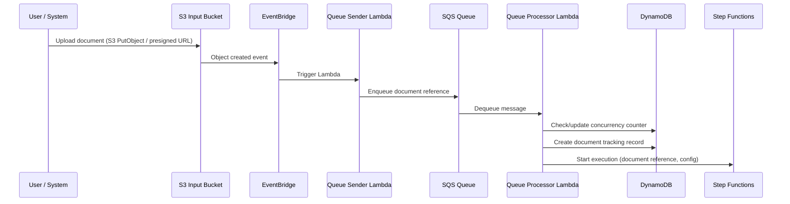

**Data in transit**: Document bytes (S3 upload), S3 object key references (SQS messages), configuration JSON (Step Functions input).

**Trust boundary crossings**:
- TB1→TB2: User uploads document over HTTPS
- TB3 internal: S3 → EventBridge → Lambda → SQS → Lambda → Step Functions

**Security controls**:
- S3 bucket policy restricts upload access
- SQS encryption at rest (SSE-SQS)
- Step Functions input validated by Queue Processor Lambda
- DynamoDB concurrency counter prevents runaway processing

### 2.2 Pipeline Mode Processing

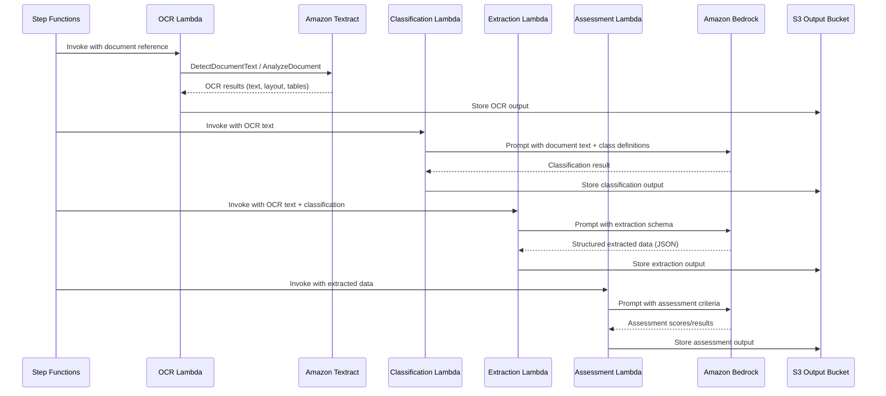

**Data transformation**: Raw document → OCR text/layout → classified document type → structured JSON extraction → quality assessment scores.

**Sensitive data exposure**: Full document text is sent to Bedrock and Textract API endpoints. Extracted PII/sensitive data flows through Lambda memory and is written to S3.

**Trust boundary crossings**:
- TB3→TB4: Lambda sends document text to Textract and Bedrock APIs

### 2.3 BDA Mode Processing

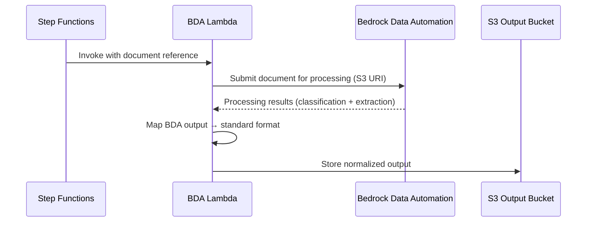

**Data transformation**: Raw document → BDA-processed results → normalized to standard pipeline output format.

**Trust boundary crossings**:
- TB3→TB4: Lambda provides S3 URI to BDA service; BDA reads document directly from S3

### 2.4 Shared Processing Tail

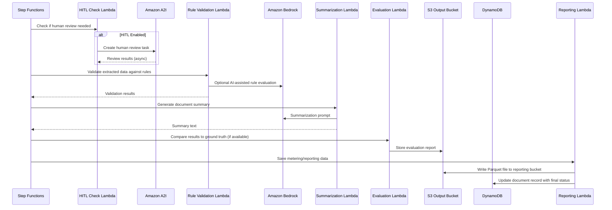

## 3. Web UI Data Flows

### 3.1 Authentication Flow

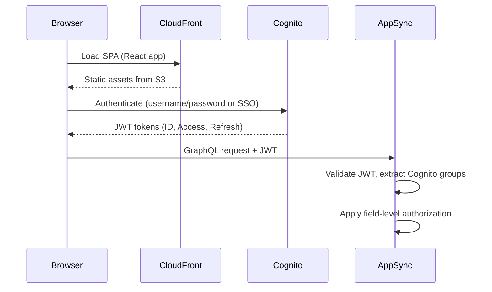

**Trust boundary crossings**: TB1→TB2 (browser to CloudFront/Cognito), TB2→TB3 (Cognito JWT to AppSync).

### 3.2 Configuration Management Flow

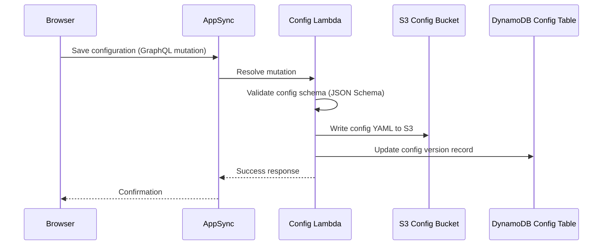

**Security note**: Configuration includes model IDs, prompts, extraction schemas, and processing parameters. Malicious configuration could influence all subsequent document processing.

### 3.3 Document Upload Flow (UI)

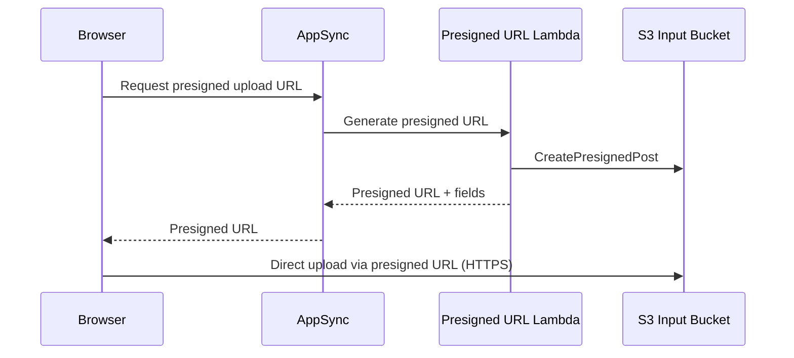

## 4. Agent & Chat Data Flows

### 4.1 Companion Chat Flow

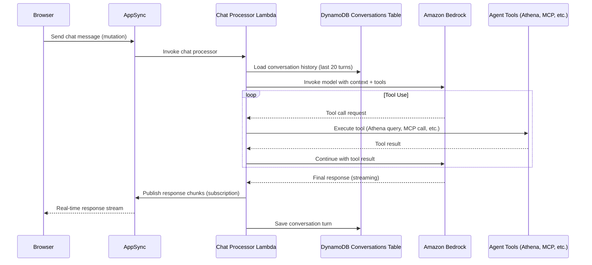

**Trust boundary crossings**:
- TB1→TB3: User message via AppSync
- TB3→TB4: Conversation context sent to Bedrock
- TB3→TB5: Analytics queries to Athena
- TB3→TB6: MCP tool calls to customer-managed agents

### 4.2 Agent Analysis Flow

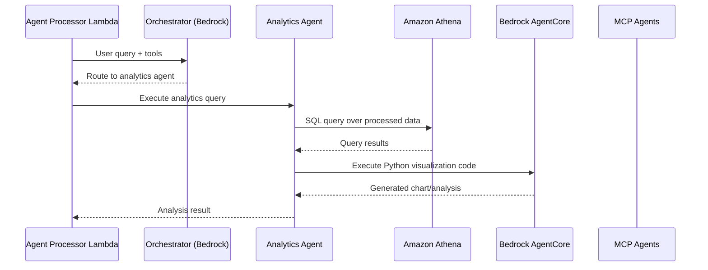

**Security note**: Natural language → SQL translation creates SQL injection risk. AgentCore code execution is sandboxed but executes AI-generated code.

### 4.3 MCP Integration Flow

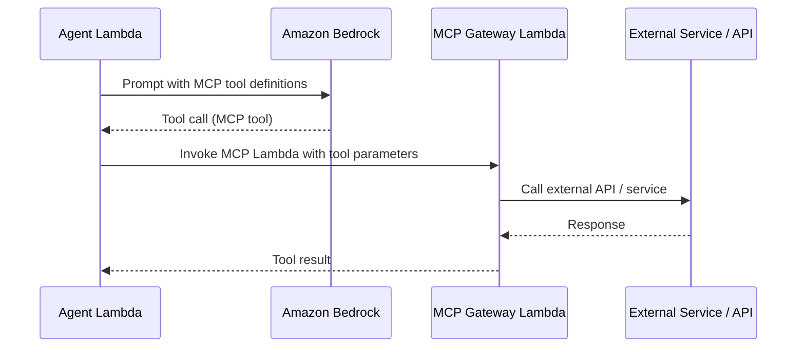

**Trust boundary crossings**: TB3→TB6→External. MCP agents can call external services, introducing data exfiltration and injection risks.

## 5. SDK/CLI Data Flow

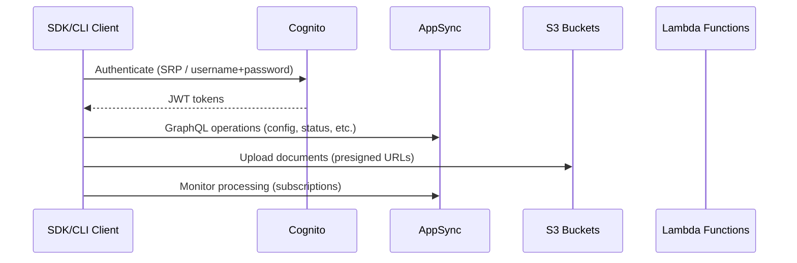

**Security note**: SDK/CLI stores credentials locally on developer machines. Tokens are short-lived but refresh tokens provide extended access.

## 6. Reporting & Analytics Data Flow

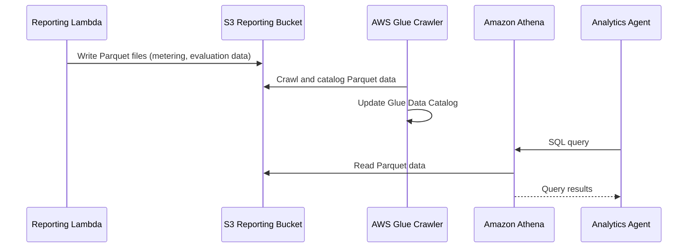

## 7. Knowledge Base Data Flow

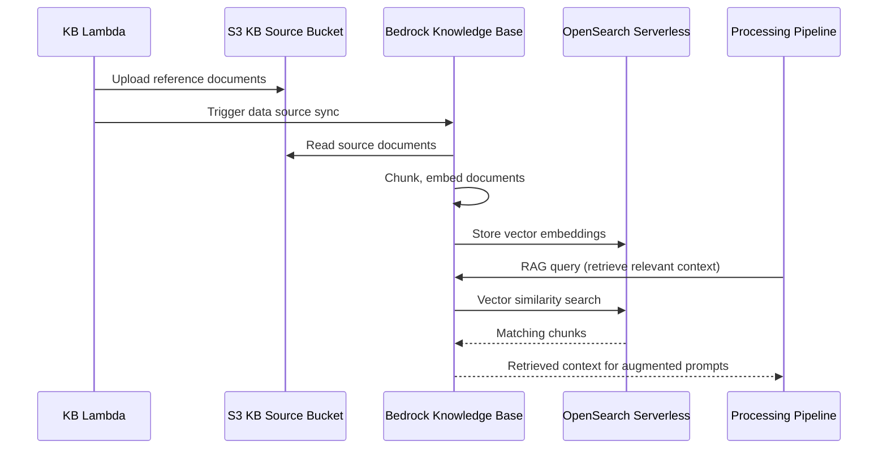

## 8. Lambda Hook Data Flows

### 8.1 Inference Hook

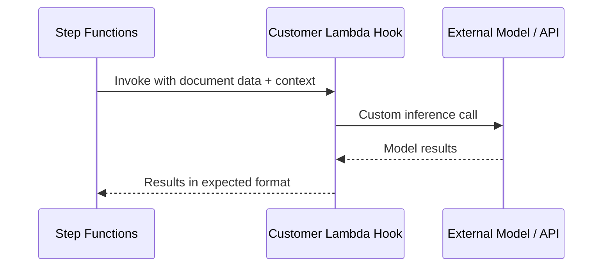

### 8.2 Post-Processing Hook

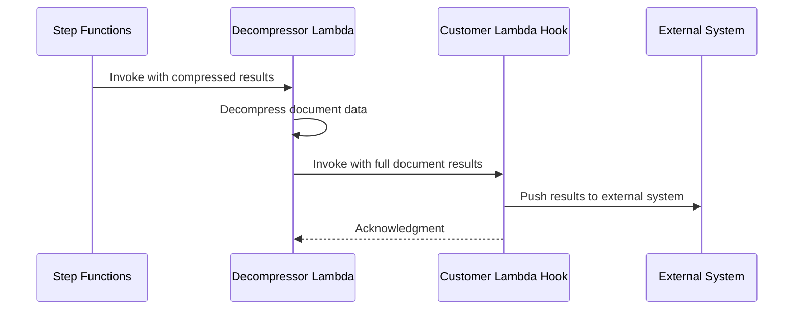

**Trust boundary crossings**: TB3→TB6. Customer-managed Lambda hooks receive full document processing results and can send data to arbitrary external systems.

## 9. Summary of Cross-Boundary Data Flows

| Flow | From | To | Data Sensitivity | Controls |
|------|------|----|-----------------|----------|
| Document upload | TB1 | TB3 | High (customer docs) | HTTPS, presigned URLs, auth |
| OCR processing | TB3 | TB4 | High (full document text) | TLS, IAM roles |
| LLM prompts | TB3 | TB4 | High (document text + PII) | TLS, IAM roles, no training opt-out |
| Chat messages | TB1 | TB3→TB4 | Medium-High (user queries + context) | Auth, TLS, conversation isolation |
| MCP tool calls | TB3 | TB6→External | Variable (depends on tool) | IAM, customer responsibility |
| Lambda hooks | TB3 | TB6 | High (full processing results) | IAM, invocation-only permissions |
| Analytics queries | TB3 | TB5 | High (aggregated processing data) | Athena workgroup, IAM |
| KB retrieval | TB3 | TB4→TB5 | Medium (reference doc chunks) | IAM, encryption |
| SDK/CLI auth | TB1 | TB2 | High (credentials) | SRP protocol, short-lived tokens |
| Configuration | TB1 | TB3 | Medium (prompts, schemas) | Auth, schema validation |
