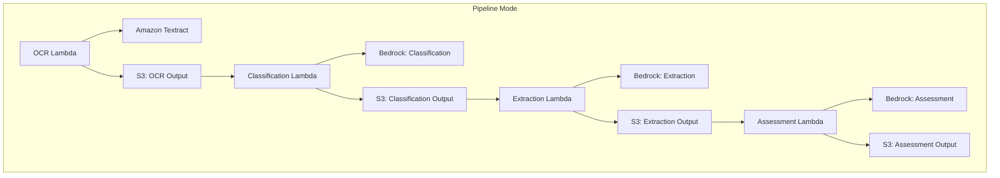

# Pipeline Mode Threat Analysis

## Document Information

| Field | Value |
|-------|-------|
| **Document Version** | 2.0 |
| **Last Updated** | 2025-03-19 |
| **Classification** | Internal |
| **Processing Mode** | Pipeline (`use_bda: false`) |

## 1. Overview

Pipeline mode is the default processing mode that uses Amazon Textract for OCR and Amazon Bedrock foundation models (Claude, Nova) for classification, extraction, assessment, and summarization. This mode provides maximum configurability with separate prompts and model selection for each processing stage.

## 2. Architecture Components

### 2.1 Processing Steps

| Step | Lambda | AWS Service | Input | Output |
|------|--------|-------------|-------|--------|
| **OCR** | OCR Lambda | Amazon Textract (DetectDocumentText, AnalyzeDocument) | S3 document URI | Text, layout, tables, forms |
| **Classification** | Classification Lambda | Amazon Bedrock (Claude/Nova) | OCR text + class definitions | Document type + confidence |
| **Extraction** | Extraction Lambda | Amazon Bedrock (Claude/Nova) | OCR text + extraction schema | Structured JSON data |
| **Assessment** | Assessment Lambda | Amazon Bedrock (Claude/Nova) | Extracted data + criteria | Quality scores + assessments |

### 2.2 Configurable Elements

Each step is independently configurable via the YAML configuration:
- **Model selection**: Different Bedrock models per step (e.g., Nova for classification, Claude for extraction)
- **Custom prompts**: Full control over system and user prompts
- **Extraction schemas**: JSON Schema-based field definitions with types, descriptions, validation rules
- **Classification definitions**: Document type names, descriptions, few-shot examples
- **Assessment criteria**: Configurable quality criteria with scoring rubrics
- **Few-shot examples**: S3-stored example documents for improved accuracy

## 3. Pipeline-Specific Threats

### PM.T01: Prompt Injection via Document Content

| Attribute | Value |
|-----------|-------|
| **Threat ID** | PM.T01 |
| **Category** | STRIDE: Tampering, Elevation of Privilege |
| **Description** | Adversarial content embedded in documents (text, metadata, hidden layers) could manipulate Bedrock model behavior during classification, extraction, or assessment |
| **Attack Vector** | Upload document containing prompt injection payloads in visible or hidden text |
| **Impact** | Misclassification, incorrect extraction, bypassed assessment criteria, data exfiltration via model output |
| **Likelihood** | High |
| **Severity** | High |
| **Affected Components** | Classification Lambda, Extraction Lambda, Assessment Lambda |
| **Mitigations** | Input sanitization, prompt engineering with guardrails, output validation, Bedrock Guardrails configuration, assessment step as verification layer |

### PM.T02: OCR Manipulation / Adversarial Documents

| Attribute | Value |
|-----------|-------|
| **Threat ID** | PM.T02 |
| **Category** | STRIDE: Tampering |
| **Description** | Specially crafted documents designed to produce incorrect OCR output from Textract, leading to downstream processing errors |
| **Attack Vector** | Documents with adversarial fonts, overlapping text, steganographic content, or layout manipulation |
| **Impact** | Incorrect text extraction leading to misclassification, wrong data extraction, failed validation |
| **Likelihood** | Medium |
| **Severity** | Medium |
| **Affected Components** | OCR Lambda, Amazon Textract |
| **Mitigations** | Document format validation, image quality checks, confidence score thresholds, multi-pass OCR comparison |

### PM.T03: Model Output Manipulation

| Attribute | Value |
|-----------|-------|
| **Threat ID** | PM.T03 |
| **Category** | STRIDE: Tampering, Information Disclosure |
| **Description** | Bedrock model responses could contain unexpected content, hallucinated data, or leak information from training data |
| **Attack Vector** | Crafted prompts or document content that causes model to generate unexpected outputs |
| **Impact** | Incorrect business decisions based on hallucinated data, false confidence scores |
| **Likelihood** | Medium |
| **Severity** | High |
| **Affected Components** | Classification Lambda, Extraction Lambda, Assessment Lambda |
| **Mitigations** | Output schema validation (JSON Schema), confidence thresholds, evaluation against ground truth, human review for high-value documents |

### PM.T04: Cross-Step Data Poisoning

| Attribute | Value |
|-----------|-------|
| **Threat ID** | PM.T04 |
| **Category** | STRIDE: Tampering |
| **Description** | Compromised output from one pipeline step could poison subsequent steps. For example, incorrect OCR output could cause the extraction step to produce malicious structured data |
| **Attack Vector** | Exploit S3 intermediate storage or Lambda compromise to modify inter-step data |
| **Impact** | Cascading errors through entire pipeline, corrupted final output |
| **Likelihood** | Low |
| **Severity** | High |
| **Affected Components** | S3 intermediate outputs, all pipeline Lambdas |
| **Mitigations** | S3 versioning, server-side encryption, IAM role separation per Lambda, Step Functions state validation |

### PM.T05: Textract Service Dependency

| Attribute | Value |
|-----------|-------|
| **Threat ID** | PM.T05 |
| **Category** | STRIDE: Denial of Service |
| **Description** | Amazon Textract service throttling or outage impacts all document processing in Pipeline mode |
| **Attack Vector** | Volume-based attacks exceeding Textract API limits, or AWS service disruption |
| **Impact** | Complete processing pipeline stoppage |
| **Likelihood** | Medium |
| **Severity** | Medium |
| **Affected Components** | OCR Lambda, Amazon Textract |
| **Mitigations** | Retry logic with exponential backoff, SQS dead letter queue, CloudWatch alarms on Textract errors, capacity planning with service quotas |

### PM.T06: Configuration Tampering

| Attribute | Value |
|-----------|-------|
| **Threat ID** | PM.T06 |
| **Category** | STRIDE: Tampering, Elevation of Privilege |
| **Description** | Malicious modification of pipeline configuration (prompts, schemas, model IDs) could alter processing behavior for all subsequent documents |
| **Attack Vector** | Compromised admin account modifies configuration via UI or API |
| **Impact** | All documents processed with malicious prompts, data extraction to attacker-controlled schemas, use of unauthorized models |
| **Likelihood** | Medium |
| **Severity** | Critical |
| **Affected Components** | Configuration S3 bucket, DynamoDB config table, AppSync API |
| **Mitigations** | RBAC (only Admin/Author can modify config), configuration versioning, JSON Schema validation, audit logging, configuration change alerts |

### PM.T07: Few-Shot Example Poisoning

| Attribute | Value |
|-----------|-------|
| **Threat ID** | PM.T07 |
| **Category** | STRIDE: Tampering |
| **Description** | Malicious few-shot examples uploaded to S3 could systematically bias classification and extraction behavior |
| **Attack Vector** | Upload poisoned example documents that cause model to misclassify or misextract targeted document types |
| **Impact** | Systematic misprocessing of specific document types |
| **Likelihood** | Low |
| **Severity** | Medium |
| **Affected Components** | Few-shot examples S3 storage, Classification Lambda, Extraction Lambda |
| **Mitigations** | RBAC on example management (Admin/Author only), example validation, evaluation framework to detect accuracy degradation |

## 4. Pipeline Mode Security Controls Summary

| Control | Implementation | Threats Mitigated |
|---------|---------------|-------------------|
| **Input validation** | Document format/size checks, Lambda input validation | PM.T01, PM.T02 |
| **Output validation** | JSON Schema validation of model outputs | PM.T03, PM.T04 |
| **Prompt engineering** | Guardrails in system prompts, input/output tags | PM.T01 |
| **Bedrock Guardrails** | Optional content filtering and topic denial | PM.T01, PM.T03 |
| **Encryption** | S3 SSE, TLS in transit | PM.T04 |
| **IAM least privilege** | Separate execution roles per Lambda | PM.T04, PM.T06 |
| **RBAC** | Cognito groups controlling config access | PM.T06, PM.T07 |
| **Retry/DLQ** | SQS DLQ, Step Functions retry policies | PM.T05 |
| **Evaluation** | Ground truth comparison for accuracy monitoring | PM.T03, PM.T07 |
| **Audit logging** | CloudWatch Logs, CloudTrail | PM.T06 |
