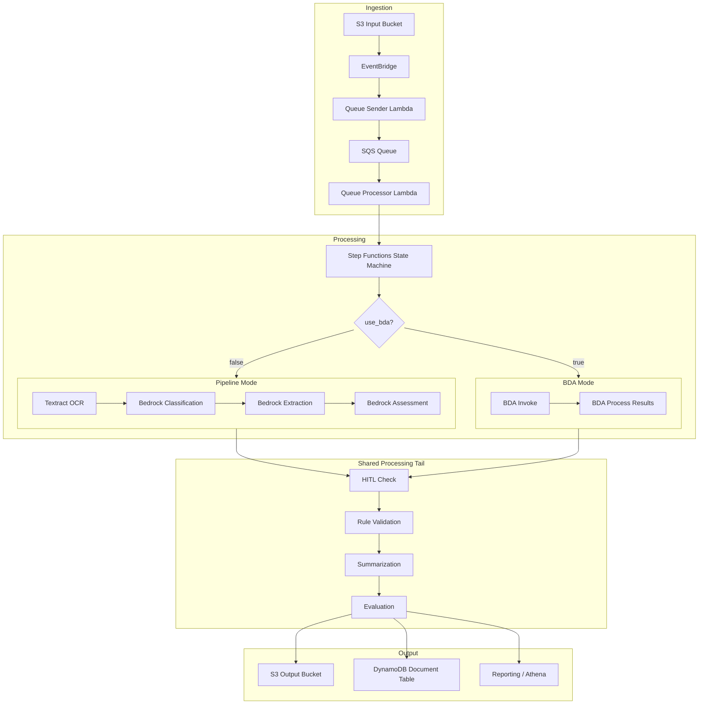
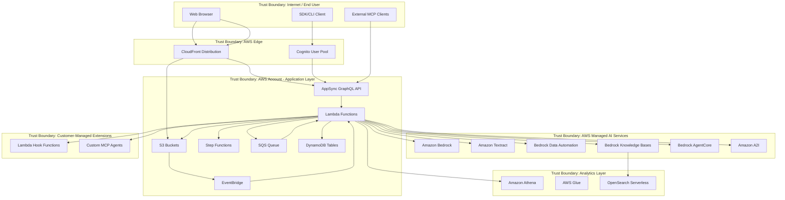

# System Overview

## Document Information

| Field | Value |
|-------|-------|
| **Document Version** | 2.0 |
| **Last Updated** | 2025-03-19 |
| **Classification** | Internal |
| **System Name** | GenAI Intelligent Document Processing (IDP) Accelerator |

## 1. System Purpose

The GenAI IDP Accelerator is an AWS-deployed intelligent document processing solution that automates the extraction, classification, and analysis of information from documents using generative AI. It provides a configurable, serverless pipeline that processes documents through multiple stages—OCR, classification, extraction, assessment, rule validation, summarization, and evaluation—with optional human-in-the-loop (HITL) review.

## 2. Unified Architecture

The system uses a **unified deployment model** with two processing modes selectable at runtime via the `use_bda` configuration flag:

- **Pipeline Mode** (`use_bda: false`, default): Uses Amazon Textract for OCR and Amazon Bedrock foundation models (Claude, Nova) for classification, extraction, and assessment.
- **BDA Mode** (`use_bda: true`): Uses Amazon Bedrock Data Automation (BDA) as an integrated service for document processing, with results mapped back into the standard pipeline output format.

Both modes share common infrastructure for document ingestion, queueing, tracking, human review, rule validation, evaluation, reporting, and the web UI.

## 3. Key Components

### 3.1 Infrastructure Layer

| Component | Service | Purpose |
|-----------|---------|---------|
| **Input/Output Storage** | Amazon S3 (3 buckets) | Document upload, processing output, configuration storage |
| **Document Queue** | Amazon SQS | Decouples ingestion from processing; manages throughput |
| **Event Routing** | Amazon EventBridge | S3 events → Lambda, Step Functions status tracking |
| **Workflow Orchestration** | AWS Step Functions | Manages multi-step document processing workflow |
| **Document Tracking** | Amazon DynamoDB (6+ tables) | Documents, Configuration, Metering, Conversations, Agents, etc. |
| **API Layer** | AWS AppSync (GraphQL) | Real-time subscriptions, CRUD operations for UI |
| **Authentication** | Amazon Cognito | User pools, 4 RBAC groups (Admin/Author/Reviewer/Viewer) |
| **Compute** | AWS Lambda (50+ functions) | All processing logic, API resolvers, agents |
| **Monitoring** | Amazon CloudWatch | 60+ alarms, dashboards, log groups |

### 3.2 AI/ML Services

| Service | Usage |
|---------|-------|
| **Amazon Bedrock** | Foundation models (Claude 3.x, Nova) for classification, extraction, assessment, summarization, agent chat |
| **Amazon Bedrock Data Automation (BDA)** | Integrated document processing (OCR + extraction) in BDA mode |
| **Amazon Textract** | OCR (DetectDocumentText, AnalyzeDocument) in Pipeline mode |
| **Amazon Bedrock Knowledge Bases** | RAG-based document retrieval using OpenSearch Serverless |
| **Amazon Bedrock AgentCore** | Sandboxed Python code execution for analytics agent |
| **Amazon Athena** | SQL analytics over processed document data |

### 3.3 Application Features

| Feature | Description | Key Services |
|---------|-------------|--------------|
| **Web UI** | React/CloudFront SPA for configuration, monitoring, review | CloudFront, S3, AppSync, Cognito |
| **Agent Analysis** | Multi-agent AI for interactive document analysis | Bedrock, Athena, AgentCore |
| **Companion Chat** | Multi-turn conversational AI with streaming | AppSync, Bedrock, DynamoDB |
| **MCP Integration** | External tool execution via Model Context Protocol | Lambda, Bedrock, external APIs |
| **RBAC** | 4-tier role-based access control | Cognito Groups, AppSync resolvers |
| **Human Review** | Amazon A2I integration for document review workflows | A2I, SageMaker, Lambda |
| **Discovery** | AI-driven configuration generation from sample documents | Bedrock, Lambda |
| **SDK/CLI** | Programmatic access for automation and integration | Python package, Cognito auth |
| **Knowledge Base** | RAG integration for context-enhanced processing | Bedrock KB, OpenSearch Serverless |
| **Lambda Hooks** | Custom inference and post-processing extensibility | Lambda, customer-managed code |
| **Reporting** | Analytics database with Athena, Glue, Parquet | S3, Glue, Athena |
| **Test Studio** | Interactive document testing in browser | AppSync, Lambda, S3 |
| **Service Tiers** | Express/Standard/Advanced feature gating | Configuration, AppSync |
| **Rule Validation** | Configurable business rule checks on extracted data | Lambda, Bedrock |
| **Few-Shot Examples** | Example-based learning for improved accuracy | S3, Lambda |
| **Nova Fine-tuning** | Custom model training for document classification | Bedrock, S3 |
| **Evaluation** | Automated accuracy measurement against ground truth | Lambda, S3 |
| **Cost Calculator** | Token-based cost estimation | Lambda |

## 4. Trust Boundaries

### Trust Boundary Descriptions

| Boundary | Description | Controls |
|----------|-------------|----------|
| **TB1: Internet/End User** | Untrusted external users and clients | TLS, authentication required |
| **TB2: AWS Edge** | CDN and identity services | CloudFront OAC, Cognito JWT validation |
| **TB3: Application Layer** | Core application infrastructure | IAM roles, least-privilege Lambda execution roles, VPC-optional |
| **TB4: Managed AI Services** | AWS-managed AI/ML services | Service-linked roles, data encryption in transit/at rest |
| **TB5: Analytics Layer** | Data analytics and search | Athena workgroup isolation, OpenSearch encryption |
| **TB6: Customer Extensions** | Customer-provided Lambda hooks and MCP agents | Separate IAM roles, invocation-only permissions from core |

## 5. Data Classification

| Data Type | Classification | Storage | Encryption |
|-----------|---------------|---------|------------|
| Source documents | Customer Confidential | S3 Input Bucket | SSE-S3 / SSE-KMS |
| Extracted data / results | Customer Confidential | S3 Output Bucket, DynamoDB | SSE-S3 / SSE-KMS, DDB encryption |
| Configuration | Internal | S3 Config Bucket, DynamoDB | SSE-S3, DDB encryption |
| User credentials | Restricted | Cognito | AWS-managed encryption |
| Chat conversations | Customer Confidential | DynamoDB | DDB encryption at rest |
| Reporting data | Customer Confidential | S3 Reporting Bucket (Parquet) | SSE-S3 |
| Knowledge Base vectors | Customer Confidential | OpenSearch Serverless | Encryption at rest |
| Processing logs | Internal | CloudWatch Logs | CloudWatch encryption |
| Evaluation/ground truth | Internal | S3 | SSE-S3 |

## 6. Deployment Model

- **Deployment method**: AWS SAM (CloudFormation) via `sam deploy`
- **Runtime**: Python 3.12+ (Lambda), React (UI)
- **Regions**: All commercial AWS regions with required service availability; GovCloud supported with limitations
- **Service tiers**: Express (basic), Standard (default), Advanced (full features)
- **Multi-tenancy**: Single-tenant per deployment (one stack = one environment)
- **Infrastructure as Code**: All resources defined in `template.yaml` + nested stacks
