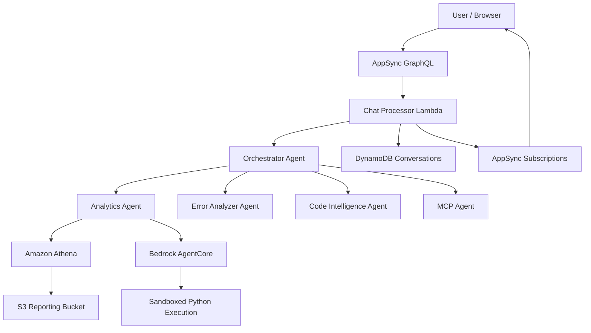

# Agent Analysis — Threat Analysis

## Document Information

| Field | Value |
|-------|-------|
| **Document Version** | 2.0 |
| **Last Updated** | 2025-03-19 |
| **Feature** | Agent Analysis (Multi-Agent AI System) |
| **Classification** | Internal |

## 1. Feature Overview

Agent Analysis provides a multi-agent AI system for interactive document data analysis. It includes:
- **Orchestrator Agent**: Routes user queries to specialized agents
- **Analytics Agent**: Executes SQL queries via Amazon Athena and generates Python visualizations via Bedrock AgentCore
- **MCP Agents**: External tool integrations via Model Context Protocol
- **Error Analyzer Agent**: Diagnoses processing failures
- **Code Intelligence Agent**: Provides codebase analysis

Users interact via a conversational interface (Companion Chat) and receive real-time streaming responses via AppSync subscriptions.

## 2. Architecture

## 3. Threat Analysis

### AGT.T01: SQL Injection via Natural Language

| Attribute | Value |
|-----------|-------|
| **Threat ID** | AGT.T01 |
| **Category** | STRIDE: Tampering, Information Disclosure |
| **Description** | The Analytics Agent translates natural language queries to SQL for Athena execution. Malicious user inputs could manipulate the generated SQL to access unauthorized data, drop tables, or extract sensitive information |
| **Attack Vector** | User submits crafted natural language query designed to generate malicious SQL (e.g., "show me all data; DROP TABLE documents--") |
| **Impact** | Unauthorized data access, data deletion, exposure of all processed document data |
| **Likelihood** | Medium |
| **Severity** | High |
| **Affected Components** | Analytics Agent, Amazon Athena, S3 Reporting Bucket |
| **Mitigations** | Athena workgroup with restricted permissions (read-only), query result size limits, SQL query validation/sanitization before execution, Athena query logging, IAM role with read-only Glue/S3 access |

### AGT.T02: Arbitrary Code Execution via AgentCore

| Attribute | Value |
|-----------|-------|
| **Threat ID** | AGT.T02 |
| **Category** | STRIDE: Tampering, Elevation of Privilege |
| **Description** | The Analytics Agent generates and executes Python code in Bedrock AgentCore for data visualization. AI-generated code could contain malicious operations if influenced by prompt injection |
| **Attack Vector** | Prompt injection via user query or data content that manipulates the AI into generating malicious Python code |
| **Impact** | Code execution within AgentCore sandbox—limited by isolation but could process sensitive data unexpectedly |
| **Likelihood** | Medium |
| **Severity** | Medium |
| **Affected Components** | Analytics Agent, Bedrock AgentCore |
| **Mitigations** | AgentCore runs in AWS-managed sandboxed environment (no network access, no AWS credentials), code output validation, execution time limits, output size limits |

### AGT.T03: Agent Routing Manipulation

| Attribute | Value |
|-----------|-------|
| **Threat ID** | AGT.T03 |
| **Category** | STRIDE: Elevation of Privilege |
| **Description** | The orchestrator agent routes queries to specialized agents based on intent classification. Prompt injection could manipulate routing to invoke unintended agents or tools |
| **Attack Vector** | Crafted user queries that trick the orchestrator into routing to a more powerful agent or invoking sensitive tools |
| **Impact** | Unauthorized access to analytics data, code execution, or external systems via MCP |
| **Likelihood** | Medium |
| **Severity** | Medium |
| **Affected Components** | Orchestrator Agent, all sub-agents |
| **Mitigations** | Agent-level authorization checks, tool-level access controls, audit logging of all agent invocations, RBAC integration with agent capabilities |

### AGT.T04: Conversation History Poisoning

| Attribute | Value |
|-----------|-------|
| **Threat ID** | AGT.T04 |
| **Category** | STRIDE: Tampering |
| **Description** | Conversation history (last 20 turns stored in DynamoDB) is included in agent context. If an earlier turn contains injected content, it could influence subsequent agent responses |
| **Attack Vector** | Multi-turn attack where early messages inject context that activates in later turns when combined with agent tool calls |
| **Impact** | Persistent prompt injection across conversation, manipulated agent behavior |
| **Likelihood** | Low |
| **Severity** | Medium |
| **Affected Components** | DynamoDB Conversations Table, Chat Processor Lambda |
| **Mitigations** | Conversation history sanitization, turn-level isolation in prompts, conversation session limits, ability to clear history |

### AGT.T05: Cross-User Data Leakage via Athena

| Attribute | Value |
|-----------|-------|
| **Threat ID** | AGT.T05 |
| **Category** | STRIDE: Information Disclosure |
| **Description** | In multi-user deployments, all users with agent access query the same Athena dataset. SQL queries could access data from documents processed by other users |
| **Attack Vector** | User crafts query to retrieve processing results from documents they didn't upload |
| **Impact** | Cross-user information disclosure of processed document data |
| **Likelihood** | Medium |
| **Severity** | High |
| **Affected Components** | Amazon Athena, S3 Reporting Bucket, Analytics Agent |
| **Mitigations** | RBAC-based agent access control (Admin/Author roles required), Athena query scoping, user-aware query generation, deployment as single-tenant per stack |

## 4. Security Controls Summary

| Control | Implementation | Threats Mitigated |
|---------|---------------|-------------------|
| **Athena read-only** | IAM role with only SELECT permissions | AGT.T01 |
| **AgentCore sandbox** | AWS-managed isolation (no network, no credentials) | AGT.T02 |
| **RBAC** | Cognito group-based agent access | AGT.T03, AGT.T05 |
| **Audit logging** | All agent invocations logged to CloudWatch | AGT.T01, AGT.T03 |
| **Query validation** | SQL sanitization before Athena execution | AGT.T01 |
| **Session management** | Conversation history limits, session isolation | AGT.T04 |
| **Single-tenant** | One deployment per environment | AGT.T05 |
