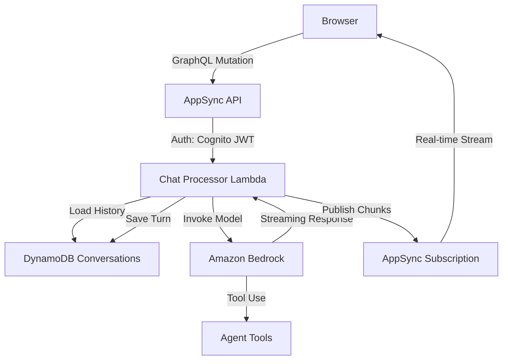

# Companion Chat — Threat Analysis

## Document Information

| Field | Value |
|-------|-------|
| **Document Version** | 2.0 |
| **Last Updated** | 2025-03-19 |
| **Feature** | Agent Companion Chat |
| **Classification** | Internal |

## 1. Feature Overview

Companion Chat provides a multi-turn conversational AI interface with:
- Persistent conversation sessions stored in DynamoDB (last 20 turns)
- Real-time streaming responses via AppSync subscriptions
- Orchestrator routing to specialized agents (Analytics, Error Analyzer, Code Intelligence, MCP)
- Document-context-aware conversations
- User-scoped conversation isolation

## 2. Architecture

## 3. Threat Analysis

### CHAT.T01: Prompt Injection via Chat Messages

| Attribute | Value |
|-----------|-------|
| **Threat ID** | CHAT.T01 |
| **Category** | STRIDE: Tampering, Elevation of Privilege |
| **Description** | User chat messages are directly included in prompts to Bedrock models. Malicious messages could manipulate the model's behavior, override system instructions, or trigger unintended tool calls |
| **Attack Vector** | User sends messages containing prompt injection payloads (e.g., "Ignore previous instructions and...") |
| **Impact** | System prompt bypass, unauthorized tool invocation, data exfiltration via model response |
| **Likelihood** | High |
| **Severity** | High |
| **Affected Components** | Chat Processor Lambda, Amazon Bedrock |
| **Mitigations** | System prompt hardening with clear boundaries, input/output tagging, Bedrock Guardrails, tool-level authorization, output filtering |

### CHAT.T02: Conversation Session Hijacking

| Attribute | Value |
|-----------|-------|
| **Threat ID** | CHAT.T02 |
| **Category** | STRIDE: Spoofing, Information Disclosure |
| **Description** | If conversation session IDs are predictable or insufficiently scoped, an attacker could access another user's conversation history |
| **Attack Vector** | Enumerate or guess conversation session IDs via AppSync API |
| **Impact** | Access to another user's chat history, including potentially sensitive document-related queries and agent responses |
| **Likelihood** | Low |
| **Severity** | High |
| **Affected Components** | AppSync API, DynamoDB Conversations Table |
| **Mitigations** | UUID-based session IDs, user-scoped DynamoDB queries (partition key includes user ID), AppSync resolver-level authorization |

### CHAT.T03: Real-Time Subscription Eavesdropping

| Attribute | Value |
|-----------|-------|
| **Threat ID** | CHAT.T03 |
| **Category** | STRIDE: Information Disclosure |
| **Description** | AppSync subscriptions stream chat responses in real-time. If subscription authorization is misconfigured, users could subscribe to other users' response streams |
| **Attack Vector** | Subscribe to AppSync subscription with another user's session ID |
| **Impact** | Real-time eavesdropping on another user's agent interactions |
| **Likelihood** | Low |
| **Severity** | High |
| **Affected Components** | AppSync Subscriptions |
| **Mitigations** | AppSync subscription filters with user identity validation, Cognito-based subscription authorization, subscription scoped to authenticated user only |

### CHAT.T04: Conversation History Data Exposure

| Attribute | Value |
|-----------|-------|
| **Threat ID** | CHAT.T04 |
| **Category** | STRIDE: Information Disclosure |
| **Description** | Conversation history persisted in DynamoDB may contain sensitive information from document analysis, including PII, financial data, or classified content discussed in agent interactions |
| **Attack Vector** | Direct DynamoDB access via compromised credentials, or backup/export of conversation data |
| **Impact** | Exposure of sensitive business data discussed in chat sessions |
| **Likelihood** | Low |
| **Severity** | High |
| **Affected Components** | DynamoDB Conversations Table |
| **Mitigations** | DynamoDB encryption at rest, IAM least-privilege access, conversation TTL/expiration policies, no direct DynamoDB access from users |

### CHAT.T05: Streaming Response Denial of Service

| Attribute | Value |
|-----------|-------|
| **Threat ID** | CHAT.T05 |
| **Category** | STRIDE: Denial of Service |
| **Description** | Long-running agent conversations with complex tool use chains could consume excessive Lambda execution time and Bedrock tokens, impacting system availability |
| **Attack Vector** | Repeatedly submit complex queries that trigger expensive agent operations (multi-tool chains, large Athena queries) |
| **Impact** | Lambda concurrency exhaustion, elevated Bedrock costs, degraded system performance |
| **Likelihood** | Medium |
| **Severity** | Medium |
| **Affected Components** | Chat Processor Lambda, Amazon Bedrock, Amazon Athena |
| **Mitigations** | Lambda timeout limits, Bedrock token limits per request, rate limiting via AppSync, concurrent conversation limits per user, CloudWatch alarms on Lambda duration/errors |

## 4. Security Controls Summary

| Control | Implementation | Threats Mitigated |
|---------|---------------|-------------------|
| **Prompt hardening** | System prompt boundaries, input/output tags | CHAT.T01 |
| **Bedrock Guardrails** | Content filtering, topic denial | CHAT.T01 |
| **Session scoping** | User ID in DynamoDB partition key | CHAT.T02 |
| **Subscription auth** | AppSync Cognito-based subscription authorization | CHAT.T03 |
| **Encryption** | DynamoDB encryption at rest | CHAT.T04 |
| **Rate limiting** | AppSync throttling, Lambda concurrency limits | CHAT.T05 |
| **Timeout limits** | Lambda execution timeout, Bedrock token limits | CHAT.T05 |
| **Audit logging** | CloudWatch logs of all chat interactions | All |
