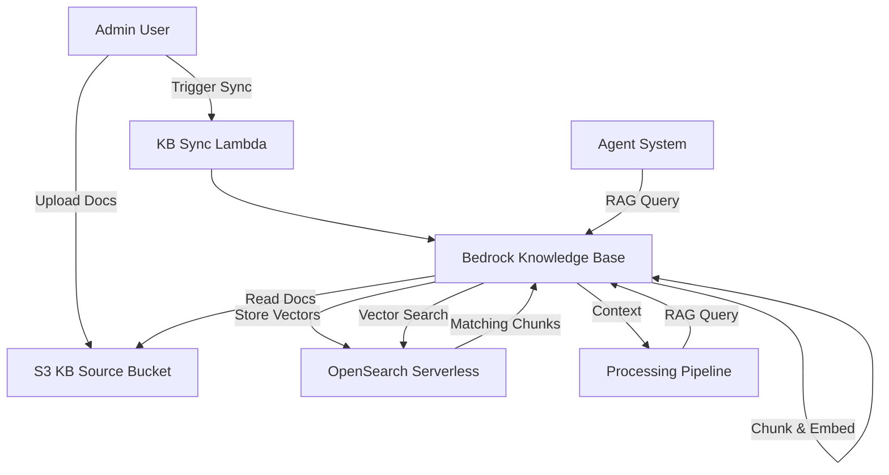

# Knowledge Base — Threat Analysis

## Document Information

| Field | Value |
|-------|-------|
| **Document Version** | 2.0 |
| **Last Updated** | 2025-03-19 |
| **Feature** | Bedrock Knowledge Base (RAG Integration) |
| **Classification** | Internal |

## 1. Feature Overview

The Knowledge Base feature integrates Amazon Bedrock Knowledge Bases to provide retrieval-augmented generation (RAG) capabilities. Reference documents are stored in S3, chunked, embedded, and indexed in OpenSearch Serverless for vector similarity search. During document processing, the pipeline can query the knowledge base to augment prompts with relevant context.

Key components:
- **S3 data source**: Reference documents uploaded for KB indexing
- **Bedrock Knowledge Base**: Manages chunking, embedding, and retrieval
- **OpenSearch Serverless**: Vector store for document embeddings
- **RAG queries**: Pipeline and agents query KB for contextual information

## 2. Architecture

## 3. Threat Analysis

### KB.T01: Knowledge Base Poisoning

| Attribute | Value |
|-----------|-------|
| **Threat ID** | KB.T01 |
| **Category** | STRIDE: Tampering |
| **Description** | Malicious or incorrect reference documents uploaded to the KB source bucket could contaminate the knowledge base, causing incorrect context to be retrieved during processing |
| **Attack Vector** | Upload poisoned reference documents that contain misleading information or prompt injection payloads, then trigger KB sync |
| **Impact** | Systematic misprocessing of documents when poisoned context is retrieved, incorrect extraction results, prompt injection via retrieved content |
| **Likelihood** | Medium |
| **Severity** | High |
| **Affected Components** | S3 KB Source Bucket, Bedrock Knowledge Base, OpenSearch Serverless |
| **Mitigations** | RBAC (Admin-only KB document management), document review before sync, KB versioning, ability to re-sync from clean source, evaluation framework to detect accuracy changes |

### KB.T02: RAG Context Injection

| Attribute | Value |
|-----------|-------|
| **Threat ID** | KB.T02 |
| **Category** | STRIDE: Tampering, Elevation of Privilege |
| **Description** | Retrieved KB context is injected into LLM prompts. If KB content contains prompt injection payloads, it could manipulate model behavior during document processing |
| **Attack Vector** | Store documents in KB that contain prompt injection instructions, which get retrieved and inserted into processing prompts |
| **Impact** | Model behavior manipulation for documents where poisoned context is retrieved, bypassing normal processing logic |
| **Likelihood** | Medium |
| **Severity** | High |
| **Affected Components** | Bedrock Knowledge Base, Processing Pipeline Lambdas |
| **Mitigations** | KB content sanitization, prompt engineering to isolate retrieved context from instructions, output validation, Bedrock Guardrails |

### KB.T03: OpenSearch Serverless Data Exposure

| Attribute | Value |
|-----------|-------|
| **Threat ID** | KB.T03 |
| **Category** | STRIDE: Information Disclosure |
| **Description** | OpenSearch Serverless stores vector embeddings and potentially document chunks. Misconfigured access policies could expose this data |
| **Attack Vector** | Overly permissive OpenSearch Serverless access policies, or compromised credentials with OpenSearch access |
| **Impact** | Exposure of reference document content stored as embeddings and chunks |
| **Likelihood** | Low |
| **Severity** | Medium |
| **Affected Components** | OpenSearch Serverless collection |
| **Mitigations** | OpenSearch Serverless encryption at rest and in transit, IAM-based access policies, network policies restricting access to VPC endpoints, no public access |

### KB.T04: Excessive RAG Retrieval

| Attribute | Value |
|-----------|-------|
| **Threat ID** | KB.T04 |
| **Category** | STRIDE: Information Disclosure, Denial of Service |
| **Description** | Crafted queries could retrieve excessive or unintended KB content, either exposing sensitive reference information or consuming excessive resources |
| **Attack Vector** | Submit documents or queries designed to trigger broad RAG retrieval, pulling back large amounts of reference content |
| **Impact** | Exposure of reference document content in processing outputs, increased Bedrock/OpenSearch costs |
| **Likelihood** | Low |
| **Severity** | Medium |
| **Affected Components** | Bedrock Knowledge Base, OpenSearch Serverless, Processing Pipeline |
| **Mitigations** | RAG retrieval result limits (top-K), relevance score thresholds, query scoping, token budget management |

## 4. Security Controls Summary

| Control | Implementation | Threats Mitigated |
|---------|---------------|-------------------|
| **RBAC** | Admin-only KB document management | KB.T01 |
| **Content sanitization** | KB content validation before sync | KB.T01, KB.T02 |
| **Prompt isolation** | Separate retrieved context from instructions in prompts | KB.T02 |
| **Encryption** | OpenSearch Serverless encryption at rest/in transit | KB.T03 |
| **Access policies** | IAM + OpenSearch network policies | KB.T03 |
| **Retrieval limits** | Top-K limits, relevance thresholds | KB.T04 |
| **Evaluation** | Accuracy monitoring to detect KB contamination | KB.T01 |
