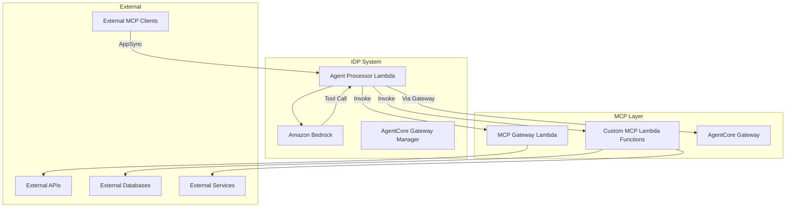

# MCP Integration — Threat Analysis

## Document Information

| Field | Value |
|-------|-------|
| **Document Version** | 2.0 |
| **Last Updated** | 2025-03-19 |
| **Feature** | Model Context Protocol (MCP) Integration |
| **Classification** | Internal |

## 1. Feature Overview

MCP Integration enables the IDP Accelerator's agent system to interact with external tools and services via the Model Context Protocol. This includes:
- **Built-in MCP agents**: Pre-configured agents for common operations
- **Custom MCP agents**: Customer-defined Lambda functions that expose tools to the AI agent
- **External MCP clients**: Third-party MCP clients connecting to the IDP system
- **AgentCore Gateway**: Managed MCP server infrastructure for tool hosting

MCP extends the agent's capabilities beyond document processing to interact with arbitrary external systems.

## 2. Architecture

## 3. Threat Analysis

### MCP.T01: Data Exfiltration via MCP Tools

| Attribute | Value |
|-----------|-------|
| **Threat ID** | MCP.T01 |
| **Category** | STRIDE: Information Disclosure |
| **Description** | MCP tools can send data to external services. A compromised or malicious MCP agent could exfiltrate sensitive document data, extracted PII, or processing results to unauthorized external endpoints |
| **Attack Vector** | Malicious custom MCP Lambda sends document processing data to attacker-controlled endpoint; or prompt injection causes agent to invoke MCP tool with sensitive data as parameters |
| **Impact** | Exfiltration of customer confidential data, PII, or processing results |
| **Likelihood** | Medium |
| **Severity** | Critical |
| **Affected Components** | Custom MCP Lambdas, MCP Gateway Lambda, external services |
| **Mitigations** | Customer-managed MCP Lambda security review, IAM least-privilege for MCP Lambdas, network-level egress controls (VPC), audit logging of all MCP tool invocations, data classification awareness in agent prompts |

### MCP.T02: Malicious Tool Injection

| Attribute | Value |
|-----------|-------|
| **Threat ID** | MCP.T02 |
| **Category** | STRIDE: Tampering, Elevation of Privilege |
| **Description** | If MCP tool definitions are dynamically loaded or configurable, an attacker could inject malicious tool definitions that the agent would treat as legitimate capabilities |
| **Attack Vector** | Modify MCP tool configuration to add tools that execute arbitrary operations, or modify existing tool descriptions to cause the agent to misuse them |
| **Impact** | Agent executes unintended operations, unauthorized system access |
| **Likelihood** | Low |
| **Severity** | High |
| **Affected Components** | MCP configuration, Agent Processor Lambda |
| **Mitigations** | MCP tool definitions stored in IaC (CloudFormation), not user-configurable at runtime; Admin-only deployment of new MCP agents; tool allowlisting |

### MCP.T03: MCP Response Injection

| Attribute | Value |
|-----------|-------|
| **Threat ID** | MCP.T03 |
| **Category** | STRIDE: Tampering |
| **Description** | External services returning data via MCP tools could inject malicious content into the agent's context, enabling indirect prompt injection |
| **Attack Vector** | External API returns response containing prompt injection payload, which is fed back to the Bedrock model as tool output |
| **Impact** | Model behavior manipulation via tool result content, cascading to further tool calls or data disclosure |
| **Likelihood** | Medium |
| **Severity** | High |
| **Affected Components** | MCP Gateway Lambda, Agent Processor Lambda, Amazon Bedrock |
| **Mitigations** | Tool output sanitization, response size limits, tool output content validation, system prompt instructions to treat tool output as untrusted data |

### MCP.T04: Unauthorized External Service Access

| Attribute | Value |
|-----------|-------|
| **Threat ID** | MCP.T04 |
| **Category** | STRIDE: Spoofing, Elevation of Privilege |
| **Description** | MCP Lambda functions may have credentials or access to external services. If these Lambdas are invoked with unexpected parameters, they could access external services beyond intended scope |
| **Attack Vector** | Agent passes manipulated parameters to MCP tool that causes Lambda to access unintended external resources |
| **Impact** | Unauthorized operations on external systems, unintended data modifications |
| **Likelihood** | Medium |
| **Severity** | High |
| **Affected Components** | Custom MCP Lambdas, external services |
| **Mitigations** | Input validation in MCP Lambda functions, parameter schema enforcement, least-privilege credentials for external services, separate IAM roles per MCP Lambda |

### MCP.T05: External MCP Client Abuse

| Attribute | Value |
|-----------|-------|
| **Threat ID** | MCP.T05 |
| **Category** | STRIDE: Spoofing, Denial of Service |
| **Description** | External MCP clients connecting to the IDP system could abuse the API to submit excessive requests or attempt unauthorized operations |
| **Attack Vector** | External client sends high-volume requests or crafted queries to exploit agent capabilities |
| **Impact** | Resource exhaustion, cost escalation, unauthorized data access |
| **Likelihood** | Medium |
| **Severity** | Medium |
| **Affected Components** | AppSync API, Agent Processor Lambda |
| **Mitigations** | Cognito authentication required for all external clients, AppSync rate limiting, RBAC-based capability restrictions, CloudWatch alarms on usage patterns |

### MCP.T06: AgentCore Gateway Lifecycle Attacks

| Attribute | Value |
|-----------|-------|
| **Threat ID** | MCP.T06 |
| **Category** | STRIDE: Denial of Service, Tampering |
| **Description** | The AgentCore Gateway Manager Lambda manages gateway lifecycle (create, start, stop). If gateway management is disrupted, MCP tool availability is impacted |
| **Attack Vector** | Repeated gateway restarts, configuration corruption, or IAM permission escalation via gateway management |
| **Impact** | MCP tool unavailability, degraded agent functionality |
| **Likelihood** | Low |
| **Severity** | Medium |
| **Affected Components** | AgentCore Gateway Manager Lambda, Bedrock AgentCore |
| **Mitigations** | IAM restrictions on gateway management operations, CloudWatch alarms on gateway status changes, gateway health monitoring |

## 4. Security Controls Summary

| Control | Implementation | Threats Mitigated |
|---------|---------------|-------------------|
| **IAM least-privilege** | Separate execution roles per MCP Lambda | MCP.T01, MCP.T04 |
| **Network controls** | Optional VPC with egress restrictions for MCP Lambdas | MCP.T01 |
| **Audit logging** | All MCP tool invocations logged | MCP.T01, MCP.T04, MCP.T05 |
| **IaC-managed tools** | Tool definitions in CloudFormation, not runtime-configurable | MCP.T02 |
| **Output sanitization** | Tool response validation and size limits | MCP.T03 |
| **Input validation** | Parameter schema enforcement in MCP Lambdas | MCP.T04 |
| **Authentication** | Cognito auth required for external clients | MCP.T05 |
| **Rate limiting** | AppSync and Lambda concurrency limits | MCP.T05, MCP.T06 |
| **Gateway monitoring** | CloudWatch alarms on gateway status | MCP.T06 |
