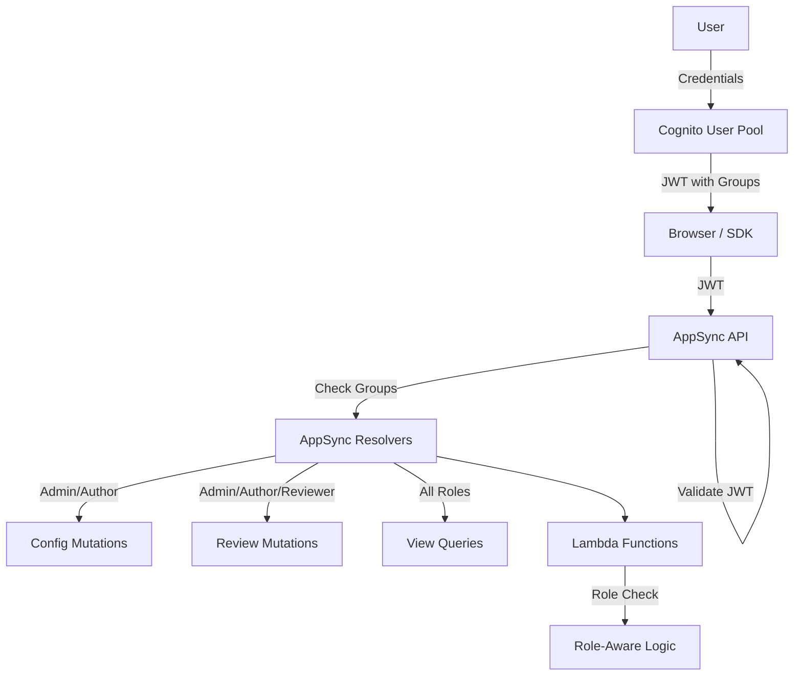

# RBAC & Authentication — Threat Analysis

## Document Information

| Field | Value |
|-------|-------|
| **Document Version** | 2.0 |
| **Last Updated** | 2025-03-19 |
| **Feature** | Role-Based Access Control & Authentication |
| **Classification** | Internal |

## 1. Feature Overview

The IDP Accelerator implements a 4-tier RBAC system using Amazon Cognito User Pools:

| Role | Precedence | Capabilities |
|------|-----------|--------------|
| **Admin** | 0 (highest) | Full system access: configuration, processing, review, agent access, user management |
| **Author** | 1 | Create/edit configurations, upload documents, run processing, use agents |
| **Reviewer** | 2 | Review processed documents, HITL review tasks, view results |
| **Viewer** | 3 (lowest) | Read-only access to processing results and dashboards |

Authorization is enforced at multiple layers:
- **Cognito Groups**: Users assigned to groups corresponding to roles
- **AppSync Resolvers**: Field-level authorization checking Cognito group membership
- **Lambda Functions**: Role-aware business logic
- **UI Components**: Feature visibility based on user role

## 2. Architecture

## 3. Threat Analysis

### AUTH.T01: Privilege Escalation via Group Manipulation

| Attribute | Value |
|-----------|-------|
| **Threat ID** | AUTH.T01 |
| **Category** | STRIDE: Elevation of Privilege |
| **Description** | If Cognito user group assignments are not properly protected, a user could add themselves to higher-privilege groups (e.g., Viewer → Admin) |
| **Attack Vector** | Direct Cognito API calls to modify group membership using stolen admin credentials, or exploiting misconfigured Cognito permissions |
| **Impact** | Unauthorized access to configuration, processing, and admin functions |
| **Likelihood** | Low |
| **Severity** | Critical |
| **Affected Components** | Cognito User Pool, IAM policies |
| **Mitigations** | IAM policies restricting Cognito admin operations, no self-service group management, Cognito user pool advanced security features, CloudTrail logging of Cognito API calls |

### AUTH.T02: JWT Token Theft/Replay

| Attribute | Value |
|-----------|-------|
| **Threat ID** | AUTH.T02 |
| **Category** | STRIDE: Spoofing |
| **Description** | JWT tokens stored in browser (localStorage/sessionStorage) or SDK client could be stolen via XSS, malicious browser extensions, or network interception, then replayed for unauthorized access |
| **Attack Vector** | XSS attack on web UI extracts JWT from storage; or man-in-the-middle (unlikely with TLS) captures token |
| **Impact** | Attacker gains authenticated access with victim's role permissions |
| **Likelihood** | Medium |
| **Severity** | High |
| **Affected Components** | Web UI, SDK/CLI, AppSync API |
| **Mitigations** | Short-lived access tokens (1 hour default), secure token storage practices, Content Security Policy headers, XSS prevention in React app, HTTPS-only |

### AUTH.T03: Insufficient Authorization Granularity

| Attribute | Value |
|-----------|-------|
| **Threat ID** | AUTH.T03 |
| **Category** | STRIDE: Elevation of Privilege |
| **Description** | AppSync resolver authorization may have gaps where certain mutations or queries don't properly check role membership, allowing lower-privilege users to perform restricted operations |
| **Attack Vector** | Directly call AppSync API with GraphQL queries that bypass UI-level restrictions, targeting resolvers with missing authorization checks |
| **Impact** | Unauthorized configuration changes, document access, or processing operations |
| **Likelihood** | Medium |
| **Severity** | High |
| **Affected Components** | AppSync Resolvers, Lambda authorization logic |
| **Mitigations** | Comprehensive resolver-level authorization for all mutations and queries, automated testing of authorization rules, security review of AppSync schema, defense-in-depth with Lambda-level role checks |

### AUTH.T04: Cognito User Pool Misconfiguration

| Attribute | Value |
|-----------|-------|
| **Threat ID** | AUTH.T04 |
| **Category** | STRIDE: Spoofing, Information Disclosure |
| **Description** | Misconfigured Cognito user pool settings (e.g., self-signup enabled, weak password policies, unverified email) could allow unauthorized account creation or account takeover |
| **Attack Vector** | Self-register accounts if self-signup is enabled, or exploit weak password requirements |
| **Impact** | Unauthorized system access, even at Viewer level provides access to document processing results |
| **Likelihood** | Low |
| **Severity** | High |
| **Affected Components** | Cognito User Pool |
| **Mitigations** | Self-signup disabled (admin-created accounts only), strong password policy enforcement, MFA option, email verification required, Cognito advanced security features (compromised credential detection) |

### AUTH.T05: Refresh Token Abuse

| Attribute | Value |
|-----------|-------|
| **Threat ID** | AUTH.T05 |
| **Category** | STRIDE: Spoofing |
| **Description** | Cognito refresh tokens have longer lifetime than access tokens and can be used to obtain new access tokens. Stolen refresh tokens provide persistent access |
| **Attack Vector** | Steal refresh token from browser storage or SDK client, use to continuously obtain fresh access tokens |
| **Impact** | Persistent unauthorized access beyond access token lifetime |
| **Likelihood** | Low |
| **Severity** | High |
| **Affected Components** | Cognito User Pool, Web UI, SDK/CLI |
| **Mitigations** | Configurable refresh token expiration, token revocation capabilities, Cognito advanced security (anomaly detection), secure token storage, session monitoring |

### AUTH.T06: Cross-Tenant Data Access (Multi-Stack)

| Attribute | Value |
|-----------|-------|
| **Threat ID** | AUTH.T06 |
| **Category** | STRIDE: Information Disclosure |
| **Description** | Each deployment is single-tenant, but organizations may deploy multiple stacks. If users have access to multiple stacks' Cognito pools, they could access data across environments |
| **Attack Vector** | User with credentials for multiple stacks accesses data from an environment they shouldn't have access to |
| **Impact** | Cross-environment data access |
| **Likelihood** | Low |
| **Severity** | Medium |
| **Affected Components** | Cognito User Pools (per stack), S3 buckets, DynamoDB tables |
| **Mitigations** | Separate Cognito User Pools per stack (default), IAM resource policies scoped to individual stacks, organizational controls on user provisioning |

## 4. Security Controls Summary

| Control | Implementation | Threats Mitigated |
|---------|---------------|-------------------|
| **IAM protection** | Restrict Cognito admin API access | AUTH.T01 |
| **Token management** | Short-lived tokens, secure storage | AUTH.T02, AUTH.T05 |
| **Resolver auth** | Field-level AppSync authorization | AUTH.T03 |
| **Cognito config** | No self-signup, strong passwords, email verification | AUTH.T04 |
| **Defense-in-depth** | Lambda-level role checks in addition to AppSync | AUTH.T03 |
| **Audit logging** | CloudTrail for Cognito, CloudWatch for AppSync | All |
| **CSP headers** | Content Security Policy in CloudFront | AUTH.T02 |
| **Stack isolation** | Separate Cognito pools per deployment | AUTH.T06 |
