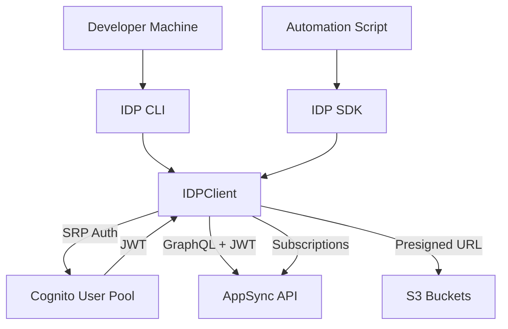

# SDK/CLI — Threat Analysis

## Document Information

| Field | Value |
|-------|-------|
| **Document Version** | 2.0 |
| **Last Updated** | 2025-03-19 |
| **Feature** | IDP SDK & CLI (Programmatic Access) |
| **Classification** | Internal |

## 1. Feature Overview

The IDP SDK and CLI provide programmatic access to the IDP Accelerator for automation, integration, and development workflows:

- **IDP SDK** (`idp_common` package): Python library with `IDPClient` entry point for document processing, configuration management, status monitoring, and evaluation
- **IDP CLI** (`idp_cli` package): Command-line interface wrapping SDK functionality for shell/script usage
- **Authentication**: Cognito-based (username/password → JWT tokens)
- **Communication**: GraphQL via AppSync, S3 presigned URLs for document upload
- **Features**: BDA sync mode, discovery, batch processing, configuration management, evaluation

## 2. Architecture

## 3. Threat Analysis

### SDK.T01: Credential Exposure on Developer Machines

| Attribute | Value |
|-----------|-------|
| **Threat ID** | SDK.T01 |
| **Category** | STRIDE: Information Disclosure |
| **Description** | SDK/CLI stores Cognito credentials (username, password) and JWT tokens on local developer machines. These could be exposed through environment variables, config files, shell history, or process memory |
| **Attack Vector** | Credentials stored in plaintext config files, shell history containing passwords, environment variable leakage, or memory dump of running SDK process |
| **Impact** | Unauthorized access to IDP system with victim's permissions |
| **Likelihood** | Medium |
| **Severity** | High |
| **Affected Components** | Developer machines, IDP SDK/CLI |
| **Mitigations** | Encourage environment variable-based credential passing, avoid shell history logging for sensitive commands, short-lived JWT tokens, credential helpers, documentation of secure usage patterns |

### SDK.T02: Insecure Automation Pipelines

| Attribute | Value |
|-----------|-------|
| **Threat ID** | SDK.T02 |
| **Category** | STRIDE: Spoofing, Information Disclosure |
| **Description** | SDK used in CI/CD pipelines or automation scripts may have credentials hardcoded or stored insecurely in pipeline configurations |
| **Attack Vector** | Credentials in CI/CD configuration files, pipeline logs exposing tokens, shared service accounts with excessive permissions |
| **Impact** | Pipeline compromise leads to IDP system access, potentially at Admin level |
| **Likelihood** | Medium |
| **Severity** | High |
| **Affected Components** | CI/CD pipelines, IDP SDK |
| **Mitigations** | Secret management (AWS Secrets Manager, CI/CD secrets), dedicated service accounts with minimal permissions (Reviewer/Viewer for read-only pipelines), credential rotation, pipeline log sanitization |

### SDK.T03: SDK Supply Chain Attack

| Attribute | Value |
|-----------|-------|
| **Threat ID** | SDK.T03 |
| **Category** | STRIDE: Tampering |
| **Description** | The SDK is installed as a Python package. If the package or its dependencies are compromised, malicious code could be introduced |
| **Attack Vector** | Compromised dependency in SDK's dependency chain, or typosquatting attack on package name |
| **Impact** | Arbitrary code execution on developer machines with access to IDP credentials |
| **Likelihood** | Low |
| **Severity** | High |
| **Affected Components** | IDP SDK package, Python package ecosystem |
| **Mitigations** | Pin dependency versions, use dependency scanning tools, package integrity verification, install from trusted sources only |

### SDK.T04: Batch Processing Abuse

| Attribute | Value |
|-----------|-------|
| **Threat ID** | SDK.T04 |
| **Category** | STRIDE: Denial of Service |
| **Description** | SDK enables batch document upload and processing. Malicious or misconfigured batch operations could flood the processing pipeline, exhausting Lambda concurrency, SQS capacity, or Bedrock quotas |
| **Attack Vector** | Script using SDK uploads massive number of documents simultaneously, overwhelming processing capacity |
| **Impact** | Processing pipeline saturation, legitimate document processing delayed or blocked, cost escalation |
| **Likelihood** | Medium |
| **Severity** | Medium |
| **Affected Components** | SQS queue, Step Functions, Lambda concurrency, Bedrock quotas |
| **Mitigations** | Concurrency controls in Queue Processor Lambda, SQS message rate limiting, DynamoDB-based concurrency counter, CloudWatch alarms on queue depth and processing rates, per-user rate limits |

## 4. Security Controls Summary

| Control | Implementation | Threats Mitigated |
|---------|---------------|-------------------|
| **Short-lived tokens** | Cognito access token expiration (1 hour) | SDK.T01 |
| **Secure credential guidance** | Documentation on env vars, secret managers | SDK.T01, SDK.T02 |
| **Minimal permissions** | Per-use-case RBAC roles for SDK users | SDK.T02 |
| **Dependency management** | Pinned versions, scanning | SDK.T03 |
| **Rate limiting** | Concurrency counter, SQS throttling | SDK.T04 |
| **Monitoring** | CloudWatch alarms on processing volume | SDK.T04 |
