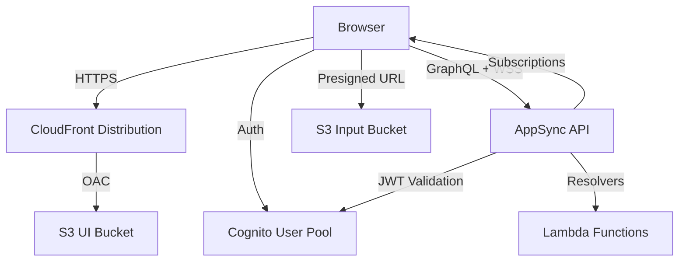

# Web UI — Threat Analysis

## Document Information

| Field | Value |
|-------|-------|
| **Document Version** | 2.0 |
| **Last Updated** | 2025-03-19 |
| **Feature** | Web UI (React SPA) |
| **Classification** | Internal |

## 1. Feature Overview

The Web UI is a React single-page application (SPA) served via Amazon CloudFront that provides:
- **Configuration management**: Create/edit document processing configurations via visual editor
- **Document upload**: Upload documents for processing with drag-and-drop
- **Processing monitoring**: Real-time status tracking of document processing via subscriptions
- **Results viewer**: View extracted data, assessments, and processing outputs
- **Human review**: Review and correct document processing results (HITL)
- **Agent chat**: Interactive AI agent conversations (Companion Chat)
- **Test Studio**: Interactive document testing and validation
- **Discovery**: AI-assisted configuration generation from sample documents
- **Dashboard**: Processing metrics, costs, and system health
- **Administration**: User management, service tier configuration

## 2. Architecture

## 3. Threat Analysis

### UI.T01: Cross-Site Scripting (XSS)

| Attribute | Value |
|-----------|-------|
| **Threat ID** | UI.T01 |
| **Category** | STRIDE: Tampering, Information Disclosure |
| **Description** | Document processing results displayed in the UI could contain malicious HTML/JavaScript. If results are rendered without proper sanitization, XSS could execute in the user's browser |
| **Attack Vector** | Upload document containing XSS payloads in text content; extraction results containing script tags are rendered in results viewer |
| **Impact** | JWT token theft, session hijacking, unauthorized API calls from user's browser, data exfiltration |
| **Likelihood** | Medium |
| **Severity** | High |
| **Affected Components** | Web UI (React), results viewer, configuration editor |
| **Mitigations** | React's default XSS protection (JSX escaping), Content Security Policy (CSP) headers, no `dangerouslySetInnerHTML` for untrusted content, output encoding for all document-derived data |

### UI.T02: Presigned URL Abuse

| Attribute | Value |
|-----------|-------|
| **Threat ID** | UI.T02 |
| **Category** | STRIDE: Spoofing, Tampering |
| **Description** | S3 presigned URLs for document upload could be shared or reused to upload malicious documents without authentication |
| **Attack Vector** | Intercepted or shared presigned URL used to upload documents outside normal authentication flow |
| **Impact** | Unauthorized document upload, processing of malicious documents, storage abuse |
| **Likelihood** | Low |
| **Severity** | Medium |
| **Affected Components** | S3 Input Bucket, presigned URL Lambda |
| **Mitigations** | Short presigned URL expiration (15 minutes), file size limits in presigned URL conditions, content type restrictions, S3 bucket lifecycle policies |

### UI.T03: GraphQL API Abuse

| Attribute | Value |
|-----------|-------|
| **Threat ID** | UI.T03 |
| **Category** | STRIDE: Tampering, Information Disclosure |
| **Description** | The AppSync GraphQL API accepts arbitrary queries from authenticated users. Deeply nested queries, introspection, or batch queries could be used to extract data or cause denial of service |
| **Attack Vector** | Authenticated user sends deeply nested GraphQL queries, uses introspection to discover schema, or sends batch mutations |
| **Impact** | API performance degradation, information disclosure via schema introspection, bulk data extraction |
| **Likelihood** | Medium |
| **Severity** | Medium |
| **Affected Components** | AppSync API, Lambda resolvers |
| **Mitigations** | AppSync query depth limits, query complexity limits, field-level authorization, rate limiting per user, introspection disabled in production |

### UI.T04: CloudFront Distribution Misconfiguration

| Attribute | Value |
|-----------|-------|
| **Threat ID** | UI.T04 |
| **Category** | STRIDE: Information Disclosure |
| **Description** | Misconfigured CloudFront distribution could expose S3 bucket contents, serve stale/cached sensitive data, or allow cache poisoning |
| **Attack Vector** | Manipulate cache keys or exploit misconfigured origin access to access unintended S3 objects |
| **Impact** | Exposure of S3 bucket contents beyond the UI, cached sensitive data served to wrong users |
| **Likelihood** | Low |
| **Severity** | Medium |
| **Affected Components** | CloudFront distribution, S3 UI bucket |
| **Mitigations** | CloudFront Origin Access Control (OAC), restrictive S3 bucket policy, proper cache-control headers for authenticated content, WAF integration optional |

### UI.T05: Client-Side Configuration Exposure

| Attribute | Value |
|-----------|-------|
| **Threat ID** | UI.T05 |
| **Category** | STRIDE: Information Disclosure |
| **Description** | The React SPA requires configuration values (Cognito pool ID, AppSync endpoint, S3 bucket names) embedded in client-side code. These values could be used to discover and target backend services |
| **Attack Vector** | Extract configuration from browser developer tools or JavaScript bundles to identify backend endpoints |
| **Impact** | Knowledge of backend service endpoints enables targeted attacks against AppSync, Cognito, or S3 |
| **Likelihood** | Medium |
| **Severity** | Low |
| **Affected Components** | Web UI JavaScript bundle |
| **Mitigations** | All backend services require authentication, client-side config contains only public endpoints, backend authorization enforced server-side, security through proper access control not obscurity |

## 4. Security Controls Summary

| Control | Implementation | Threats Mitigated |
|---------|---------------|-------------------|
| **React XSS protection** | JSX auto-escaping, no dangerouslySetInnerHTML | UI.T01 |
| **CSP headers** | CloudFront response headers policy | UI.T01 |
| **Presigned URL limits** | Short expiration, size/type conditions | UI.T02 |
| **AppSync limits** | Query depth/complexity limits, rate limiting | UI.T03 |
| **CloudFront OAC** | Origin Access Control for S3 | UI.T04 |
| **HTTPS-only** | CloudFront redirect HTTP to HTTPS | UI.T01, UI.T05 |
| **RBAC** | Field-level AppSync authorization | UI.T03 |
