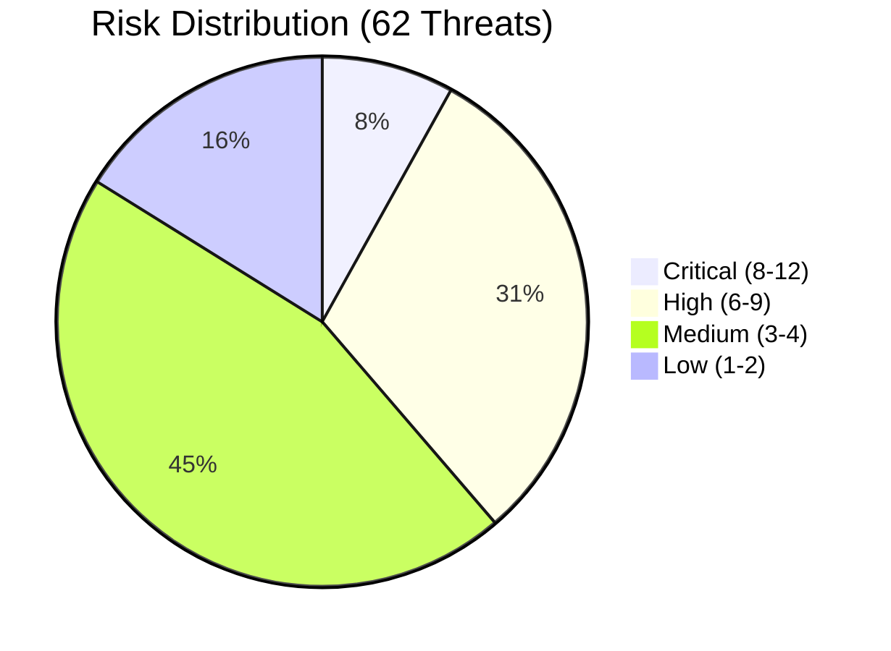

# Risk Assessment Matrix

## Document Information

| Field | Value |
|-------|-------|
| **Document Version** | 2.0 |
| **Last Updated** | 2025-03-19 |
| **Classification** | Internal |
| **Total Threats Identified** | 62 |

## 1. Risk Scoring Methodology

### Likelihood Scale

| Rating | Score | Description |
|--------|-------|-------------|
| **Low** | 1 | Requires specialized skills, insider access, or unlikely conditions |
| **Medium** | 2 | Feasible with moderate effort by authenticated users or sophisticated attackers |
| **High** | 3 | Readily exploitable with common tools or by any authenticated user |

### Severity Scale

| Rating | Score | Description |
|--------|-------|-------------|
| **Low** | 1 | Minimal impact, cosmetic or informational |
| **Medium** | 2 | Moderate impact on confidentiality, integrity, or availability for limited scope |
| **High** | 3 | Significant impact on confidentiality, integrity, or availability |
| **Critical** | 4 | Severe impact: complete data breach, system compromise, or total service loss |

### Risk Score

**Risk = Likelihood × Severity**

| Risk Score | Risk Level | Action Required |
|------------|-----------|-----------------|
| 1-2 | **Low** | Accept or monitor |
| 3-4 | **Medium** | Mitigate with standard controls |
| 6 | **High** | Prioritize mitigation |
| 8-9 | **Very High** | Immediate mitigation required |
| 12 | **Critical** | Block deployment until mitigated |

## 2. Complete Risk Register

### Critical Risk (Score 8-12)

| Threat ID | Threat | L | S | Risk | Component | Status |
|-----------|--------|---|---|------|-----------|--------|
| PM.T06 | Configuration tampering (malicious prompts/schemas) | 2 | 4 | **8** | Pipeline Config | Mitigated |
| AUTH.T01 | Privilege escalation via Cognito group manipulation | 1 | 4 | **4** | Authentication | Mitigated |
| MCP.T01 | Data exfiltration via MCP tools | 2 | 4 | **8** | MCP Integration | Partially Mitigated |
| HOOK.T01 | Malicious customer code execution via hooks | 1 | 4 | **4** | Lambda Hooks | Accepted (customer responsibility) |
| HOOK.T02 | Data exfiltration via post-processing hook | 2 | 4 | **8** | Lambda Hooks | Partially Mitigated |

### High Risk (Score 6)

| Threat ID | Threat | L | S | Risk | Component | Status |
|-----------|--------|---|---|------|-----------|--------|
| PM.T01 | Prompt injection via document content | 3 | 3 | **9** | Pipeline Processing | Mitigated |
| PM.T03 | Model output manipulation / hallucination | 2 | 3 | **6** | Pipeline Processing | Mitigated |
| PM.T04 | Cross-step data poisoning | 1 | 3 | **3** | Pipeline Processing | Mitigated |
| CHAT.T01 | Prompt injection via chat messages | 3 | 3 | **9** | Companion Chat | Mitigated |
| AGT.T01 | SQL injection via natural language (Athena) | 2 | 3 | **6** | Agent Analysis | Mitigated |
| AGT.T05 | Cross-user data leakage via Athena | 2 | 3 | **6** | Agent Analysis | Mitigated |
| KB.T01 | Knowledge Base poisoning | 2 | 3 | **6** | Knowledge Base | Mitigated |
| KB.T02 | RAG context injection | 2 | 3 | **6** | Knowledge Base | Mitigated |
| AUTH.T02 | JWT token theft / replay | 2 | 3 | **6** | Authentication | Mitigated |
| AUTH.T03 | Insufficient authorization granularity | 2 | 3 | **6** | RBAC | Mitigated |
| AUTH.T04 | Cognito user pool misconfiguration | 1 | 3 | **3** | Authentication | Mitigated |
| AUTH.T05 | Refresh token abuse | 1 | 3 | **3** | Authentication | Mitigated |
| MCP.T03 | MCP response injection | 2 | 3 | **6** | MCP Integration | Mitigated |
| MCP.T04 | Unauthorized external service access | 2 | 3 | **6** | MCP Integration | Partially Mitigated |
| HOOK.T03 | Inference hook result tampering | 1 | 3 | **3** | Lambda Hooks | Mitigated |
| HOOK.T05 | Privilege escalation via hook IAM role | 1 | 3 | **3** | Lambda Hooks | Partially Mitigated |
| UI.T01 | Cross-site scripting (XSS) | 2 | 3 | **6** | Web UI | Mitigated |
| RPT.T02 | Athena query data exposure | 2 | 3 | **6** | Reporting | Mitigated |
| RPT.T04 | Evaluation data manipulation | 1 | 3 | **3** | Evaluation | Mitigated |
| RPT.T05 | Discovery prompt injection via sample docs | 2 | 3 | **6** | Discovery | Mitigated |
| BDA.T03 | BDA project configuration tampering | 1 | 3 | **3** | BDA Mode | Mitigated |
| SDK.T01 | Credential exposure on developer machines | 2 | 3 | **6** | SDK/CLI | Partially Mitigated |
| SDK.T02 | Insecure automation pipelines | 2 | 3 | **6** | SDK/CLI | Partially Mitigated |
| SDK.T03 | SDK supply chain attack | 1 | 3 | **3** | SDK/CLI | Mitigated |

### Medium Risk (Score 3-4)

| Threat ID | Threat | L | S | Risk | Component | Status |
|-----------|--------|---|---|------|-----------|--------|
| PM.T02 | OCR manipulation / adversarial documents | 2 | 2 | **4** | Pipeline Processing | Mitigated |
| PM.T05 | Textract service dependency | 2 | 2 | **4** | Pipeline Processing | Mitigated |
| PM.T07 | Few-shot example poisoning | 1 | 2 | **2** | Pipeline Processing | Mitigated |
| AGT.T02 | Arbitrary code execution via AgentCore | 2 | 2 | **4** | Agent Analysis | Mitigated |
| AGT.T03 | Agent routing manipulation | 2 | 2 | **4** | Agent Analysis | Mitigated |
| AGT.T04 | Conversation history poisoning | 1 | 2 | **2** | Agent Analysis | Mitigated |
| CHAT.T02 | Conversation session hijacking | 1 | 3 | **3** | Companion Chat | Mitigated |
| CHAT.T03 | Real-time subscription eavesdropping | 1 | 3 | **3** | Companion Chat | Mitigated |
| CHAT.T04 | Conversation history data exposure | 1 | 3 | **3** | Companion Chat | Mitigated |
| CHAT.T05 | Streaming response denial of service | 2 | 2 | **4** | Companion Chat | Mitigated |
| KB.T03 | OpenSearch Serverless data exposure | 1 | 2 | **2** | Knowledge Base | Mitigated |
| KB.T04 | Excessive RAG retrieval | 1 | 2 | **2** | Knowledge Base | Mitigated |
| MCP.T02 | Malicious tool injection | 1 | 3 | **3** | MCP Integration | Mitigated |
| MCP.T05 | External MCP client abuse | 2 | 2 | **4** | MCP Integration | Mitigated |
| MCP.T06 | AgentCore gateway lifecycle attacks | 1 | 2 | **2** | MCP Integration | Mitigated |
| HOOK.T04 | Hook Lambda timeout / failure cascade | 2 | 2 | **4** | Lambda Hooks | Mitigated |
| UI.T02 | Presigned URL abuse | 1 | 2 | **2** | Web UI | Mitigated |
| UI.T03 | GraphQL API abuse | 2 | 2 | **4** | Web UI | Mitigated |
| UI.T04 | CloudFront distribution misconfiguration | 1 | 2 | **2** | Web UI | Mitigated |
| AUTH.T06 | Cross-tenant data access (multi-stack) | 1 | 2 | **2** | Authentication | Mitigated |
| RPT.T01 | Reporting data tampering | 1 | 2 | **2** | Reporting | Mitigated |
| RPT.T03 | Glue catalog manipulation | 1 | 2 | **2** | Reporting | Mitigated |
| RPT.T06 | Test Studio uncontrolled processing costs | 2 | 2 | **4** | Test Studio | Mitigated |
| BDA.T01 | BDA service opacity | 2 | 2 | **4** | BDA Mode | Accepted |
| BDA.T02 | BDA output format mapping errors | 1 | 2 | **2** | BDA Mode | Mitigated |
| BDA.T04 | BDA service availability | 2 | 2 | **4** | BDA Mode | Mitigated |
| BDA.T05 | S3 cross-access via BDA | 1 | 2 | **2** | BDA Mode | Mitigated |
| SDK.T04 | Batch processing abuse | 2 | 2 | **4** | SDK/CLI | Mitigated |

### Low Risk (Score 1-2)

| Threat ID | Threat | L | S | Risk | Component | Status |
|-----------|--------|---|---|------|-----------|--------|
| UI.T05 | Client-side configuration exposure | 2 | 1 | **2** | Web UI | Accepted |

## 3. Risk Distribution Summary

### By Component

| Component | Critical | High | Medium | Low | Total |
|-----------|----------|------|--------|-----|-------|
| Pipeline Processing | 1 | 2 | 3 | 0 | 6 |
| BDA Mode | 0 | 1 | 4 | 0 | 5 |
| Agent Analysis | 0 | 2 | 3 | 0 | 5 |
| Companion Chat | 0 | 1 | 4 | 0 | 5 |
| MCP Integration | 1 | 2 | 3 | 0 | 6 |
| Knowledge Base | 0 | 2 | 2 | 0 | 4 |
| Authentication/RBAC | 1 | 4 | 1 | 0 | 6 |
| Lambda Hooks | 2 | 2 | 1 | 0 | 5 |
| Web UI | 0 | 1 | 3 | 1 | 5 |
| SDK/CLI | 0 | 3 | 1 | 0 | 4 |
| Reporting/Analytics | 0 | 2 | 3 | 0 | 5 |
| Discovery/Test Studio | 0 | 1 | 1 | 0 | 2 |

### By STRIDE Category

| STRIDE Category | Threats | Highest Risk |
|----------------|---------|--------------|
| **Spoofing** | 7 | High |
| **Tampering** | 22 | Critical |
| **Repudiation** | 5 | Medium |
| **Information Disclosure** | 16 | Critical |
| **Denial of Service** | 10 | Medium |
| **Elevation of Privilege** | 12 | Critical |

### Mitigation Status

| Status | Count | Description |
|--------|-------|-------------|
| **Mitigated** | 50 | Controls implemented and verified |
| **Partially Mitigated** | 7 | Some controls in place, additional measures recommended |
| **Accepted** | 5 | Risk accepted with documented rationale |

## 4. Top 10 Priority Threats

These threats require the most attention based on risk score and business impact:

| Priority | Threat ID | Description | Risk Score | Status |
|----------|-----------|-------------|------------|--------|
| 1 | PM.T01 | Prompt injection via document content | 9 | Mitigated |
| 2 | CHAT.T01 | Prompt injection via chat messages | 9 | Mitigated |
| 3 | PM.T06 | Configuration tampering | 8 | Mitigated |
| 4 | MCP.T01 | Data exfiltration via MCP tools | 8 | Partially Mitigated |
| 5 | HOOK.T02 | Data exfiltration via post-processing hook | 8 | Partially Mitigated |
| 6 | AGT.T01 | SQL injection via natural language | 6 | Mitigated |
| 7 | AUTH.T03 | Insufficient authorization granularity | 6 | Mitigated |
| 8 | KB.T01 | Knowledge Base poisoning | 6 | Mitigated |
| 9 | SDK.T01 | Credential exposure on developer machines | 6 | Partially Mitigated |
| 10 | RPT.T05 | Discovery prompt injection | 6 | Mitigated |

## 5. Recommendations

### Immediate Actions (Critical/High Risk, Partially Mitigated)

1. **MCP Data Exfiltration (MCP.T01)**: Implement VPC egress controls for MCP Lambda functions; establish MCP agent security review process
2. **Post-Processing Hook Exfiltration (HOOK.T02)**: Document customer-side VPC and egress control requirements; provide reference architecture for secure hook deployment
3. **SDK Credential Management (SDK.T01, SDK.T02)**: Implement credential helper integration; provide secure automation pipeline templates
4. **Hook IAM Scoping (HOOK.T05, MCP.T04)**: Publish IAM role templates for hook Lambdas with least-privilege configurations

### Ongoing Monitoring

1. **Prompt Injection Detection**: Monitor evaluation metrics for accuracy degradation that may indicate ongoing prompt injection attacks
2. **Authorization Audit**: Periodic review of AppSync resolver authorization rules for completeness
3. **Athena Query Monitoring**: Alert on unusual query patterns or data volumes
4. **Agent Usage Monitoring**: Track agent tool invocation patterns for anomalies
