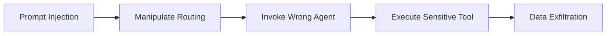

# AI-Assisted Threat Identification Notes

## Document Information

| Field | Value |
|-------|-------|
| **Document Version** | 2.0 |
| **Last Updated** | 2025-03-19 |
| **Classification** | Internal |

## 1. Methodology

The v2.0 threat model was developed using a combination of:

1. **Manual architecture review** — Analysis of CloudFormation templates (`template.yaml`, nested stacks), Lambda function code, AppSync schema, and project documentation
2. **STRIDE systematic analysis** — Each component evaluated against all six STRIDE categories
3. **AI-assisted threat identification** — Generative AI used to identify novel threat vectors specific to the system's GenAI-heavy architecture
4. **Data flow analysis** — Mapping all cross-boundary data flows and identifying security-relevant transitions

## 2. GenAI-Specific Threat Patterns Identified

### 2.1 Prompt Injection Attack Surface

The system has an unusually large prompt injection attack surface due to its document-centric nature:

| Injection Vector | Pipeline Stage | Threat ID |
|-----------------|----------------|-----------|
| Document text content | OCR → Classification, Extraction, Assessment | PM.T01 |
| Chat user messages | Agent prompt | CHAT.T01 |
| Knowledge Base retrieved content | RAG → Processing prompt | KB.T02 |
| MCP tool responses | Tool output → Agent context | MCP.T03 |
| Discovery sample documents | Discovery → Config generation | RPT.T05 |
| Few-shot example documents | Example → Classification/Extraction prompt | PM.T07 |
| Conversation history | Prior turns → Current prompt | AGT.T04 |

**Key insight**: The system is subject to both **direct prompt injection** (user-controlled inputs like chat messages) and **indirect prompt injection** (document content, KB context, MCP responses that are not directly user-controlled but can be influenced).

### 2.2 Multi-Agent Attack Chains

The orchestrator → agent → tool architecture creates potential attack chains:

Threats AGT.T03, MCP.T01, and MCP.T04 form a potential chain where:
1. Prompt injection manipulates orchestrator routing
2. Orchestrator invokes analytics or MCP agent unnecessarily
3. Agent executes tools with sensitive data as parameters
4. Tool sends data to external service

### 2.3 Configuration as a Persistent Attack Surface

Unlike traditional applications, the IDP Accelerator's processing behavior is almost entirely configuration-driven:

- **Prompts**: System and user prompts for each processing step
- **Schemas**: Extraction field definitions and types
- **Models**: Bedrock model selection per step
- **Rules**: Validation rules and criteria
- **Examples**: Few-shot learning examples

A single configuration change (PM.T06) has persistent, system-wide impact on all subsequent document processing. This makes configuration integrity a critical security concern.

### 2.4 Extensibility as Trust Boundary

The Lambda hook and MCP integration patterns create explicit trust boundaries (TB6) where customer-managed code executes with access to processing data:

- **Inference hooks**: Receive document data, return extraction results
- **Post-processing hooks**: Receive complete processing results
- **MCP agents**: Can send data to external services

These are designed features, not vulnerabilities, but they require careful security guidance for customers implementing hooks and agents.

## 3. Threats Not Covered (Out of Scope)

The following areas were considered but determined to be out of scope:

| Area | Rationale |
|------|-----------|
| **AWS account compromise** | Covered by AWS shared responsibility model |
| **Physical security** | AWS data center security |
| **Bedrock model vulnerabilities** | AWS-managed service internals |
| **DNS hijacking** | Network-level attacks outside application scope |
| **Social engineering** | Human factors outside technical threat model |
| **Insider threat (AWS employees)** | Covered by AWS compliance programs |

## 4. Changes from v1.0

| Aspect | v1.0 | v2.0 |
|--------|------|------|
| Architecture | 3 separate patterns | 1 unified architecture, 2 modes |
| Pattern 3 (SageMaker) | Included | Removed (no longer exists) |
| Agent threats | Not covered | 5 threats (AGT.T01-T05) |
| Chat threats | Not covered | 5 threats (CHAT.T01-T05) |
| MCP threats | Not covered | 6 threats (MCP.T01-T06) |
| KB threats | Not covered | 4 threats (KB.T01-T04) |
| RBAC threats | Not covered | 6 threats (AUTH.T01-T06) |
| SDK threats | Not covered | 4 threats (SDK.T01-T04) |
| Hook threats | Not covered | 5 threats (HOOK.T01-T05) |
| UI threats | Not covered | 5 threats (UI.T01-T05) |
| Reporting threats | Not covered | 6 threats (RPT.T01-T06) |
| Total threats | 31 | 62 |
| Threat ID format | AME/SAC/DAP/EWR/CPA/P1/P2/P3 | PM/BDA/AGT/CHAT/MCP/KB/AUTH/SDK/HOOK/UI/RPT |
